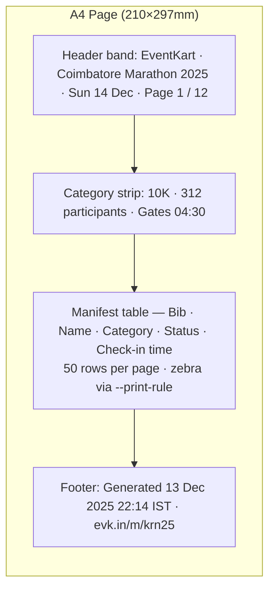

# EventKart Design System v2 — "Pre-Dawn, Refined"

> The organizer operating system for fitness events in India. Built for the 5 AM start line — now polished for 2026.

## Table of Contents

- [1. Executive Summary](#1-executive-summary)
- [2. Design Philosophy](#2-design-philosophy)
- [3. Color System](#3-color-system)
- [4. Typography](#4-typography)
- [5. Spacing & Layout](#5-spacing-layout)
- [6. Component Design Tokens](#6-component-design-tokens)
- [7. Layout Patterns](#7-layout-patterns)
- [8. Motion & Animation](#8-motion-animation)
- [9. Iconography](#9-iconography)
- [10. Surface-Specific Design](#10-surface-specific-design)
- [11. Responsive Design Strategy](#11-responsive-design-strategy)
- [12. Accessibility](#12-accessibility)
- [13. Loading, Empty & Error System](#13-loading-empty-error-system)
- [14. Command Palette](#14-command-palette)
- [15. Notifications & Toasts](#15-notifications-toasts)
- [16. Charts & Data Visualization](#16-charts-data-visualization)
- [17. Forms — Extended Patterns](#17-forms-extended-patterns)
- [18. Theming Layers](#18-theming-layers)
- [19. Internationalization & RTL](#19-internationalization-rtl)
- [20. Tokens, Tooling & Component Catalog](#20-tokens-tooling-component-catalog)
- [21. Complete CSS Theme — app.css](#21-complete-css-theme-appcss)
- [22. Migration Guide — v1 → v2](#22-migration-guide-v1-v2)
- [23. Appendix](#23-appendix)

## 1. Executive Summary

**EventKart** (Hindi/Sanskrit for "ray of light") is the organizer operating system for fitness events in India. V2 keeps that mission and rebuilds the design system on a modern stack: TanStack Start (React 19), Tailwind v4, and shadcn/ui v4.

**What v2 keeps from v1.** The foundation is intact and earns its keep — OKLch color in light and dark modes, the "Pre-Dawn Clarity" philosophy, India-native product decisions (UPI-first, phone OTP, ₹ Indian numbering, 360px baseline), warm neutrals, the saffron-promoted dark mode, accessibility-first defaults (WCAG AA, reduced-motion), and the chalk-underline signature interaction.

**What v2 adds.** A modernization pass focused on restraint:

- **Motion** via `motion` (motion.dev) — declarative, layout-aware, reduced-motion friendly. Replaces ad-hoc CSS keyframes for view transitions, list reorders, and hero entrances.
- **View Transitions API** for cross-route morphs on event-card → event-detail.
- **Glass tiers** — three calibrated levels of `backdrop-filter` blur (chrome / overlay / hero), not a free-for-all.
- **Aurora gradients** — animated multi-stop OKLch gradients reserved for marketing hero surfaces.
- **Bento layouts** for the marketing landing and organizer overview.
- **Animated numerals** via `@number-flow/react` for stat cards, ticket counts, and check-in totals.
- **Density modes** — `comfortable` (default) and `compact` for power-user tables.

**Library decisions (v2 stack).**

| Concern           | Library                                | Rationale                                       |
| ----------------- | -------------------------------------- | ----------------------------------------------- |
| Motion            | `motion` (motion.dev)                  | Layout animations, view transitions, RM-aware   |
| Icons (product)   | `lucide-react`                         | shadcn standard, 95% of all icons               |
| Icons (marketing) | `@phosphor-icons/react` (duotone only) | Hero illustrations, max 1 per page              |
| Forms             | `react-hook-form` + `zod`              | Replaces TanStack Form for ecosystem maturity   |
| Tables            | `@tanstack/react-table`                | Server-paginated, density-aware                 |
| Toasts            | `sonner`                               | Replaces ad-hoc toast layer                     |
| Command palette   | `cmdk`                                 | Powers `Cmd+K`                                  |
| Rich text         | `Tiptap` v3                            | Event description editor                        |
| Charts            | `Recharts`                             | Dashboard analytics                             |
| Date picker       | `react-day-picker` v9                  | Booking & organizer calendars                   |
| Numerals          | `@number-flow/react`                   | Earned-celebration animated counts              |
| Headlines         | `react-wrap-balancer`                  | Marketing typography polish                     |
| Images            | `unpic`                                | Network-aware, AVIF/WebP, India-mobile          |
| Fonts             | `@fontsource-variable/*`               | Self-hosted Inter, Plus Jakarta, JetBrains Mono |
| i18n              | `lingui` v5                            | en-IN, hi-IN, ta-IN ready                       |

**Net-new sections in v2.** Eight additions extend (not replace) the v1 spine:

1. Motion choreography & view transitions
2. Glass & elevation tiers
3. Aurora gradient system
4. Bento layout primitives
5. Density modes
6. Animated numerals & celebration moments
7. Print / PDF ticket surface
8. Polish budget & "earned vs. decorative" rubric

**Out of scope for v2.** Email surface (transactional templates) is owned by a separate spec.

---

## 2. Design Philosophy

### 2.1 Five Principles

#### 1. Pre-Dawn Clarity

The UI should feel like the 5 AM race start — focused, clean, low noise. Energy comes from contrast and a single purposeful accent, not from saturation everywhere. Backgrounds are warm neutrals, type is decisive, the only "loud" color is the saffron accent on actions that move you forward.

#### 2. Trust Through Clarity

Trust is earned pixel by pixel. Hierarchy is structured. Verification badges are visible. Pricing is itemised before payment. Refund policies are linked, not hidden. Professional polish is non-negotiable. **Never dark patterns** — no fake countdown timers, no manufactured scarcity, no pre-checked add-ons.

#### 3. India-Native, Not India-Themed

No mandala patterns. No marigold gradients. No "tricolour" garnishes. Indian-ness shows up in product decisions: UPI as the first payment option, phone OTP as the primary identity, mobile-first layouts that work on a 360px Android, warm neutrals (not Silicon Valley cool grey), and `₹` formatting with Indian numbering conventions (`₹1,49,500`, not `₹149,500`).

#### 4. Progressive Disclosure

On mobile, show only what matters now. Complexity is available on demand but never forced. Registration flows feel like three taps, not three forms. Long policies collapse behind "Read more". Advanced organizer settings live behind tabs, not on the landing pane.

#### 5. Earned Celebration

Delight is rationed. We use motion and color celebration only when the user completes something meaningful — booking confirmed, OTP verified, check-in successful. This makes those moments hit harder, and the rest of the product feel calmer.

### 2.2 Visual Metaphor — "The Starting Line"

Inspired by the chalk line on the road at a race start. Key interactions echo the precision, purpose, and quiet anticipation of that moment. Cards have a 4px lane-line on the left in the event/category color. The signature underline draws left-to-right, like someone marking the line.

### 2.3 Brand Personality

| Trait            | Means                                             | Doesn't mean                     |
| ---------------- | ------------------------------------------------- | -------------------------------- |
| **Energetic**    | Clear action affordances, decisive motion         | Loud, neon, saturated everywhere |
| **Grounded**     | Warm neutrals, real photography, honest copy      | Beige, dull, corporate           |
| **Trustworthy**  | Verification, transparent pricing, clear policies | Stiff, bureaucratic              |
| **Contemporary** | Geometric headings, OKLch color, modern radii     | Trendy, throwaway                |
| **Purposeful**   | Every element earns its place                     | Minimal to the point of cold     |

### 2.4 The Signature Interaction — The Chalk Underline

A **2px animated underline** that draws **left-to-right on hover**, in `--accent` (Dawn Saffron), with a `360ms` `--ease-standard` curve. It marks the starting line. It appears on:

- Primary CTAs (`Register Now`, `Continue to Payment`)
- Active nav items (drawn, not just static)
- Featured event card titles on hover
- Tab strip active indicator

```css
.chalk-underline {
  background-image: linear-gradient(var(--accent), var(--accent));
  background-size: 0% 2px;
  background-position: 0 100%;
  background-repeat: no-repeat;
  transition: background-size var(--duration-quick) var(--ease-standard);
}
.chalk-underline:hover,
.chalk-underline[data-active="true"] {
  background-size: 100% 2px;
}
```

### 2.5 Polish Budget

V2 introduces glass, aurora, animated numerals, and view transitions. Without rules, every page becomes a demo reel. The polish budget is hard-capped per surface.

**One accent moment per visible viewport.** Pick exactly one of:

- A saffron primary CTA (the chalk underline counts)
- An aurora gradient hero
- An animated numeral (`@number-flow/react`)

Never stack all three in the same fold. If the design calls for two, demote one (e.g., a numeral becomes a static `tabular-nums` figure).

**Motion budget per surface.** Count any element with `animate`, `transition`, or `motion.*` props that is currently on screen.

| Surface                | Max active animations on-screen |
| ---------------------- | ------------------------------- |
| Marketing              | 4                               |
| App (dashboard, lists) | 2                               |
| Check-in               | 1                               |

Hover/focus/press states do not count. Reduced-motion always takes precedence.

**Glass usage rule.**

| Tier | `backdrop-filter`          | Allowed on                                     |
| ---- | -------------------------- | ---------------------------------------------- |
| 1    | `blur(8px) saturate(1.1)`  | App chrome (top bar, sidebar rail, sticky CTA) |
| 2    | `blur(16px) saturate(1.2)` | Modals, popovers, command palette              |
| 3    | `blur(28px) saturate(1.3)` | Marketing hero overlays only                   |

Tier 1 is the only glass permitted inside the authenticated app. Tiers 2–3 are reserved for marketing surfaces and modal scrims.

**Aurora gradients.** Marketing-only. Never on the dashboard, organizer tables, check-in, or admin. If a stakeholder asks to "make the dashboard pop with aurora," the answer is no.

**Confetti.** Max **1× per booking session**, only on confirmed payment (`status === "captured"`). Not on add-to-cart, not on OTP success, not on form-step completion.

### 2.6 Earned vs. Decorative

Every animation, gradient, glass surface, and celebratory effect must answer one question before it ships:

> **Does this communicate state, hierarchy, or progress?**

If yes → it's **earned**. Ship it.
If no → it's **decorative**. Remove it.

**Earned examples**

- Chalk underline draws on hover → communicates _interactive affordance_
- Animated numeral on check-in count → communicates _live state change_
- View transition from card → detail → communicates _spatial continuity_
- Confetti on payment confirmation → communicates _milestone completion_
- Skeleton shimmer → communicates _loading progress_

**Decorative (cut)**

- Aurora gradient behind a static stat tile (no state change)
- Hover scale on a non-interactive logo
- Parallax scroll on a pricing table
- Auto-playing hero animation that loops forever
- "Floating" card with idle bob animation

When in doubt, ship the static version first. Add motion only when a user tester asks "did something just happen?" and the answer should have been yes.

---

## 3. Color System

All colors are expressed in **OKLch** for perceptually uniform lightness and a future-proof, wide-gamut foundation.

### 3.1 Primary — Deep Midnight Indigo

`oklch(0.21 0.05 265)` — The EventKart indigo. Trust, depth, distinct from every competitor (Townscript generic blue, BookMyShow red, Insider pink, Swiggy orange). Used for: primary buttons, active nav, focus rings, headings on white surfaces, dashboard chrome.

### 3.2 Accent — Dawn Saffron

`oklch(0.72 0.185 55)` — The "eventkart" (ray) color. The fire in the brand. Used for: hero CTAs (`Register Now`), the chalk underline, energy moments, lane-lines on featured cards. **In dark mode, saffron is promoted to `--primary`** because indigo loses contrast on `oklch(0.16 0.025 265)` backgrounds.

### 3.3 Warm Neutral Scale

10 shades, hue ~55–75°. Warmer than pure grey — invites you in, doesn't feel like a hospital.

| Token        | OKLch                   | Approx Use              |
| ------------ | ----------------------- | ----------------------- |
| `--warm-50`  | `oklch(0.985 0.005 75)` | Page background (light) |
| `--warm-100` | `oklch(0.965 0.005 75)` | Subtle row hover        |
| `--warm-200` | `oklch(0.92 0.008 70)`  | Borders, dividers       |
| `--warm-300` | `oklch(0.87 0.01 65)`   | Disabled borders        |
| `--warm-400` | `oklch(0.708 0.015 60)` | Placeholder text        |
| `--warm-500` | `oklch(0.556 0.015 55)` | Muted body text         |
| `--warm-600` | `oklch(0.44 0.015 50)`  | Secondary body text     |
| `--warm-700` | `oklch(0.37 0.015 48)`  | Body text on light      |
| `--warm-800` | `oklch(0.27 0.012 45)`  | Headings on light       |
| `--warm-900` | `oklch(0.195 0.01 42)`  | Foreground (light)      |
| `--warm-950` | `oklch(0.145 0.008 40)` | Highest contrast text   |

### 3.4 Semantic Colors

| Role                | Light                  | Dark                   |
| ------------------- | ---------------------- | ---------------------- |
| Success             | `oklch(0.62 0.17 148)` | `oklch(0.72 0.16 148)` |
| Warning             | `oklch(0.80 0.155 82)` | `oklch(0.82 0.15 84)`  |
| Error / Destructive | `oklch(0.63 0.22 24)`  | `oklch(0.68 0.20 24)`  |
| Info                | `oklch(0.62 0.16 245)` | `oklch(0.74 0.14 233)` |

Each has a paired `-foreground` token guaranteed AA on its background. **Status is never communicated by color alone** — always icon + text + color.

### 3.5 Extended Palette

#### Event Category Colors (used as 4px lane-line, badge border, chip text)

| Category            | OKLch                  | Reads as       |
| ------------------- | ---------------------- | -------------- |
| Fun Run             | `oklch(0.79 0.15 63)`  | Warm orange    |
| 5K                  | `oklch(0.76 0.16 148)` | Fresh green    |
| 10K                 | `oklch(0.71 0.15 223)` | Open-sky blue  |
| Half Marathon (21K) | `oklch(0.62 0.19 298)` | Focused violet |
| Full Marathon (42K) | `oklch(0.58 0.20 18)`  | Grit red       |

#### Status Colors (organizer + admin workflows)

| Status               | OKLch                  |
| -------------------- | ---------------------- |
| Draft                | `oklch(0.72 0.02 92)`  |
| In Review            | `oklch(0.82 0.16 84)`  |
| Approved             | `oklch(0.76 0.16 148)` |
| Rejected             | `oklch(0.63 0.22 24)`  |
| Checked-in / Scanned | `oklch(0.77 0.17 148)` |

#### Chart / Data Viz (5 colors, ordered for color-blind friendliness)

| #   | Light                  | Dark                   |
| --- | ---------------------- | ---------------------- |
| 1   | `oklch(0.68 0.16 271)` | `oklch(0.74 0.16 272)` |
| 2   | `oklch(0.74 0.12 201)` | `oklch(0.76 0.12 201)` |
| 3   | `oklch(0.77 0.14 148)` | `oklch(0.80 0.14 148)` |
| 4   | `oklch(0.78 0.13 84)`  | `oklch(0.83 0.13 84)`  |
| 5   | `oklch(0.69 0.18 39)`  | `oklch(0.75 0.18 39)`  |

### 3.6 Dark Mode — "Pre-Dawn"

Not pure black. A deep warm indigo (`oklch(0.16 0.025 265)`) that feels like the sky 30 minutes before sunrise. Cards elevate via small lightness increments (`0.20`, `0.24`, `0.26`), not via white overlays. Saffron is promoted to primary. Borders stay subtle but visible.

### 3.7 Surface & Elevation

We use **lightness, not shadow**, to indicate elevation in dark mode. In light mode, shadow + slight warm-tint shift.

| Level            | Light surface       | Dark surface            | Shadow (light only)   |
| ---------------- | ------------------- | ----------------------- | --------------------- |
| 0 (page)         | `--warm-50`         | `oklch(0.16 0.025 265)` | none                  |
| 1 (card)         | `oklch(1 0.003 75)` | `oklch(0.20 0.03 265)`  | `--shadow-xs`         |
| 2 (hover card)   | `oklch(1 0.003 75)` | `oklch(0.22 0.03 265)`  | `--shadow-md`         |
| 3 (popover/menu) | `oklch(1 0.003 75)` | `oklch(0.24 0.03 265)`  | `--shadow-lg`         |
| 4 (modal)        | `oklch(1 0.003 75)` | `oklch(0.26 0.03 265)`  | `--shadow-lg` + scrim |

### 3.8 Gradients & Auroras

Gradients are scenic, not structural. Cap chroma at **0.12** to avoid AMOLED bleed. Always pair with `prefers-reduced-transparency` fallbacks (solid surface).

#### Aurora Hero — marketing only

Conic blend of indigo → violet → saffron, behind hero text, with a 4% noise grain overlay to defeat banding.

```css
.aurora-hero {
  background: conic-gradient(
    from 220deg at 50% 30%,
    oklch(0.21 0.05 265) 0deg,
    oklch(0.62 0.12 298) 140deg,
    oklch(0.72 0.12 55) 260deg,
    oklch(0.21 0.05 265) 360deg
  );
  filter: saturate(0.9);
}
.aurora-hero::after {
  content: "";
  position: absolute;
  inset: 0;
  background-image: url("/grain.png");
  opacity: 0.04;
  mix-blend-mode: overlay;
}
```

- **Light variant:** lift base lightness +0.08 across stops, drop chroma to 0.09.
- **Dark variant:** values above; darken outer 20% with a radial vignette `radial-gradient(transparent 60%, oklch(0.12 0.02 265) 100%)`.

#### Spotlight — empty states & focus moments

Soft warm halo from center.

```css
.spotlight {
  background: radial-gradient(
    ellipse at center,
    oklch(0.95 0.01 75 / 0.6) 0%,
    oklch(0.95 0.01 75 / 0) 70%
  );
}
/* Dark */
.dark .spotlight {
  background: radial-gradient(
    ellipse at center,
    oklch(0.32 0.04 265 / 0.55) 0%,
    oklch(0.32 0.04 265 / 0) 70%
  );
}
```

#### CTA Saffron — primary action surfaces

```css
.cta-saffron {
  background: linear-gradient(
    135deg,
    oklch(0.72 0.185 55) 0%,
    oklch(0.62 0.19 50) 100%
  );
}
/* Dark: shift end stop warmer to keep contrast */
.dark .cta-saffron {
  background: linear-gradient(
    135deg,
    oklch(0.76 0.18 58) 0%,
    oklch(0.66 0.19 50) 100%
  );
}
```

#### Success-Soft — confirmation banners, "You're in." moments

```css
.success-soft {
  background: linear-gradient(
    180deg,
    oklch(0.62 0.17 148 / 0.1) 0%,
    oklch(0.62 0.17 148 / 0) 100%
  );
}
.dark .success-soft {
  background: linear-gradient(
    180deg,
    oklch(0.72 0.16 148 / 0.14) 0%,
    oklch(0.72 0.16 148 / 0) 100%
  );
}
```

#### Don'ts

- ❌ No rainbow / multi-hue gradients (>3 stops).
- ❌ Never on app chrome (sidebar, top-nav body, table headers).
- ❌ Never under body text without a scrim.
- ❌ No animated gradients on scroll-pinned elements.

### 3.9 Glass Surface Tiers

Three tiers, picked by content depth — not by aesthetics.

| Tier            | Use                            | Backdrop-blur | Bg opacity | Border      |
| --------------- | ------------------------------ | ------------- | ---------- | ----------- |
| 1 (subtle)      | Top nav on scroll, sticky tabs | `12px`        | `bg/72`    | `border/8`  |
| 2 (card)        | Hero overlay cards, filter bar | `20px`        | `bg/64`    | `border/12` |
| 3 (modal-grade) | Booking confirmation modal     | `40px`        | `bg/52`    | `border/16` |

```css
.glass-1 {
  background: oklch(1 0.003 75 / 0.72);
  backdrop-filter: blur(12px) saturate(1.1);
  border: 1px solid oklch(0.27 0.012 45 / 0.08);
}
.dark .glass-1 {
  /* warm-indigo overlay, NOT white */
  background: oklch(0.2 0.03 265 / 0.72);
  border-color: oklch(0.95 0.005 75 / 0.08);
}
```

#### Light vs Dark

- **Light:** glass = warm-white at varying alpha; preserves the 75° hue cast.
- **Dark:** glass = warm-indigo overlay at varying alpha. **Never** a translucent white — it dirties to grey on Pre-Dawn.

#### Performance

- Tier 1: safe everywhere, including scroll-pinned headers.
- Tier 2: avoid on lists with >24 visible items.
- Tier 3: **never** on scroll-pinned elements; modal-only. iOS Safari composites a fresh blur per scroll frame → jank.
- Always feature-test: `@supports not (backdrop-filter: blur(1px)) { … solid fallback … }`.

#### A11y

- Glass MUST sit on a backdrop with sufficient contrast for any text on top (AA against the _resolved_ color, not the glass color alone).
- If the backdrop is media (image/video), apply a scrim **first**:

```css
.glass-on-media::before {
  content: "";
  position: absolute;
  inset: 0;
  background: linear-gradient(transparent, oklch(0 0 0 / 0.4));
}
```

- Honor `prefers-reduced-transparency`: collapse all tiers to opaque surface tokens.

### 3.10 Marketing vs App Palette Deltas

Two palettes share roots, diverge on warmth, glass intensity, and accent boldness.

| Surface                  | Background token             | Accent                     | Aurora?        | Glass tier | Notes                          |
| ------------------------ | ---------------------------- | -------------------------- | -------------- | ---------- | ------------------------------ |
| Marketing landing        | `--marketing-bg`             | `--marketing-accent-glow`  | ✅ hero        | 2–3        | Large saffron type, spotlights |
| Discovery (event browse) | `--marketing-bg`             | saffron                    | ❌             | 1–2        | Glass on filter bar only       |
| Event detail (public)    | `--marketing-bg`             | saffron                    | ⚠️ banner only | 2          | Aurora limited to hero band    |
| Booking flow             | `--warm-50` / `--page`       | indigo                     | ❌             | 2 (modal)  | Calm; saffron only on confirm  |
| Organizer dashboard      | `--app-chrome`               | indigo (KPI flash saffron) | ❌             | 1          | Tabular, dense                 |
| Organizer rail / sidebar | `--app-rail`                 | indigo                     | ❌             | none       | Solid                          |
| Admin console            | `--app-chrome`               | indigo                     | ❌             | 1          | Status colors do the talking   |
| Check-in (PWA, outdoor)  | `--checkin-bg` (solid white) | `--checkin-accent` (solid) | ❌             | none       | Forced high-contrast           |

#### Token deltas

```css
:root {
  /* marketing — warmer, softer */
  --marketing-bg: oklch(0.985 0.008 70);
  --marketing-accent-glow: oklch(0.72 0.185 55 / 0.35);

  /* app — cooler, calmer */
  --app-chrome: oklch(0.985 0.005 75);
  --app-rail: oklch(0.965 0.005 75);

  /* check-in — forced contrast, never themed */
  --checkin-bg: #ffffff;
  --checkin-fg: #000000;
  --checkin-accent: oklch(0.58 0.22 28);
}
.dark {
  --marketing-bg: oklch(0.16 0.025 265);
  --marketing-accent-glow: oklch(0.76 0.18 58 / 0.4);
  --app-chrome: oklch(0.18 0.028 265);
  --app-rail: oklch(0.16 0.025 265);
  /* check-in tokens DO NOT switch in dark mode */
}
```

#### Rules

- Marketing → "discoverable, alive". Aurora ok, glass Tiers 2–3, large saffron accents.
- App → "competent, fast". Tier 1 glass max, accents reserved for KPI deltas, status pills, CTA buttons.
- Check-in → "outdoor, gloves, sun". Solid color blocks ≥ 56px tap target. **No glass, no gradients, no theme switch.**

---

---

## 4. Typography

### 4.1 Font Stack

| Role               | Family                | Weights            | Notes                                                            |
| ------------------ | --------------------- | ------------------ | ---------------------------------------------------------------- |
| Headings / Display | **Plus Jakarta Sans** | 500, 600, 700, 800 | Geometric, modern, premium. Never below 500.                     |
| Body / UI          | **Inter**             | 400, 500, 600, 700 | Workhorse. Never above 700 (use Plus Jakarta if heavier needed). |
| Monospace          | **JetBrains Mono**    | 400, 500, 600      | Booking codes, OTP, bib numbers, data tables.                    |

```css
font-family-display: "Plus Jakarta Sans", "Inter", system-ui, sans-serif;
font-family-sans:
  "Inter",
  system-ui,
  -apple-system,
  "Segoe UI",
  sans-serif;
font-family-mono: "JetBrains Mono", "SF Mono", Menlo, Consolas, monospace;
```

Load from `next/font` equivalent or via `<link>` with `display: swap`. Subset to `latin` + `latin-ext` for V1.

### 4.2 Fluid Type Scale

All sizes use `clamp(min, fluid, max)` with viewport scaling between 320px and 1440px.

| Token       | Min  | Fluid                  | Max  | Use                    |
| ----------- | ---- | ---------------------- | ---- | ---------------------- |
| `text-xs`   | 11px | `0.6875rem + 0.125vw`  | 12px | Captions, micro-labels |
| `text-sm`   | 13px | `0.8125rem + 0.125vw`  | 14px | Secondary body         |
| `text-base` | 15px | `0.9375rem + 0.125vw`  | 16px | Body                   |
| `text-lg`   | 17px | `1.0625rem + 0.1875vw` | 18px | Lead body              |
| `text-xl`   | 19px | `1.1875rem + 0.25vw`   | 20px | Card titles            |
| `text-2xl`  | 22px | `1.375rem + 0.375vw`   | 24px | Section subheads       |
| `text-3xl`  | 26px | `1.625rem + 0.5vw`     | 30px | Section headings       |
| `text-4xl`  | 30px | `1.875rem + 0.75vw`    | 36px | Page headings          |
| `text-5xl`  | 36px | `2.25rem + 1.25vw`     | 48px | Hero / display         |
| `text-6xl`  | 44px | `2.75rem + 1.75vw`     | 60px | Major hero             |

### 4.3 Weight Rules

- **Plus Jakarta Sans**: never below `500`. Hero/display uses `700` or `800`.
- **Inter**: never above `700`. Buttons use `600`. Body uses `400`. Strong inline emphasis uses `500` or `600`.
- Display (4xl–6xl): `line-height 1.1`, `letter-spacing -0.025em`.
- Heading (xl–3xl): `line-height 1.2`, `letter-spacing -0.015em`.
- Body (base, lg): `line-height 1.6`, `letter-spacing 0`.
- Small (xs, sm): `line-height 1.5`, `letter-spacing 0.01em`.

### 4.4 Tabular Numerics

Tabular figures mandatory for: prices (`₹1,499`), counts (`1,247 registered`), OTPs, bib numbers, durations, KPI cards, leaderboards.

```css
.tabular {
  font-variant-numeric: tabular-nums;
  font-feature-settings:
    "tnum" 1,
    "lnum" 1;
}
```

Apply at the smallest scope possible (a `<span>`, not the whole card) so prose reading rhythm isn't affected.

### 4.5 Line Lengths & Responsive Rules

- Optimal measure: **60–75ch** for body prose; clamp with `max-width: 65ch` on long-form (event description, blog).
- Hero only `text-5xl`/`text-6xl` on `lg+`. On mobile, hero caps at `text-4xl`.
- Body never goes below 15px on mobile (Indian users often have aged or budget devices).
- Avoid all-caps for runs > 2 words; use `text-sm font-semibold tracking-wide` for eyebrow labels.

### 4.6 Animated Numerals — `@number-flow/react`

Live numbers feel alive without being noisy.

#### When YES

- Live ticket counts on event detail (`248 left`).
- Dashboard KPI cards (revenue, registrations, scan rate).
- Booking total as user toggles add-ons / quantity.
- Leaderboards, timer countdowns updating per-second.

#### When NO

- Static prices in card grids — jitter on first paint reads as broken.
- Table cells — N×M instances tank scroll perf.
- Anything in a virtualized list.
- Anything below `text-sm` — motion is illegible.

#### Requirements

- The host element MUST have `font-variant-numeric: tabular-nums` (otherwise digit-width drift causes layout shift).
- Use a single shared spring config token set so motion stays consistent.

```css
:root {
  --num-tabular-spring-stiffness: 240;
  --num-tabular-spring-damping: 28;
  --num-tabular-spring-mass: 1;
}
```

#### Currency formatting

Indian locale, no fractional rupees in UI:

```ts
const inr = new Intl.NumberFormat("en-IN", {
  style: "currency",
  currency: "INR",
  maximumFractionDigits: 0,
});
inr.format(149500); // "₹1,49,500"
```

#### Recipe

```tsx
import NumberFlow from "@number-flow/react";

type Props = { total: number };

export function BookingTotal({ total }: Props) {
  return (
    <span className="tabular text-3xl font-semibold text-foreground">
      <NumberFlow
        value={total}
        format={{
          style: "currency",
          currency: "INR",
          maximumFractionDigits: 0,
        }}
        locales="en-IN"
        spinTiming={{ duration: 600, easing: "cubic-bezier(0.22, 1, 0.36, 1)" }}
        respectMotionPreference
      />
    </span>
  );
}
```

`respectMotionPreference` is non-negotiable — `prefers-reduced-motion: reduce` must short-circuit to a hard swap.

### 4.7 Headline Wrap Balance — `react-wrap-balancer`

Stops orphaned widows in display type. Costs ~1KB + a layout measurement per balanced node.

#### When YES

- Hero H1 (always).
- Section H2 ≥ 32px (`text-3xl` and up).
- Marketing card titles spanning 2–4 lines.
- Modal titles, empty-state titles.

#### When NO

- Paragraph body — measurement cost dwarfs the readability win.
- Short labels < 5 words — no widow risk.
- Items inside virtualized lists.
- Any text inside a `contenteditable`.

#### Setup

Wrap the entire `<body>` once with the provider so SSR measurements are shared:

```tsx
// src/routes/__root.tsx
import { Provider as BalancerProvider } from "react-wrap-balancer";

export function RootLayout({ children }: { children: React.ReactNode }) {
  return (
    <html lang="en">
      <body>
        <BalancerProvider>{children}</BalancerProvider>
      </body>
    </html>
  );
}
```

#### Recipe

```tsx
import Balancer from "react-wrap-balancer";

export function Hero({ title }: { title: string }) {
  return (
    <h1 className="font-display text-5xl font-bold tracking-tight lg:text-6xl">
      <Balancer ratio={0.5}>{title}</Balancer>
    </h1>
  );
}
```

`ratio={0.5}` → balanced. `ratio={1}` → maximally tight bottom line (use for 2-line titles only).

### 4.8 RTL Typography Adjustments — ROADMAP (V2.x)

> ⚠️ V1 ships **English-only LTR**. This section is the contract for V2.x Arabic + Urdu rollout. Do not implement in V1; do future-proof token names.

#### Type rules for Arabic

- **Line-height: +0.05** over the LTR equivalent (Arabic ascenders/descenders are taller).
- **Letter-spacing: 0** — never tighten. Negative tracking destroys ligatures.
- **Font fallback chain** (headings):

```css
font-family-display-rtl:
  "Plus Jakarta Sans", "Noto Naskh Arabic", "Geeza Pro", system-ui, sans-serif;
font-family-sans-rtl:
  "Inter", "Noto Naskh Arabic", "Tahoma", system-ui, sans-serif;
```

- Plus Jakarta has no Arabic glyphs → Noto Naskh Arabic carries them; the cascade keeps Latin words mid-sentence on-brand.

#### Direction & layout

- Set `direction: rtl` on `<html>` for RTL locales; never per-component.
- Use **logical properties only** (`margin-inline-start`, `padding-inline-end`, `border-inline-start`) — never `margin-left`/`right`. Tailwind v4 `ms-*`, `me-*`, `ps-*`, `pe-*`.
- Icons that imply direction (chevron, back-arrow, send) must mirror via `[dir="rtl"] .icon-directional { transform: scaleX(-1); }`.
- Text alignment uses `text-start` / `text-end`, never `text-left` / `text-right`.

#### Numerals

- **Keep Western (Latin) digits by default** for prices and IDs — Arabic users overwhelmingly read Latin numerals in commerce contexts.
- Switch to Arabic-Indic (`٠١٢٣٤٥٦٧٨٩`) only when locale = `ar-EG`/`ar-SA` AND user explicitly opts in.
- Tabular-nums still applies — both digit sets have monospaced variants in Noto Naskh.

---

---

## 5. Spacing & Layout

### 5.1 Spacing Scale (4px base)

`2, 4, 6, 8, 12, 16, 20, 24, 32, 40, 48, 64, 80, 96` (in px). Every value is a multiple of 4 (rare 2px exception for hairline insets only). All component padding, gap, and margin MUST resolve to a token in this scale — never raw values.

### 5.2 Semantic Aliases

Map intent → spacing token. Use these in component code; only fall back to raw scale values for one-off layout primitives.

| Alias             | Value | Use                                              |
| ----------------- | ----- | ------------------------------------------------ |
| `--space-step`    | 8px   | Tight stacks (icon ↔ label)                      |
| `--space-stride`  | 16px  | Default padding inside cards, button paddings    |
| `--space-pace`    | 24px  | Card grid gap, form field stack                  |
| `--space-block`   | 32px  | Between blocks within a section                  |
| `--space-section` | 48px  | Section vertical gap (mobile)                    |
| `--space-page`    | 64px  | Section vertical gap (desktop), page top padding |

### 5.3 Radius Scale

Soft, modern, never gummy. Radii do **not** scale with density (5.6) — a chip is a chip.

| Token           | Value  | Use                                       |
| --------------- | ------ | ----------------------------------------- |
| `--radius-xs`   | 4px    | Inline chips, badges, kbd, tags           |
| `--radius-sm`   | 6px    | Inputs, small buttons                     |
| `--radius-md`   | 10px   | Default — buttons, dropdowns, popovers    |
| `--radius-lg`   | 14px   | Cards, alerts, sheets                     |
| `--radius-xl`   | 20px   | Hero cards, marketing tiles, modals       |
| `--radius-2xl`  | 28px   | Bento feature cells, large media surfaces |
| `--radius-full` | 9999px | Pills, avatars, FAB, switch tracks        |

Pair nested radii so the inner radius = outer radius − padding (avoids the "stuck-on" look). A card with `--radius-lg` (14px) + `--space-stride` (16px) padding houses children at `--radius-xs` (4px).

### 5.4 Layout Grid

| Breakpoint      | Columns | Gutter | Margin          |
| --------------- | ------- | ------ | --------------- |
| xs (0–479)      | 4       | 16px   | 16px            |
| sm (480–639)    | 8       | 16px   | 20px            |
| md (640–767)    | 8       | 20px   | 24px            |
| lg (768–1023)   | 12      | 24px   | 32px            |
| xl (1024–1279)  | 12      | 24px   | 40px            |
| 2xl (1280–1439) | 12      | 32px   | 48px            |
| 3xl (1440+)     | 12      | 32px   | auto (centered) |

Container widths: `sm=640 · md=768 · lg=1024 · xl=1280 · 2xl=1400`. Discovery and dashboard pages cap at `2xl`.

**Touch targets:** min `44×44`, primary actions `48×48`, check-in (gloves, sun, hurry) `56×56`.

### 5.5 Bento Grid Recipes

Modern asymmetric layouts. One feature cell anchors; smaller cells orbit. Used for: organizer dashboard KPI grid, marketing "featured events" section, admin overview, event detail "what's included".

#### Base

- 12-column CSS grid.
- Gap = `var(--space-pace)` (24px).
- Card heights: `min-height` only — let content breathe; never `height: 100%` with fixed pixel.

#### Span helpers

| Class           | Span                  | Use                         |
| --------------- | --------------------- | --------------------------- |
| `bento-feature` | col-span-8 row-span-2 | The hero KPI / lead event   |
| `bento-half`    | col-span-6            | Side-by-side comparisons    |
| `bento-third`   | col-span-4            | KPI tile                    |
| `bento-quarter` | col-span-3            | Compact metric, status tile |

#### Mobile collapse

- ≤640px → 1-col stack (`grid-cols-1`); all spans reset to full width.
- 641–1023px → 2-col bento; common patterns: `4+4+4` (three thirds become full-width then 1+1+1 stacked at 2-col? no — they collapse to `6+6` first with the third wrapping below) or `6+6` for halves. Feature cell drops its `row-span` and becomes a single full-width tile.
- ≥1024px → full 12-col bento.

#### Recipe

```tsx
export function DashboardBento() {
  return (
    <div className="grid grid-cols-1 gap-[var(--space-pace)] md:grid-cols-12">
      {/* Feature: revenue trend */}
      <article className="md:col-span-12 lg:col-span-8 lg:row-span-2 min-h-[280px] rounded-[var(--radius-2xl)] bg-card p-stride">
        <RevenueChart />
      </article>

      {/* Quarter tiles: KPIs */}
      <article className="md:col-span-6 lg:col-span-4 min-h-[132px] rounded-[var(--radius-xl)] bg-card p-stride">
        <KpiTile label="Registrations" value={1247} />
      </article>
      <article className="md:col-span-6 lg:col-span-4 min-h-[132px] rounded-[var(--radius-xl)] bg-card p-stride">
        <KpiTile label="Scan rate" value="98.2%" />
      </article>

      {/* Halves: secondary content */}
      <article className="md:col-span-6 min-h-[200px] rounded-[var(--radius-xl)] bg-card p-stride">
        <UpcomingEvents />
      </article>
      <article className="md:col-span-6 min-h-[200px] rounded-[var(--radius-xl)] bg-card p-stride">
        <RecentBookings />
      </article>
    </div>
  );
}
```

Don'ts: never nest a bento inside a bento; never let a `bento-feature` grow past `row-span-2` (breaks aspect rhythm); don't mix bento with a sibling table on the same screen — pick one.

### 5.6 Density Modes

Three modes: `compact`, `comfortable` (default), `spacious`. Driven by an attribute on a container — usually `<html>` or a route segment root.

```html
<html data-density="comfortable">
  …
</html>
```

#### Multipliers

| Mode          | Multiplier | Applies to               |
| ------------- | ---------- | ------------------------ |
| `compact`     | `0.875`    | padding, gap, row-height |
| `comfortable` | `1.0`      | (default)                |
| `spacious`    | `1.125`    | padding, gap, row-height |

Does **NOT** scale: `font-size`, `border-radius`, `icon-size`, `border-width`, touch-target minimums (a 44px tap target stays 44px in compact).

#### Token plumbing

```css
:root {
  --density: 1;
  --space-step: calc(8px * var(--density));
  --space-stride: calc(16px * var(--density));
  --space-pace: calc(24px * var(--density));
  --space-block: calc(32px * var(--density));
  --row-height: calc(40px * var(--density));
}
[data-density="compact"] {
  --density: 0.875;
}
[data-density="comfortable"] {
  --density: 1;
}
[data-density="spacious"] {
  --density: 1.125;
}
```

#### Defaults per surface

| Surface                 | Default density     |
| ----------------------- | ------------------- |
| Admin tables / consoles | `compact`           |
| Organizer dashboard     | `comfortable`       |
| Booking flow            | `comfortable`       |
| Marketing / discovery   | `spacious`          |
| Check-in PWA            | `spacious` (forced) |

#### User toggle UX

- Lives in header settings dropdown → "Display density" with three radio options + visual preview row.
- Persist to **both** `localStorage` (instant client read) and a `density` cookie (SSR-safe; TanStack Start reads it in `createServerFn` and emits the `data-density` on `<html>` for the first paint — no FOUC).
- Changing density does **not** require a reload; the CSS var update reflows immediately.

```tsx
import { useEffect } from "react";

type Density = "compact" | "comfortable" | "spacious";

export function setDensity(d: Density) {
  document.documentElement.dataset.density = d;
  localStorage.setItem("ek:density", d);
  document.cookie = `density=${d}; path=/; max-age=31536000; samesite=lax`;
}

export function useDensityHydration() {
  useEffect(() => {
    const stored = localStorage.getItem("ek:density") as Density | null;
    if (stored && stored !== document.documentElement.dataset.density) {
      document.documentElement.dataset.density = stored;
    }
  }, []);
}
```

#### Screenshot description (placeholder for design handoff)

> Header settings dropdown. Three rows, each a labeled radio: "Compact" (tight 36px row of mock list items), "Comfortable" (default 40px row, selected state with saffron dot), "Spacious" (45px row with extra breathing). Below the radios: a single-line helper "Affects spacing only. Text size and tap targets are unchanged." Saved indicator (checkmark) fades in on change.

---

---

## 6. Component Design Tokens

> v2 — every component is **density-aware** (`[data-density="compact|comfortable|spacious"]` ancestor), **motion-aware** (`useReducedMotion()` from `motion/react`), and **surface-aware** (marketing vs app per §7.8/§7.9). Imports use `@repo/ui/components/ui/*` for shadcn primitives and `@repo/ui/components/*` for app-level wrappers.

Token legend used throughout:

```css
/* motion */
--duration-fast: 180ms;
--duration-base: 240ms;
--duration-slow: 360ms;
--duration-xl:   540ms;
--ease-standard:    cubic-bezier(.2,0,0,1);
--ease-finish:      cubic-bezier(.16,1,.3,1);
--motion-spring-soft:    { type:"spring", stiffness:220, damping:26, mass:.9 };
--motion-spring-snappy:  { type:"spring", stiffness:380, damping:30, mass:.7 };
--motion-spring-chalk:   { type:"spring", stiffness:260, damping:22, mass:.8 };

/* density offsets — applied to height/padding-y */
[data-density="compact"]      → −4px
[data-density="comfortable"]  →  0   /* default */
[data-density="spacious"]     → +4px
```

---

### 6.1 Action

#### 6.1.1 Button

**Variants** — `default` (primary indigo) · `secondary` · `outline` · `ghost` · `destructive` · `link` · `accent` (saffron, app) · **`hero`** (NEW, marketing only)
**Sizes** — `sm 36` · `default 44` · `lg 52` · `xl 56` · `icon` (square). Density offset applied to `h` and `px`.
**States**

- default: `bg-[var(--variant-bg)] text-[var(--variant-fg)]`
- hover: `brightness(1.04)` + chalk underline (`primary|accent|hero`) animated 360ms
- focus-visible: `ring-2 ring-[var(--ring)] ring-offset-2 ring-offset-[var(--background)]`
- active: `translate-y-px` 180ms
- disabled: `opacity-50 grayscale cursor-not-allowed pointer-events-none`
- loading: contents swap for `<Spinner size="sm"/>` + label, width preserved (`min-w` snapshot)
- success: green flash 600ms then revert (`var(--success)` bg pulse)
- error: shake 240ms (`x:[0,-4,4,-3,3,0]`), border `var(--destructive)`

**Hero variant spec**

```css
.btn-hero {
  background: var(--gradient-cta-saffron);
  color: var(--accent-foreground);
  box-shadow:
    var(--shadow-md),
    inset 0 1px 0 oklch(100% 0 0 / 0.2);
  /* animated chalk underline via motion.span layoutId="hero-underline" */
}
```

**Motion**

```tsx
const reduce = useReducedMotion();
const press = reduce
  ? {}
  : { scale: 0.98, transition: { duration: 0.18, ease: "easeOut" } };
const hover = reduce
  ? {}
  : { y: -1, transition: { type: "spring", stiffness: 380, damping: 30 } };
```

**Accessibility** — `role="button"` (native `<button>`); keys: `Space|Enter` activate. AA contrast 4.5:1 enforced for every variant on `--background` and `--card`. `aria-busy="true"` while loading. Reduced-motion: drop scale/translate, keep color transitions.

**Recipe**

```tsx
import { Button } from "@repo/ui/components/ui/button";
import { Spinner } from "@repo/ui/components/ui/spinner";
import { motion, useReducedMotion } from "motion/react";

export function HeroCTA({ pending }: { pending: boolean }) {
  const reduce = useReducedMotion();
  return (
    <Button
      variant="hero"
      size="xl"
      disabled={pending}
      aria-busy={pending}
      className="relative overflow-hidden"
    >
      {pending ? <Spinner size="sm" /> : "Register now"}
      {!reduce && (
        <motion.span
          layoutId="hero-underline"
          className="absolute inset-x-4 bottom-1 h-[2px] rounded-full bg-[var(--accent-foreground)]/70"
          transition={{ type: "spring", stiffness: 260, damping: 22 }}
        />
      )}
    </Button>
  );
}
```

**Storybook** — `Button/Variants` · `Button/Sizes` · `Button/States` · `Button/Hero` · `Button/Loading` · `Button/Density`

**Don'ts**

- Don't use `hero` outside marketing surfaces (§7.8).
- Don't disable without a tooltip explaining why.
- Don't change width on loading — snapshot `min-w` first.
- Don't stack two `accent`/`hero` CTAs in the same viewport.

---

#### 6.1.2 ButtonGroup

**Variants** — `segmented` (default, 1 active) · `attached` (toolbar, multi) · `split` (primary + dropdown)
**Sizes** — inherits Button sizes; first/last child get rounded ends, middle squared.
**States** — child Button states; active member: `bg-[var(--secondary)] text-[var(--secondary-foreground)]` + sliding `motion.span` indicator with `layoutId="bg-indicator-${groupId}"`.
**Motion** — indicator uses `motion-spring-snappy`; press inherits Button.
**Accessibility** — `role="group"` (toolbar: `role="toolbar"` + `aria-orientation`). Arrow keys move focus within group; `Home|End` jump to ends. Selection via `Space`.
**Recipe**

```tsx
import {
  ButtonGroup,
  ButtonGroupItem,
} from "@repo/ui/components/ui/button-group";

<ButtonGroup value={range} onValueChange={setRange} aria-label="Date range">
  <ButtonGroupItem value="7d">7d</ButtonGroupItem>
  <ButtonGroupItem value="30d">30d</ButtonGroupItem>
  <ButtonGroupItem value="90d">90d</ButtonGroupItem>
</ButtonGroup>;
```

**Storybook** — `ButtonGroup/Segmented` · `ButtonGroup/Toolbar` · `ButtonGroup/Density`
**Don'ts**

- Don't mix variants inside one group.
- Don't exceed 5 segments — switch to `Tabs` or `Select`.
- Don't use as primary CTA container.

---

### 6.2 Surface

#### 6.2.1 Card

**Variants**
| name | bg | border | shadow | use |
|---|---|---|---|---|
| `default` | `--card` | `1px --border` | `--shadow-sm` | app default |
| `elevated` | `--card` | none | `--shadow-md` | dashboard tiles |
| `outlined` | transparent | `1px --border` | none | settings rows |
| `glass-1` | `var(--glass-1-bg)` | `var(--glass-1-border)` | `var(--shadow-sm)` | app-allowed glass |
| `glass-2` | `var(--glass-2-bg)` | `var(--glass-2-border)` | `var(--shadow-md)` | marketing only |
| `glass-3` | `var(--glass-3-bg)` | `var(--glass-3-border)` | `var(--shadow-lg)` | marketing hero |

**Span helpers** (CSS grid contexts):

```ts
const span = {
  feature: "col-span-12 md:col-span-8 row-span-2",
  half: "col-span-12 md:col-span-6",
  third: "col-span-12 md:col-span-4",
  quarter: "col-span-6  md:col-span-3",
} as const;
```

**Sizes** — padding `p-3 / p-4 / p-6` for `sm|md|lg`; density offset on `p` and child gap.
**States** — default · hover (`-translate-y-0.5 shadow-md` 360ms; marketing only) · focus-within (`ring-2 ring-[var(--ring)]/40`) · disabled (opacity-60). Glass tiers add `backdrop-blur-xl saturate-150`.
**Motion** — Ken-Burns hover for media (marketing only):

```tsx
<motion.img
  whileHover={reduce ? {} : { scale: 1.04 }}
  transition={{ duration: 0.54, ease: [0.16, 1, 0.3, 1] }}
/>
```

**Accessibility** — Card is presentational by default; if interactive, wrap content in `<a>`/`<button>` with full focus ring. AAA on `glass-*` requires backdrop with luminance contrast ≥ 7:1 against text — enforce via `text-foreground` only, never `--muted-foreground` body on glass.
**Recipe**

```tsx
import {
  Card,
  CardHeader,
  CardTitle,
  CardContent,
} from "@repo/ui/components/ui/card";

<Card variant="glass-2" span="feature" className="overflow-hidden">
  <CardHeader>
    <CardTitle>Coimbatore Marathon 2025</CardTitle>
  </CardHeader>
  <CardContent>…</CardContent>
</Card>;
```

**Storybook** — `Card/Default` · `Card/Elevated` · `Card/Glass` · `Card/Bento` · `Card/KenBurns`
**Don'ts**

- Don't use `glass-2|3` on app chrome (§7.9).
- Don't nest glass cards.
- Don't apply Ken-Burns to organizer photos (uncanny on faces).
- Don't put body copy ≤ 12px on glass tiers.

---

#### 6.2.2 EventCard

**Variants** — `default` · `compact` (horizontal mobile-list) · `featured` (marketing, glass-2 + Ken-Burns)
**Sizes** — md (grid), sm (carousel), lg (featured)
**States** — default · hover (`-translate-y-0.5`, lane-line scales `scaleY(1)` from `0.6`, image `scale(1.03)`) · focus-visible (ring on outer link) · loading (`<EventCardSkeleton/>`) · sold-out (banner overlay, `--muted` desaturate 30%).
**Motion**

```tsx
<motion.article
  style={{ viewTransitionName: `event-card-${id}` }}
  whileHover={reduce ? {} : "hover"}
  initial="rest"
  animate="rest"
  variants={{ rest: {}, hover: { y: -2 } }}
  transition={{ type: "spring", stiffness: 260, damping: 22 }}
>
  <motion.span
    aria-hidden
    className="absolute inset-y-0 left-0 w-1 origin-top rounded-l"
    style={{ background: categoryColor }}
    variants={{ rest: { scaleY: 0.6 }, hover: { scaleY: 1 } }}
  />
  <motion.img variants={{ rest: { scale: 1 }, hover: { scale: 1.03 } }} />
  <NumberFlow value={priceFromINR} prefix="₹" suffix=" onwards" />
</motion.article>
```

**Accessibility** — wrap interactive area in single `<a>`; expose `aria-label="Coimbatore Marathon 2025, Sat 2 Feb, ₹1,499 onwards"`. Lane-line is `aria-hidden`. Verified badge uses `<VerifiedBadge/>` (text + icon, not color-only).
**Recipe**

```tsx
import { EventCard } from "@repo/ui/components/event-card";
<EventCard event={e} priority="hero" />;
```

**Storybook** — `EventCard/Default` · `EventCard/Featured` · `EventCard/SoldOut` · `EventCard/Loading` · `EventCard/ViewTransition`
**Don'ts**

- Don't omit `view-transition-name` — hero→detail morph relies on it.
- Don't animate price unless value changes.
- Don't drop the lane-line — it carries category meaning at a glance.
- Don't use `featured` variant inside dashboards.

---

#### 6.2.3 StatCard / KPICard

**Variants** — `default` · `trend` (with sparkline) · `delta` (label + arrow)
**Sizes** — `sm` (table embed), `md` (grid), `lg` (hero KPI, `col-feature row-span-2`)
**States** — default · loading (`<KPICardSkeleton/>`) · stale (caption "updated 2m ago", `--muted-foreground`) · error (icon + retry).
**Motion** — `<NumberFlow>` for value (240ms ease); sparkline draws via Recharts `<Line isAnimationActive>` 540ms ease-finish.
**Accessibility**

```tsx
<dl>
  <dt className="text-sm text-muted-foreground">Registrations today</dt>
  <dd className="text-4xl font-semibold tabular-nums">
    <NumberFlow value={247} />
  </dd>
  <dd
    className="text-xs text-success"
    aria-label="Up 18 percent versus yesterday"
  >
    ▲ 18% vs yesterday
  </dd>
</dl>
```

Trend arrow has `aria-hidden`; semantic carried by sr-only label.
**Recipe**

```tsx
import { KPICard } from "@repo/ui/components/kpi-card";
<KPICard
  label="Revenue"
  value={147500}
  format="inr"
  delta={+0.18}
  sparkline={series}
/>;
```

**Storybook** — `KPI/Default` · `KPI/Trend` · `KPI/Hero` · `KPI/Loading`
**Don'ts**

- Don't use color alone for delta — always include arrow + sr-only.
- Don't animate when `prefers-reduced-motion`.
- Don't stack > 4 KPIs in one row on desktop.

---

#### 6.2.4 OrganizerCard

**Variants** — `default` · `compact` (inline byline) · `verbose` (profile page)
**States** — verification badge **always visible**; un-verified shows `Unverified` neutral pill (never red — implies fraud).
**Recipe**

```tsx
import { Card } from "@repo/ui/components/ui/card";
import { VerifiedBadge } from "@repo/ui/components/verified-badge";

<Card variant="outlined" className="flex items-center gap-3 p-4">
  <Avatar src={org.logo} />
  <div>
    <p className="font-semibold">{org.name}</p>
    <VerifiedBadge verified={org.verified} eventsHosted={org.eventsHosted} />
  </div>
</Card>;
```

**Storybook** — `OrganizerCard/Default` · `OrganizerCard/Unverified`
**Don'ts**

- Don't hide verification status, ever.
- Don't tint verified blue (looks paid).

---

### 6.3 Forms

#### 6.3.1 Input / InputGroup / Field

**Variants** — `default` · `filled` · `ghost` (table-inline). Sizes `sm 36 / md 44 / lg 48`.
**States** — default · hover (`border-foreground/30`) · focus-visible (`ring-2 ring-[var(--ring)] ring-offset-2 border-transparent`) · disabled · readonly (`bg-muted`) · invalid (`aria-invalid` → `border-destructive ring-destructive/30`).
**Motion** — label/helper crossfade on error 180ms; never animate the input border thickness (causes reflow).
**Accessibility** — label always above input. `aria-describedby` references helper + error ids. Phone uses `inputMode="numeric" autoComplete="tel-national"`.
**Recipe**

```tsx
import {
  Field,
  FieldLabel,
  FieldHelper,
  FieldError,
} from "@repo/ui/components/ui/field";
import { Input } from "@repo/ui/components/ui/input";
import {
  InputGroup,
  InputGroupAddon,
} from "@repo/ui/components/ui/input-group";

<Field name="phone">
  <FieldLabel>Mobile number</FieldLabel>
  <InputGroup>
    <InputGroupAddon>+91</InputGroupAddon>
    <Input inputMode="numeric" maxLength={10} autoComplete="tel-national" />
  </InputGroup>
  <FieldHelper>We'll send a 6-digit OTP.</FieldHelper>
  <FieldError />
</Field>;
```

**Storybook** — `Input/Variants` · `Input/Sizes` · `Input/States` · `InputGroup/Phone` · `InputGroup/Search`
**Don'ts**

- Don't use floating labels.
- Don't replace label with placeholder.
- Don't gate next field until current passes async validation.

---

#### 6.3.2 Form (RHF + zod)

**Recipe**

```tsx
import { useForm } from "react-hook-form";
import { zodResolver } from "@hookform/resolvers/zod";
import { z } from "zod";
import {
  Form,
  FormField,
  FormItem,
  FormLabel,
  FormControl,
  FormMessage,
} from "@repo/ui/components/ui/form";
import { Input } from "@repo/ui/components/ui/input";
import { Button } from "@repo/ui/components/ui/button";

const schema = z.object({
  email: z.string().email("Enter a valid email"),
  phone: z.string().regex(/^[6-9]\d{9}$/, "10-digit Indian mobile"),
});

export function DetailsForm() {
  const form = useForm<z.infer<typeof schema>>({
    resolver: zodResolver(schema),
    mode: "onTouched",
    defaultValues: { email: "", phone: "" },
  });
  return (
    <Form {...form}>
      <form onSubmit={form.handleSubmit(submit)} className="space-y-4">
        <FormField
          control={form.control}
          name="email"
          render={({ field }) => (
            <FormItem>
              <FormLabel>Email</FormLabel>
              <FormControl>
                <Input type="email" autoComplete="email" {...field} />
              </FormControl>
              <FormMessage />
            </FormItem>
          )}
        />
        <Button type="submit" size="lg">
          Continue
        </Button>
      </form>
    </Form>
  );
}
```

**Accessibility** — `FormMessage` auto-wires `aria-describedby` + `aria-invalid`. Submit button announces validation summary on first submit.
**Storybook** — `Form/Login` · `Form/BookingDetails` · `Form/ServerError`
**Don'ts**

- Don't validate `onChange` for inputs with masks — use `onBlur`/`onTouched`.
- Don't submit on Enter inside multi-step flows; require explicit CTA.

---

#### 6.3.3 OTP Input

**Variants** — `default` (6 cells) · `numeric` (default) · `alphanumeric`
**Sizes** — md `48×48`, lg `52×52`
**States** — empty · active (pulsing `--accent` ring 1.5s loop) · filled (`border-success`) · invalid (shake 240ms, border-destructive) · **success-morph** (cells flash success then collapse to single check):

```tsx
const variants = {
	cell: { opacity: 1, scale: 1 },
	collapsed: (i: number) => ({ opacity: 0, scale: 0.6, transition: { delay: i * 0.04 } }),
}
<motion.div animate={verified ? "collapsed" : "cell"} variants={variants} />
{verified && <motion.div layoutId="otp-result" initial={{ scale: 0.6, opacity: 0 }} animate={{ scale: 1, opacity: 1 }}>
	<CheckCircle2 className="size-10 text-success" />
</motion.div>}
```

**Motion** — pulse keyframes; success morph uses `motion-spring-snappy`.
**Accessibility** — single visually-hidden `<input autoComplete="one-time-code" inputMode="numeric" maxLength={6} aria-label="6-digit verification code">`; cells are presentational (`aria-hidden`). Auto-paste from SMS supported via `otp` autocomplete + Web OTP API on Android.
**Recipe**

```tsx
import {
  InputOTP,
  InputOTPGroup,
  InputOTPSlot,
} from "@repo/ui/components/ui/input-otp";

<InputOTP
  maxLength={6}
  value={code}
  onChange={setCode}
  autoComplete="one-time-code"
>
  <InputOTPGroup>
    {[0, 1, 2, 3, 4, 5].map((i) => (
      <InputOTPSlot key={i} index={i} />
    ))}
  </InputOTPGroup>
</InputOTP>;
```

**Storybook** — `OTP/Default` · `OTP/Filled` · `OTP/Error` · `OTP/SuccessMorph`
**Don'ts**

- Don't disable paste.
- Don't auto-submit before user lifts finger on the 6th cell on mobile.
- Don't show error before the user types the 6th digit.

---

#### 6.3.4 Select / NativeSelect / Combobox

**Variants** — `Select` (custom, listbox) · `NativeSelect` (mobile booking — uses platform picker) · `Combobox` (cmdk, search + multi)
**Sizes** — match Input sizes.
**States** — closed default/hover/focus · open (`--popover` panel, `--shadow-lg`) · empty (`<Empty variant="no-results"/>`) · loading (skeleton rows).
**Motion** — popover open: `opacity 0→1, scale .98→1` 180ms ease-standard; reduced-motion: opacity only.
**Accessibility** — Select: `role="combobox" aria-expanded`. Arrow keys navigate, `Home|End`, type-ahead. Combobox announces result count via `aria-live="polite"`.
**Recipe**

```tsx
import { Combobox } from "@repo/ui/components/ui/combobox";
<Combobox
  options={cities}
  value={city}
  onChange={setCity}
  placeholder="Search cities…"
  emptyState={<Empty variant="no-results" headline="No cities" />}
/>;
```

**Storybook** — `Select/Default` · `Select/Long` · `Combobox/Search` · `Combobox/Multi` · `NativeSelect/Mobile`
**Don'ts**

- Don't use Combobox for ≤ 5 options — use RadioGroup.
- Don't hide selected chips inside Combobox value — keep visible.

---

#### 6.3.5 Checkbox / Radio / Switch / Toggle

**Variants** — `Checkbox` (single, group) · `RadioGroup` · `Switch` (binary, immediate effect) · `Toggle`/`ToggleGroup` (toolbar pressed state)
**Sizes** — sm 16, md 20, lg 24.
**States** — unchecked · hover (border darker) · focus-visible (ring) · checked (`--primary` fill + check icon) · indeterminate (Checkbox only, dash) · disabled.
**Motion** — Switch thumb spring `motion-spring-snappy`; checkmark draws via SVG `pathLength` 240ms.
**Accessibility** — group via `<fieldset><legend>`; never use Switch for actions requiring confirmation (use Button). Reduced-motion: snap thumb.
**Recipe**

```tsx
import { Checkbox } from "@repo/ui/components/ui/checkbox";
import { RadioGroup, RadioGroupItem } from "@repo/ui/components/ui/radio-group";
import { Switch } from "@repo/ui/components/ui/switch";

<fieldset className="space-y-2">
  <legend className="text-sm font-medium">T-shirt size</legend>
  <RadioGroup
    value={size}
    onValueChange={setSize}
    className="grid grid-cols-5 gap-2"
  >
    {["XS", "S", "M", "L", "XL"].map((s) => (
      <label key={s} className="flex items-center gap-2">
        <RadioGroupItem value={s} />
        {s}
      </label>
    ))}
  </RadioGroup>
</fieldset>;
```

**Storybook** — `Checkbox/Group` · `Radio/Sizes` · `Switch/Immediate` · `Toggle/Toolbar`
**Don'ts**

- Don't use Switch where Save button is required.
- Don't use Checkbox for mutually-exclusive options.

---

#### 6.3.6 Slider

**Variants** — `single` · `range`
**Sizes** — `sm 4` · `md 6` · `lg 8` track height; thumb `size-5`.
**States** — default · hover (thumb scale 1.1) · focus-visible (`ring-4 ring-[var(--ring)]/30`) · dragging (`cursor-grabbing`, value tooltip above thumb, `tabular-nums`) · disabled.
**Motion** — value tooltip fade 180ms; thumb position uses framework spring (Radix internal), no extra motion needed.
**Accessibility** — `role="slider" aria-valuemin/max/now`. Arrow keys ±1 step, `PageUp/Down` ±10, `Home/End` extremes. Always pair with a tabular numeric display for AA legibility.
**Recipe**

```tsx
import { Slider } from "@repo/ui/components/ui/slider";
<div className="flex items-center gap-4">
  <Slider
    value={[distance]}
    onValueChange={([v]) => setDistance(v)}
    min={1}
    max={42}
    step={1}
    className="flex-1"
  />
  <output className="tabular-nums w-12 text-right">{distance} km</output>
</div>;
```

**Storybook** — `Slider/Single` · `Slider/Range` · `Slider/Disabled`
**Don'ts**

- Don't use Slider for precise numeric entry — pair with Input.
- Don't omit visible value.

---

#### 6.3.7 DatePicker

Wraps `react-day-picker` v9, `en-IN` locale (week starts Mon, `dd-MM-yyyy`).
**Variants** — `single` · `range` · `multiple`
**States** — closed · open (Popover) · selected (`bg-primary text-primary-foreground`) · in-range (`bg-primary/15`) · today (ring-1 `--accent`) · disabled (past dates).
**Motion** — month transition `x: ±20, opacity 0→1`, 240ms ease-standard; reduced-motion: instant.
**Accessibility** — DayPicker built-in: arrow keys navigate, `PageUp/Down` month, `Shift+PageUp/Down` year. `aria-label` per day localized.
**Recipe**

```tsx
import { DatePicker } from "@repo/ui/components/date-picker";
<DatePicker
  mode="range"
  locale="en-IN"
  value={range}
  onChange={setRange}
  disabled={{ before: new Date() }}
/>;
```

**Storybook** — `DatePicker/Single` · `DatePicker/Range` · `DatePicker/Disabled`
**Don'ts**

- Don't allow past dates for event bookings.
- Don't show year-picker by default for short ranges.

---

#### 6.3.8 Calendar

Month grid primitive used by DatePicker and standalone in dashboards.
**Variants** — `default` · `mini` (sidebar widget) · `agenda` (with event dots)
**States** — same as DatePicker; agenda dots colored by category.
**Recipe**

```tsx
import { Calendar } from "@repo/ui/components/ui/calendar";
<Calendar mode="single" selected={date} onSelect={setDate} weekStartsOn={1} />;
```

**Storybook** — `Calendar/Default` · `Calendar/Agenda` · `Calendar/Mini`
**Don'ts**

- Don't render full Calendar on viewports < 360px — use NativeSelect.

---

### 6.4 Navigation

#### 6.4.1 Tabs

**Variants** — `underline` (default — chalk underline) · `pills` (filter chips) · `enclosed` (settings panels)
**Sizes** — sm/md/lg height; density-aware on `py`.
**States** — default · hover (`text-foreground`) · active (`text-foreground` + sliding underline) · disabled · loading (skeleton tab labels).
**Motion** — sliding chalk underline:

```tsx
import * as TabsPrimitive from "@repo/ui/components/ui/tabs";
import { motion, useReducedMotion } from "motion/react";

function Trigger({
  value,
  label,
  active,
}: {
  value: string;
  label: string;
  active: boolean;
}) {
  const reduce = useReducedMotion();
  return (
    <TabsPrimitive.TabsTrigger value={value} className="relative px-4 py-2">
      {label}
      {active && (
        <motion.span
          layoutId="tab-underline"
          className="absolute inset-x-2 -bottom-px h-[2px] rounded-full bg-[var(--accent)]"
          transition={
            reduce
              ? { duration: 0 }
              : {
                  type: "spring",
                  stiffness: 380,
                  damping: 30,
                  mass: 0.7,
                  duration: 0.36,
                }
          }
        />
      )}
    </TabsPrimitive.TabsTrigger>
  );
}
```

**Accessibility** — `role="tablist"`; arrows move focus; `Home|End` jump; `aria-controls` references panel id; manual activation in dashboards (avoid surprise tab content).
**Storybook** — `Tabs/Underline` · `Tabs/Pills` · `Tabs/Enclosed` · `Tabs/SlidingUnderline`
**Don'ts**

- Don't nest Tabs inside Tabs.
- Don't use Tabs to switch between distinct routes — use NavigationMenu.
- Don't disable tabs without explanation tooltip.

---

#### 6.4.2 Accordion / Collapsible

**Variants** — `single` (one open) · `multiple` · `collapsible-section` (chevron-less, list grouping)
**States** — collapsed · expanded · disabled.
**Motion** — height transition via `motion.div animate={{ height: open ? "auto" : 0 }}` with measured wrapper (`<motion.div initial={false}>` + `Presence`); 360ms ease-finish, opacity tween 240ms.
**Accessibility** — `aria-expanded`, `aria-controls`; trigger toggles on `Enter|Space`.
**Recipe**

```tsx
import {
  Accordion,
  AccordionItem,
  AccordionTrigger,
  AccordionContent,
} from "@repo/ui/components/ui/accordion";

<Accordion type="single" collapsible>
  <AccordionItem value="refund">
    <AccordionTrigger>Refund policy</AccordionTrigger>
    <AccordionContent>Full refund up to 7 days before…</AccordionContent>
  </AccordionItem>
</Accordion>;
```

**Storybook** — `Accordion/Single` · `Accordion/Multiple` · `Accordion/Disabled`
**Don'ts**

- Don't hide critical info inside Accordion (refund, T&Cs > 1 line).
- Don't animate height without `overflow-hidden`.

---

#### 6.4.3 NavigationMenu / Menubar / Breadcrumb / Pagination

**NavigationMenu** — public top-nav primitive; mega-menu via `<NavigationMenuContent>`. Active link gets chalk underline (`layoutId="nav-underline"`).
**Menubar** — desktop org-dashboard secondary actions (File-style menus). Keyboard: `Alt`+letter to open.
**Breadcrumb** — `aria-label="Breadcrumb"`, last item `aria-current="page"`. Truncate middle on mobile to `…`.
**Pagination** — sizes match Button. Sibling/boundary count props (`siblingCount=1`, `boundaryCount=1`). `aria-label="Pagination"`, current page `aria-current="page"`.

```tsx
import {
  Pagination,
  PaginationContent,
  PaginationItem,
  PaginationLink,
  PaginationPrevious,
  PaginationNext,
} from "@repo/ui/components/ui/pagination";
<Pagination>
  <PaginationContent>
    <PaginationItem>
      <PaginationPrevious href="?p=2" />
    </PaginationItem>
    <PaginationItem>
      <PaginationLink isActive>3</PaginationLink>
    </PaginationItem>
    <PaginationItem>
      <PaginationNext href="?p=4" />
    </PaginationItem>
  </PaginationContent>
</Pagination>;
```

**Storybook** — `NavigationMenu/Mega` · `Menubar/Dashboard` · `Breadcrumb/Truncated` · `Pagination/Default`
**Don'ts**

- Don't use Breadcrumb on flows ≤ 2 levels.
- Don't show Pagination when result count fits on one page.

---

#### 6.4.4 Sidebar

**Variants** — `rail` (72px collapsed) · `expanded` (240px) · `floating` (overlay, mobile)
**Surface** — app chrome only: `bg-[var(--sidebar)] text-[var(--sidebar-foreground)] border-r border-[var(--sidebar-border)]`. **No glass on sidebar.**
**States** — item: default · hover (`bg-sidebar-accent`) · active (`bg-sidebar-accent text-sidebar-accent-foreground` + 2px left chalk indicator) · focus-visible · disabled.
**Density-aware** — compact 32px row, comfortable 36px, spacious 40px.
**Motion** — collapse animation `width` 240ms ease-standard; labels fade-out at 120ms then width animates.
**Accessibility** — `<nav aria-label="Primary">`; items `<a>` with icon + label (`sr-only` when collapsed). Toggle button `aria-expanded`. Skip-to-content link required.
**Recipe**

```tsx
import {
  Sidebar,
  SidebarBody,
  SidebarItem,
  SidebarFooter,
} from "@repo/ui/components/ui/sidebar";
<Sidebar collapsible defaultCollapsed={false}>
  <SidebarBody>
    <SidebarItem icon={LayoutDashboard} href="/admin">
      Overview
    </SidebarItem>
    <SidebarItem icon={Users} href="/admin/organizers">
      Organizers
    </SidebarItem>
  </SidebarBody>
  <SidebarFooter>
    <CollapseToggle />
  </SidebarFooter>
</Sidebar>;
```

**Storybook** — `Sidebar/Rail` · `Sidebar/Expanded` · `Sidebar/Mobile` · `Sidebar/Density`
**Don'ts**

- Don't apply gradient backgrounds to sidebar.
- Don't put primary CTA inside sidebar.
- Don't auto-collapse on hover (Fitts's Law).

---

### 6.5 Overlays

#### 6.5.1 Sheet / Drawer (vaul) / Dialog / AlertDialog

| Component       | Use                            | Trigger                             |
| --------------- | ------------------------------ | ----------------------------------- |
| `Drawer` (vaul) | mobile-default for any modal   | bottom-up sheet, swipe-down dismiss |
| `Sheet`         | side panel (filters, settings) | left/right/top/bottom               |
| `Dialog`        | desktop modal forms            | centered                            |
| `AlertDialog`   | destructive confirms           | centered, no backdrop dismiss       |

**Surface** — `--popover`, `--radius-xl`, `--shadow-lg`. Backdrop `bg-foreground/40 backdrop-blur-sm`.
**Motion**

- Drawer: vaul handles slide; spring `220/26`
- Dialog: `opacity 0→1` 240ms + `scale .96→1` ease-finish
- Sheet: slide from edge 360ms ease-finish
- reduced-motion: opacity-only

**Accessibility** — focus trap, `Esc` closes (AlertDialog requires explicit cancel), restore focus on close, `aria-labelledby`/`aria-describedby`.
**Recipe**

```tsx
import {
  Drawer,
  DrawerContent,
  DrawerHeader,
  DrawerTitle,
} from "@repo/ui/components/ui/drawer";
import {
  Dialog,
  DialogContent,
  DialogHeader,
  DialogTitle,
} from "@repo/ui/components/ui/dialog";
import { useMediaQuery } from "@repo/ui/hooks/use-media-query";

export function Modal({ open, onOpenChange, title, children }) {
  const isDesktop = useMediaQuery("(min-width: 768px)");
  if (isDesktop)
    return (
      <Dialog open={open} onOpenChange={onOpenChange}>
        <DialogContent>
          <DialogHeader>
            <DialogTitle>{title}</DialogTitle>
          </DialogHeader>
          {children}
        </DialogContent>
      </Dialog>
    );
  return (
    <Drawer open={open} onOpenChange={onOpenChange}>
      <DrawerContent>
        <DrawerHeader>
          <DrawerTitle>{title}</DrawerTitle>
        </DrawerHeader>
        {children}
      </DrawerContent>
    </Drawer>
  );
}
```

**Storybook** — `Dialog/Form` · `Drawer/Filters` · `Sheet/Settings` · `AlertDialog/Destructive`
**Don'ts**

- Don't use Dialog on mobile (tap targets, keyboard overlap).
- Don't allow backdrop dismiss on AlertDialog.
- Don't put more than 1 primary CTA in footer.

---

#### 6.5.2 Popover / HoverCard / Tooltip / ContextMenu / DropdownMenu

| Component      | Trigger                  | Persistence                      |
| -------------- | ------------------------ | -------------------------------- |
| `Tooltip`      | hover/focus, 500ms delay | dismiss on leave/blur            |
| `HoverCard`    | hover, 700ms delay       | rich content, no actions         |
| `Popover`      | click                    | persists until outside-click/Esc |
| `DropdownMenu` | click                    | menu of actions                  |
| `ContextMenu`  | right-click / long-press | platform menu                    |

**Motion** — open `opacity 0→1, y: -2 → 0` 180ms; close 120ms.
**Accessibility / focus order** — focus moves into popover content on open (Popover, DropdownMenu, ContextMenu). Tooltip never receives focus. Restore focus to trigger on close. Keyboard: `Esc` closes; menus: arrows, `Home/End`, type-ahead.
**Recipe**

```tsx
import {
  Popover,
  PopoverTrigger,
  PopoverContent,
} from "@repo/ui/components/ui/popover";
<Popover>
  <PopoverTrigger asChild>
    <Button variant="outline">Filters</Button>
  </PopoverTrigger>
  <PopoverContent align="start" className="w-80">
    …
  </PopoverContent>
</Popover>;
```

**Storybook** — `Tooltip/Default` · `HoverCard/Profile` · `Popover/Filters` · `DropdownMenu/Actions` · `ContextMenu/Row`
**Don'ts**

- Don't put forms inside Tooltip — use Popover.
- Don't nest DropdownMenu more than 2 levels.
- Don't rely on hover-only on touch devices.

---

#### 6.5.3 Toaster (sonner)

**Config**

```tsx
import { Toaster } from "@repo/ui/components/ui/sonner";

<Toaster
  position={isMobile ? "bottom-center" : "bottom-right"}
  visibleToasts={3}
  expand
  richColors
  closeButton
  gap={8}
  offset={isMobile ? 16 : 24}
  toastOptions={{
    classNames: {
      toast: "group border-l-4 rounded-[var(--radius-lg)] shadow-md",
      success: "border-l-success",
      error: "border-l-destructive",
      warning: "border-l-warning",
      info: "border-l-primary",
    },
    duration: 4000, // overridden per-call (see below)
  }}
/>;
```

**Durations** (from v1 §6.8): `success 3000 · default 4000 · warning 5000 · error 8000 · loading Infinity`.

**Variants**

- `toast.success(msg, { description, action })`
- `toast.error(msg)` — `role="alert" aria-live="assertive"`
- `toast.warning(msg)`
- `toast.info(msg)`
- `toast.loading(msg)`
- `toast.promise(promise, { loading, success, error })`

**Action button** — single secondary action (e.g. `View`) using `--primary` text + chalk underline.

**Undo pattern**

```tsx
const id = toast("Registration cancelled", {
  action: { label: "Undo", onClick: () => restore(reg) },
  duration: 8000,
  cancel: { label: "Dismiss", onClick: () => toast.dismiss(id) },
});
```

**Promise pattern**

```tsx
toast.promise(payments.confirm(orderId), {
  loading: "Confirming payment…",
  success: (d) => `Booking #${d.id} confirmed`,
  error: (e) => e.message ?? "Payment failed",
});
```

**Stacking** — max 3; older toasts collapse with `+N more` chip; queue preserved.

**Motion** — slide+fade in (`y: 24 → 0` mobile, `x: 24 → 0` desktop) 240ms ease-finish; spring on swipe-dismiss.

**Accessibility** — info/success: `role="status" aria-live="polite"`; warning/error: `role="alert" aria-live="assertive"`. Reduced-motion: opacity-only.

**Storybook** — `Toaster/Success` · `Toaster/Error` · `Toaster/Promise` · `Toaster/Undo` · `Toaster/Stacking`

**Don'ts**

- Don't use toast for blocking confirmation (use AlertDialog).
- Don't stack > 3 visible.
- Don't put forms inside toast.
- Don't rely solely on color — always icon + text.

---

#### 6.5.4 Command (cmdk)

Global scope orchestrator opened with `⌘K` / `Ctrl+K`.

**Scopes** — `events` · `participants` · `actions` · `nav` · `settings`. Only the scopes relevant to the current route are shown; route-specific scopes pre-filter.

**Recent items** — last 5 actions persisted in `localStorage` under `ek:cmd:recent`; rendered as `Recent` group at top when input is empty.

**Keybindings**
| Key | Action |
|---|---|
| `⌘K` / `Ctrl+K` | open / focus |
| `Esc` | close |
| `↑ ↓` | move |
| `Enter` | run |
| `⌘1..9` | jump to scope |
| `Backspace` (empty) | step out of scope |

**Motion** — open: backdrop fade 180ms + dialog `scale .98 → 1` 240ms ease-finish; results crossfade 120ms.

**Accessibility** — `role="dialog" aria-modal="true"`. Input `role="combobox"`, listbox `role="listbox"`, items `role="option" aria-selected`. Live region announces "{n} results".

**Recipe**

```tsx
import {
  Command,
  CommandDialog,
  CommandInput,
  CommandList,
  CommandGroup,
  CommandItem,
  CommandEmpty,
} from "@repo/ui/components/ui/command";
import { useHotkey } from "@repo/ui/hooks/use-hotkey";

export function CmdK() {
  const [open, setOpen] = useState(false);
  useHotkey(["mod+k"], () => setOpen((o) => !o));
  return (
    <CommandDialog open={open} onOpenChange={setOpen}>
      <CommandInput placeholder="Type a command or search…" />
      <CommandList>
        <CommandEmpty>
          <Empty variant="no-results" headline="Nothing matches" />
        </CommandEmpty>
        <CommandGroup heading="Recent">
          {recents.map((r) => (
            <CommandItem key={r.id} onSelect={r.run}>
              {r.label}
            </CommandItem>
          ))}
        </CommandGroup>
        <CommandGroup heading="Events">
          {events.map((e) => (
            <CommandItem
              key={e.id}
              onSelect={() => navigate(`/events/${e.slug}`)}
            >
              {e.title}
            </CommandItem>
          ))}
        </CommandGroup>
        <CommandGroup heading="Actions">
          <CommandItem onSelect={createEvent}>
            Create event <CommandShortcut>⌘N</CommandShortcut>
          </CommandItem>
        </CommandGroup>
      </CommandList>
    </CommandDialog>
  );
}
```

**Storybook** — `Command/Default` · `Command/Empty` · `Command/Recent` · `Command/Scoped` · `Command/Mobile`

**Don'ts**

- Don't open `⌘K` over a focused input without saving its state.
- Don't show > 7 results per group — paginate or scope.
- Don't use cmdk for primary nav on mobile (use bottom nav).

---

### 6.6 Data Display

#### 6.6.1 Table

Basic table primitive; full TanStack Table integration spec lives in §16.

**Variants** — `default` · `striped`-free (zebra-free per v1) · `bordered` · `compact`
**States** — header sticky on scroll; row hover `bg-muted/50`; selected `bg-primary/10`; sorted col header carries arrow icon.
**Density** — `compact` row 36px, `comfortable` 44px, `spacious` 52px.
**Accessibility** — semantic `<table>` always (not divs); `<caption>` for context; `<th scope>`; sortable headers as `<button>` inside `<th>` with `aria-sort`.
**Recipe**

```tsx
import {
  Table,
  TableHeader,
  TableBody,
  TableRow,
  TableHead,
  TableCell,
} from "@repo/ui/components/ui/table";
<Table>
  <TableHeader>
    <TableRow>
      <TableHead>Participant</TableHead>
      <TableHead className="text-right tabular-nums">Bib</TableHead>
    </TableRow>
  </TableHeader>
  <TableBody>
    {rows.map((r) => (
      <TableRow key={r.id}>
        <TableCell>{r.name}</TableCell>
        <TableCell className="text-right tabular-nums">{r.bib}</TableCell>
      </TableRow>
    ))}
  </TableBody>
</Table>;
```

**Storybook** — `Table/Default` · `Table/Sorted` · `Table/Selectable` · `Table/Mobile`
**Don'ts**

- Don't render zebra rows.
- Don't left-align numerics.
- Don't render > 100 rows without virtualization (defer to TanStack Table §16).

---

### 6.7 Primitives & Atoms

#### 6.7.1 Avatar

**Variants** — `image` · `initials` · `placeholder`. **Sizes** — `xs 20 / sm 24 / md 32 / lg 40 / xl 56 / 2xl 80`. Initials use `--muted` bg + `--muted-foreground`. Always has `alt` (or `aria-label` for initials).

```tsx
import {
  Avatar,
  AvatarImage,
  AvatarFallback,
} from "@repo/ui/components/ui/avatar";
<Avatar>
  <AvatarImage src={u.photo} />
  <AvatarFallback>{u.initials}</AvatarFallback>
</Avatar>;
```

#### 6.7.2 Badge

**Variants** — `default` · `secondary` · `outline` · `success` · `warning` · `destructive` · `info` · `category` (pill, transparent, 1px border in category color). Always icon + text — never color-only.

#### 6.7.3 VerifiedBadge (existing — `verified-badge.tsx`)

Composition of `Badge` + `ShieldCheck` Lucide. Always success-tinted, never blue. Props: `verified: boolean`, `eventsHosted?: number`. Renders neutral `Unverified` pill when `verified=false`. Always rendered next to organizer name.

#### 6.7.4 Kbd

`<kbd className="rounded border bg-muted px-1 font-mono text-xs">⌘K</kbd>` — used inside Command, Tooltip, menus.

#### 6.7.5 Spinner

Sizes `xs 12 / sm 16 / md 20 / lg 24`. CSS-only `border-2 border-current border-t-transparent rounded-full animate-spin`. Reduced-motion: replace with pulsing dot.

#### 6.7.6 Progress

**Variants** — `linear` (default) · `indeterminate` (shimmer sweep) · `circular`. Always pair with `aria-valuenow` and a visible numeric label for AA.

#### 6.7.7 Separator

`<hr role="separator" aria-orientation="horizontal|vertical">`. Use `--border`. 1px.

#### 6.7.8 ScrollArea

Custom scrollbar via Radix; thumb `bg-foreground/20`, hover `/30`. Always retain native scroll behavior on touch.

#### 6.7.9 AspectRatio

Wrap media: `<AspectRatio ratio={16/9}>`. Cards always declare a ratio to prevent CLS.

#### 6.7.10 Resizable

Two-pane split for org-dashboard split views; min/max sizes mandatory; handle has `aria-label="Resize"` and is keyboard-driftable (`←→`).

#### 6.7.11 Carousel (embla)

**Variants** — `default` · `peek` (next slide visible) · `auto-scroll` (marketing only)
**States** — pagination dots; prev/next buttons disabled at ends.
**Motion** — embla handles inertia; reduced-motion: snap, no transition.
**Accessibility** — `aria-roledescription="carousel"`, slides `aria-roledescription="slide" aria-label="3 of 6"`. Pause on focus when auto-scrolling.

```tsx
import {
  Carousel,
  CarouselContent,
  CarouselItem,
  CarouselPrevious,
  CarouselNext,
} from "@repo/ui/components/ui/carousel";
<Carousel opts={{ loop: false, dragFree: true }}>
  <CarouselContent>
    {events.map((e) => (
      <CarouselItem key={e.id} className="basis-4/5 md:basis-1/3">
        <EventCard event={e} />
      </CarouselItem>
    ))}
  </CarouselContent>
  <CarouselPrevious />
  <CarouselNext />
</Carousel>;
```

**Don'ts** — don't autoplay on app surfaces; don't loop infinitely without pause.

---

### 6.8 Skeleton (composition factory)

Atomic primitive: `<Skeleton/>` (existing `skeleton.tsx`). Compose **named** skeletons that mirror the final layout 1:1 — same paddings, gaps, ratios. Never reuse a generic 3-line skeleton.

**Shimmer utility** (Tailwind v4 `@utility`):

```css
@utility shimmer {
  background: linear-gradient(
    90deg,
    var(--muted) 0%,
    color-mix(in oklch, var(--muted), white 8%) 50%,
    var(--muted) 100%
  );
  background-size: 200% 100%;
  animation: shimmer 1.5s linear infinite;
}
@keyframes shimmer {
  0% {
    background-position: -200% 0;
  }
  100% {
    background-position: 200% 0;
  }
}
@media (prefers-reduced-motion: reduce) {
  .shimmer {
    animation: none;
    background: var(--muted);
  }
}
```

**Recipes**

```tsx
import { Skeleton } from "@repo/ui/components/ui/skeleton";

export function EventCardSkeleton() {
  return (
    <div className="rounded-[var(--radius-xl)] border border-[var(--border)] p-4">
      <Skeleton className="aspect-video w-full rounded-[var(--radius-lg)] shimmer" />
      <div className="mt-4 space-y-2">
        <Skeleton className="h-4 w-24 shimmer" />
        <Skeleton className="h-6 w-3/4 shimmer" />
        <Skeleton className="h-4 w-1/2 shimmer" />
      </div>
    </div>
  );
}

export function TableSkeleton({
  rows = 8,
  cols = 4,
}: {
  rows?: number;
  cols?: number;
}) {
  return (
    <div className="overflow-hidden rounded-[var(--radius-lg)] border border-[var(--border)]">
      <div
        className="grid border-b bg-muted/40 p-3"
        style={{ gridTemplateColumns: `repeat(${cols}, 1fr)` }}
      >
        {Array.from({ length: cols }).map((_, i) => (
          <Skeleton key={i} className="h-4 w-20 shimmer" />
        ))}
      </div>
      {Array.from({ length: rows }).map((_, r) => (
        <div
          key={r}
          className="grid items-center gap-3 border-b p-3 last:border-b-0"
          style={{ gridTemplateColumns: `repeat(${cols}, 1fr)` }}
        >
          {Array.from({ length: cols }).map((_, c) => (
            <Skeleton key={c} className="h-4 w-full shimmer" />
          ))}
        </div>
      ))}
    </div>
  );
}

export function FormSkeleton({ fields = 4 }: { fields?: number }) {
  return (
    <div className="space-y-4">
      {Array.from({ length: fields }).map((_, i) => (
        <div key={i} className="space-y-2">
          <Skeleton className="h-3 w-24 shimmer" />
          <Skeleton className="h-11 w-full shimmer" />
        </div>
      ))}
      <Skeleton className="h-12 w-32 shimmer" />
    </div>
  );
}

export function KPICardSkeleton() {
  return (
    <div className="rounded-[var(--radius-lg)] border p-4">
      <Skeleton className="h-3 w-28 shimmer" />
      <Skeleton className="mt-3 h-9 w-24 shimmer" />
      <Skeleton className="mt-2 h-3 w-20 shimmer" />
    </div>
  );
}
```

**Accessibility** — skeleton wrapper carries `aria-busy="true"` and `aria-live="polite"`. Once data lands, fade-out 180ms via `<AnimatePresence>`.
**Storybook** — `Skeleton/EventCard` · `Skeleton/Table` · `Skeleton/Form` · `Skeleton/KPI` · `Skeleton/ReducedMotion`
**Don'ts**

- Don't use a generic skeleton across all pages — compose per layout.
- Don't keep skeletons up > 1.5s if data is cached — render last-known.
- Don't shimmer on `prefers-reduced-motion`.

---

### 6.9 Empty (existing — `empty.tsx`)

Wrap the existing `Empty` primitive with **4 illustration variants**. Each variant: Lucide icon (24–32px in a 64px circle) · headline (`text-base font-semibold`) · body (`text-sm text-muted-foreground`) · optional CTA.

| Variant      | Icon            | Headline                   | Body                                            | CTA                 |
| ------------ | --------------- | -------------------------- | ----------------------------------------------- | ------------------- |
| `no-events`  | `CalendarOff`   | "Quiet at the start line." | "No upcoming events here yet."                  | "Browse all events" |
| `no-results` | `SearchX`       | "No matches."              | "Try adjusting filters or check spelling."      | "Reset filters"     |
| `error`      | `TriangleAlert` | "Something tripped."       | "We couldn't load this. Try again in a moment." | "Retry"             |
| `offline`    | `WifiOff`       | "You're offline."          | "We'll refresh when you're back online."        | —                   |

**Recipe**

```tsx
import {
  Empty,
  EmptyMedia,
  EmptyTitle,
  EmptyDescription,
  EmptyAction,
} from "@repo/ui/components/ui/empty";
import { CalendarOff, SearchX, TriangleAlert, WifiOff } from "lucide-react";
import { Button } from "@repo/ui/components/ui/button";

const ICONS = {
  "no-events": CalendarOff,
  "no-results": SearchX,
  error: TriangleAlert,
  offline: WifiOff,
} as const;
type Variant = keyof typeof ICONS;

export function EmptyState({
  variant,
  headline,
  body,
  action,
}: {
  variant: Variant;
  headline: string;
  body?: string;
  action?: { label: string; onClick: () => void };
}) {
  const Icon = ICONS[variant];
  return (
    <Empty role={variant === "error" ? "alert" : "status"}>
      <EmptyMedia className="flex size-16 items-center justify-center rounded-full bg-muted">
        <Icon className="size-7 text-muted-foreground" aria-hidden />
      </EmptyMedia>
      <EmptyTitle>{headline}</EmptyTitle>
      {body && <EmptyDescription>{body}</EmptyDescription>}
      {action && (
        <EmptyAction asChild>
          <Button variant="outline" onClick={action.onClick}>
            {action.label}
          </Button>
        </EmptyAction>
      )}
    </Empty>
  );
}
```

**Integration notes**

- Combobox/Command empty states **must** use `<EmptyState variant="no-results"/>`.
- Table empty rows render `<EmptyState/>` inside a single full-width `<TableCell colSpan>`.
- Error boundaries pass `variant="error"` with the boundary's `reset` as the action.
- `verified-badge.tsx` is consumed by `OrganizerCard` (§6.2.4) and rendered next to author bylines in EventCard (§6.2.2).

**Motion** — fade-in 240ms; reduced-motion: instant. Icon never spins.
**Storybook** — `Empty/NoEvents` · `Empty/NoResults` · `Empty/Error` · `Empty/Offline`
**Don'ts**

- Don't use stock illustrations.
- Don't write more than 1 sentence of body copy.
- Don't omit CTA for `no-results` and `error`.

---

### 6.10 Chart (Recharts wrapper)

Detail in **§16 Data Visualization**. API surface only here.

**Components** — `ChartContainer` · `ChartTooltip` · `ChartTooltipContent` · `ChartLegend` · `ChartLegendContent`. Built on existing `chart.tsx` shadcn primitive.

**Config object**

```tsx
import { ChartContainer, ChartTooltip, ChartTooltipContent } from "@repo/ui/components/ui/chart"
import { Area, AreaChart, CartesianGrid, XAxis } from "recharts"

const config = {
	registrations: { label: "Registrations", color: "var(--chart-1)" },
	revenue:       { label: "Revenue (₹)",  color: "var(--chart-2)" },
} satisfies ChartConfig

<ChartContainer config={config} className="h-64 w-full">
	<AreaChart data={data}>
		<CartesianGrid vertical={false} strokeDasharray="3 3" />
		<XAxis dataKey="day" tickLine={false} axisLine={false} />
		<ChartTooltip content={<ChartTooltipContent indicator="line" />} />
		<Area dataKey="registrations" type="monotone" stroke="var(--color-registrations)" fill="var(--color-registrations)" fillOpacity={0.15} />
	</AreaChart>
</ChartContainer>
```

**A11y** — wrap with `<figure>` + `<figcaption>`; provide `<table>` data-source as `<details>` collapsed. Reduced-motion: `isAnimationActive={!reduce}`.

**Storybook** — `Chart/Area` · `Chart/Bar` · `Chart/Line` · `Chart/Pie` · `Chart/Sparkline`

**Don'ts**

- Don't use 3D charts.
- Don't rely on color alone — patterns + labels.
- Don't animate continuously (no live-streaming pulse on app surfaces).

---

## 7. Layout Patterns

### 7.1 Public Discovery `/`

Curated horizontal sections, vertical stack on mobile:

1. Hero search (location + date + distance filters)
2. **This Weekend in Coimbatore** — horizontal scroll on mobile (`embla peek`), grid on desktop
3. **Early Bird Ending** — urgency by fact, not flame
4. **Popular in Coimbatore**
5. **Browse by category** — 5 chips (Fun · 5K · 10K · 21K · 42K)

Card grid: `grid-cols-1 sm:grid-cols-2 lg:grid-cols-3` with `gap-4 md:gap-6`.

### 7.2 Event Detail `/events/:slug`

Information architecture (top to bottom):

1. **Hero** — image carousel (embla), title, date/time, location, category pills. Hero image carries `view-transition-name="event-card-{id}"` for morph from listing.
2. **Trust strip** — verified organizer · refund policy · paid via Razorpay · X registered
3. **Pricing & categories** — table with early-bird vs regular pricing, slots left (factual)
4. **Route** — embedded map / route image, distance, elevation
5. **Schedule** — flag-off, expected finish, post-event
6. **Policies** — refund, transfer, weather (collapsible)
7. **Organizer** — profile card with verification + past events
8. **FAQ** — accordion

**Mobile**: sticky bottom CTA bar with price + `Register Now` (`Button variant="hero" size="xl"` on marketing detail; `accent xl` on app detail). Dismisses on scroll-up, returns on scroll-down.

### 7.3 Discovery Filter Strip

Sticky sub-nav under top nav. Order: `Date · Distance · City · Category · Price · More`. Each is a Popover trigger on desktop, Drawer on mobile (vaul). Active filters render as removable chips above results. `Clear all` (link) at the right.

### 7.4 Booking Flow `/book/:eventId`

4 steps, single scrollable view per step:

```
[●━━━━●━━━━○━━━━○]   Category → Details → OTP → Payment
```

- Step 1: pick category (5K/10K/21K) + add-ons (T-shirt size)
- Step 2: details (name, email, phone, emergency contact, t-shirt size confirm)
- Step 3: OTP verification (6-cell input — success-morph on verify, §6.3.3)
- Step 4: payment (UPI first, cards collapsed)

**Sticky bottom CTA bar** on every step:

```
┌─────────────────────────────────────┐
│ ₹1,499  +  ₹50 fee  =  ₹1,549      │
│ [────── Continue → ──────────────]  │  ← Button accent xl, full-width on mobile
└─────────────────────────────────────┘
```

Just `←` back arrow + segmented step indicator at top. No bottom nav (it would compete with the sticky CTA bar).

### 7.5 Admin Sidebar

Icon rail sidebar (§6.4.4). 72px collapsed · 240px expanded. Search bar prominent in page header. All tables filterable by status, date, organizer. Bulk actions in floating action bar when rows are selected. Density toggle (`compact|comfortable|spacious`) lives in the top-right of the page header and writes `[data-density]` on `<html>`.

### 7.6 Empty States

Use `<EmptyState variant=…/>` (§6.9). Short, witty copy + Lucide icon — no stock illustrations:

| Surface                 | Variant      | Copy                                          |
| ----------------------- | ------------ | --------------------------------------------- |
| No events match filters | `no-results` | _"No matches."_ + reset chips                 |
| No participants yet     | `no-events`  | _"Quiet at the start line."_ + share link CTA |
| No payouts              | `no-events`  | _"Your first payout will appear here."_       |
| Inbox empty             | `no-events`  | _"All clear. Go for a run."_                  |
| Network down            | `offline`    | _"You're offline."_                           |
| Boundary error          | `error`      | _"Something tripped."_ + Retry                |

### 7.7 Error Pages

| Code | Heading                                 | Body                                                     |
| ---- | --------------------------------------- | -------------------------------------------------------- |
| 404  | _"Took a wrong turn."_                  | The page you're looking for isn't here. + `Back to home` |
| 500  | _"We tripped. We're getting back up."_  | Try again in a minute. + `Contact support`               |
| 403  | _"You're off the course for this one."_ | You don't have access. + `Sign in`                       |

Always include: navigation back + support link (`support@eventkart.run`).

---

### 7.8 Marketing Surface Rules

Marketing surfaces: `/`, `/events/*` (public), `/cities/*`, `/about`, `/organizers` (landing), campaign pages.

| Effect / Pattern                        | Marketing                 |
| --------------------------------------- | ------------------------- |
| Aurora background (`--gradient-aurora`) | ✓                         |
| Glass tier 1                            | ✓                         |
| Glass tier 2                            | ✓                         |
| Glass tier 3 (hero only)                | ✓                         |
| Saffron CTA gradient (`Button hero`)    | ✓                         |
| Animated headlines (split-text, motion) | ✓                         |
| Ken-Burns hover on media                | ✓                         |
| Large hero (≥ 60vh)                     | ✓                         |
| `view-transition-name` morphs           | ✓                         |
| `<NumberFlow>` animated stats           | ✓                         |
| Auto-play carousel                      | ✓ (pause on focus, max 1) |
| `[data-density="spacious"]` default     | ✓                         |
| Compact density                         | ✗ forbidden               |
| Sober chrome (sidebar/menubar)          | ✗ forbidden               |
| Data tables (TanStack)                  | ✗ forbidden               |
| KPI dashboards                          | ✗ forbidden               |
| Persistent rails                        | ✗ forbidden               |

Token gate: every marketing page wraps in `<main data-surface="marketing" data-density="spacious">`.

### 7.9 App Surface Rules

App surfaces: `/dashboard/*` (organizer cockpit), `/admin/*`, `/account/*`, `/book/*`, `/checkin/*`.

| Effect / Pattern                          | App         |
| ----------------------------------------- | ----------- |
| Sober chrome (`--background`, `--card`)   | ✓           |
| Glass tier 1 (overlays only)              | ✓           |
| Persistent sidebar / menubar              | ✓           |
| Density toggle in header                  | ✓           |
| `[data-density="comfortable"]` default    | ✓           |
| `<Tabs underline>` chalk underline        | ✓           |
| TanStack Tables, KPIs, charts             | ✓           |
| Motion ≤ 2 active animations per view     | ✓           |
| `view-transition-name` (route morph only) | ✓           |
| Toaster `bottom-right` (desktop)          | ✓           |
| Aurora background                         | ✗ forbidden |
| Glass tier 2 / 3                          | ✗ forbidden |
| Gradients on chrome (sidebar/header)      | ✗ forbidden |
| `Button hero` variant                     | ✗ forbidden |
| Decorative motion (Ken-Burns, parallax)   | ✗ forbidden |
| Auto-play carousel                        | ✗ forbidden |
| Animated headlines                        | ✗ forbidden |

Token gate: every app shell wraps in `<main data-surface="app" data-density="comfortable">`. ESLint rule (`design/no-marketing-on-app`) blocks `Button variant="hero"` and `Card variant="glass-2|glass-3"` under `data-surface="app"`.

### 7.10 Dashboard Bento Patterns

12-column responsive grid. Wrap in `<section className="grid grid-cols-12 gap-4 md:gap-6">`. Cards use `Card span` helpers (§6.2.1).

#### Layout A — Overview default

```
┌──────────┬──────────┬──────────┬──────────┐
│  KPI 1   │  KPI 2   │  KPI 3   │  KPI 4   │   row 1: 4 × col-3
├──────────┴──────────┴───┬──────┴──────────┤
│                         │                 │
│      Chart (col-8)      │  Activity feed  │   row 2: col-8 + col-4
│                         │     (col-4)     │
└─────────────────────────┴─────────────────┘
```

```tsx
<section className="grid grid-cols-12 gap-4 md:gap-6">
  {kpis.map((k) => (
    <KPICard key={k.id} {...k} className="col-span-6 md:col-span-3" />
  ))}
  <Card variant="elevated" className="col-span-12 md:col-span-8">
    <RegistrationsChart />
  </Card>
  <Card variant="elevated" className="col-span-12 md:col-span-4">
    <ActivityFeed />
  </Card>
</section>
```

#### Layout B — Hero KPI

```
┌────────────────────┬──────────┐
│                    │  KPI A   │
│   Hero KPI         ├──────────┤
│   (col-feature,    │  KPI B   │
│    span 2 rows)    │          │
├────────────────────┴──────────┤
│         Chart strip           │   col-span-12, h-40
└───────────────────────────────┘
```

```tsx
<section className="grid grid-cols-12 grid-rows-[auto_auto_auto] gap-4 md:gap-6">
  <KPICard
    {...hero}
    variant="hero"
    className="col-span-12 md:col-span-8 row-span-2"
  />
  <KPICard {...secondary[0]} className="col-span-6 md:col-span-4" />
  <KPICard {...secondary[1]} className="col-span-6 md:col-span-4" />
  <Card variant="elevated" className="col-span-12 h-40">
    <RevenueSparkStrip />
  </Card>
</section>
```

#### Layout C — Pure list (admin)

```
┌──────────────────────────────────────────────────┐
│ Sticky filter bar: search · status · date · …    │   sticky top-16
├──────────────────────────────────────────────────┤
│                                                  │
│   Data table (col-12, virtualized)               │
│                                                  │
└──────────────────────────────────────────────────┘
```

```tsx
<section className="space-y-4">
  <div className="sticky top-16 z-10 -mx-4 border-b bg-background/80 px-4 py-3 backdrop-blur">
    <FilterBar />
  </div>
  <DataTable columns={columns} data={rows} />
</section>
```

#### Layout D — Split chart + leaderboard

```
┌─────────────────────────┬──────────────────────┐
│                         │                      │
│      Chart (col-8)      │   Leaderboard        │
│                         │   (col-4)            │
│                         │                      │
└─────────────────────────┴──────────────────────┘
```

```tsx
<section className="grid grid-cols-12 gap-4 md:gap-6">
  <Card variant="elevated" className="col-span-12 md:col-span-8">
    <DistanceMixChart />
  </Card>
  <Card variant="elevated" className="col-span-12 md:col-span-4">
    <TopOrganizers />
  </Card>
</section>
```

#### Mobile collapse rules

| Breakpoint        | Behavior                                                                                                                                                           |
| ----------------- | ------------------------------------------------------------------------------------------------------------------------------------------------------------------ |
| `< 640px`         | All cards collapse to `col-span-12`, `row-span` reset to 1; charts re-render at `h-56`; activity feeds become `<Sheet>` triggered by an "Activity" pill in header. |
| `640–768px`       | KPI grid becomes `grid-cols-2`; charts stay full-width.                                                                                                            |
| `≥ 768px`         | Layout as specified.                                                                                                                                               |
| Sticky filter bar | On `< 640px`, becomes a `Drawer` triggered by a "Filters" Button; active filter chips remain in the page header.                                                   |
| Density           | Mobile forces `[data-density="comfortable"]` regardless of header toggle (touch targets ≥ 44px).                                                                   |

---

## 8. Motion & Animation

Motion in EventKart is **runner cadence** — quick start, soft land. Every animation is a token, every token has a job. Reduced motion is a first-class branch, not a fallback.

---

### 8.1 Timing System (Runner Cadence)

| Token                  | Duration | Use                                          |
| ---------------------- | -------- | -------------------------------------------- |
| `--duration-instant`   | 180ms    | Button press, hover lift, micro feedback     |
| `--duration-quick`     | 360ms    | State change, underline draw, modal backdrop |
| `--duration-moderate`  | 540ms    | Page transition, drawer slide                |
| `--duration-celebrate` | 720ms    | Booking confirmed, check-in success only     |

**Rules**: nothing under 120ms (perceived as glitch), nothing over 720ms (perceived as slow).

---

### 8.2 Easing Curves

| Token              | Bezier                              | Use                              |
| ------------------ | ----------------------------------- | -------------------------------- |
| `--ease-standard`  | `cubic-bezier(0.32, 0.72, 0.24, 1)` | Default — quick start, soft land |
| `--ease-symmetric` | `cubic-bezier(0.65, 0, 0.35, 1)`    | Toggles, switches                |
| `--ease-snap`      | `cubic-bezier(0.85, 0, 0.15, 1)`    | Sharp moments (close, dismiss)   |
| `--ease-finish`    | `cubic-bezier(0.16, 1, 0.30, 1)`    | Modal/sheet land, no overshoot   |
| `--ease-spring`    | `cubic-bezier(0.22, 1.5, 0.36, 1)`  | Celebration only                 |

---

### 8.3 Micro-Interactions

| Element        | Interaction                                                           |
| -------------- | --------------------------------------------------------------------- |
| Primary button | `translateY(1px)` press 180ms; chalk underline draws on hover 360ms   |
| Card           | `translateY(-2px)` + `shadow-md` + lane-line extends top→bottom 360ms |
| OTP cell       | Pulsing accent border on active cell, 1.5s loop                       |
| Tab strip      | Active underline slides between tabs 360ms `--ease-standard`          |
| Toggle         | Knob slides 180ms `--ease-symmetric`                                  |
| Toast          | Enter: slide-up 360ms; exit: fade 180ms                               |

---

### 8.4 View Transitions (overview)

Use the **View Transition API** as progressive enhancement for cross-route morphs. Default is a 360ms cross-fade `--ease-standard`. Booking steps slide horizontally (forward = left, back = right) 540ms `--ease-finish`. Static fallback for unsupported browsers. Full integration recipe in §8.8.

---

### 8.5 Booking Success Choreography

#### Booking Confirmed

```
   ─────────────────────────         ← line draws left→right, 540ms accent
        You're in.                   ← display text fades in 360ms
   ┌─────────────┐
   │  [QR code]  │                   ← QR fades + scales from 0.95→1, 540ms spring
   └─────────────┘
   Booking #KRN-2A4F-91X             ← code in mono, tabular
   Add to Apple Wallet · Save PDF    ← actions
```

Total choreography: under 1.2s. No confetti. Calm, earned.

#### Check-in Success

Instant green flash (`--success` background pulse 180ms) + checkmark scale-in 360ms `--ease-spring` + auto-advance to next scan after 1.2s. **Sound is optional and off by default.**

---

### 8.6 Reduced Motion

```css
@media (prefers-reduced-motion: reduce) {
  *,
  *::before,
  *::after {
    animation-duration: 0.01ms !important;
    animation-iteration-count: 1 !important;
    transition-duration: 0.01ms !important;
    scroll-behavior: auto !important;
  }
}
```

All draw/slide/scale effects have static fallbacks. The chalk underline becomes a static 2px line. The OTP cell pulse becomes a static border. JS-driven motion (see §8.7) branches on `useReducedMotion()`.

---

### 8.7 Motion Library — `motion` (motion.dev)

The official successor to `framer-motion`. Same API, smaller bundle, SSR-first, React 19 + Compiler ready, native View Transitions integration.

**Install**

```bash
pnpm add motion
```

```tsx
import {
  motion,
  AnimatePresence,
  useReducedMotion,
  LazyMotion,
  domAnimation,
} from "motion/react";
```

**Why `motion` (vs alternatives)**

| Lib                 | Bundle | SSR   | RC19/Compiler | View Transitions | Notes                          |
| ------------------- | ------ | ----- | ------------- | ---------------- | ------------------------------ |
| **motion** ✅       | ~20KB  | First | Yes           | First-class      | Drop-in for framer-motion      |
| framer-motion (v11) | ~50KB  | OK    | Partial       | Manual           | Legacy name; same team         |
| react-spring        | ~25KB  | OK    | No (yet)      | No               | Imperative API, less ergonomic |
| auto-animate        | ~3KB   | Yes   | Yes           | No               | Layout-only, no orchestration  |

**SSR gotcha — code-split with `LazyMotion`**

```tsx
import { LazyMotion, domAnimation, m } from "motion/react";

export function MotionRoot({ children }: { children: React.ReactNode }) {
  return <LazyMotion features={domAnimation}>{children}</LazyMotion>;
}
// Use `m.div` (not `motion.div`) inside LazyMotion to keep the tree-shake.
```

**React Compiler** — hoist `variants` outside the component so the compiler treats them as stable references:

```tsx
const cardVariants = {
  rest: { y: 0, boxShadow: "var(--shadow-sm)" },
  hover: { y: -2, boxShadow: "var(--shadow-md)" },
};

export function EventCard({ event }: { event: Event }) {
  return (
    <motion.article
      variants={cardVariants}
      initial="rest"
      whileHover="hover"
      transition={{ duration: 0.36, ease: [0.32, 0.72, 0.24, 1] }}
    >
      {/* … */}
    </motion.article>
  );
}
```

**Spring tokens** — CSS vars are reference-only (motion can't read them at SSR). Hardcode in TSX:

| Spring | stiffness | damping | mass | Use                        |
| ------ | --------- | ------- | ---- | -------------------------- |
| soft   | 120       | 20      | 1    | Cards, modals, drawers     |
| snappy | 220       | 18      | 1    | Toggles, popovers, menus   |
| bouncy | 160       | 12      | 1    | Celebration only (booking) |

CSS var aliases (mirrored in `globals.css` for documentation parity):
`--motion-spring-soft-stiffness`, `--motion-spring-soft-damping`, `--motion-spring-soft-mass` (and `-snappy-*`, `-bouncy-*`).

**Recipe — animated card**

```tsx
import { motion, useReducedMotion } from "motion/react";

const cardMotion = {
  rest: { y: 0 },
  hover: { y: -2 },
};

export function EventCard({ event }: { event: Event }) {
  const reduce = useReducedMotion();
  return (
    <motion.article
      variants={cardMotion}
      initial="rest"
      whileHover={reduce ? "rest" : "hover"}
      transition={{ type: "spring", stiffness: 120, damping: 20, mass: 1 }}
      className="card"
    >
      {/* … */}
    </motion.article>
  );
}
```

---

### 8.8 View Transitions — TanStack Router Integration

**Browser support**

| Browser | Support                |
| ------- | ---------------------- |
| Chrome  | 111+ ✅                |
| Edge    | 111+ ✅                |
| Safari  | 18+ ✅                 |
| Firefox | 132+ ✅ (flag earlier) |

Firefox stable < 132: graceful fallback to CSS cross-fade defined in `globals.css`.

**React 19 + TanStack Router**

```tsx
import { useViewTransition } from "react";
import { useNavigate, useViewTransitionState } from "@tanstack/react-router";

export function useTransitionedNavigate() {
  const navigate = useNavigate();
  const startViewTransition = useViewTransition();
  const reduce =
    typeof window !== "undefined" &&
    window.matchMedia("(prefers-reduced-motion: reduce)").matches;

  return (to: string) => {
    if (reduce || !document.startViewTransition) {
      navigate({ to });
      return;
    }
    startViewTransition(() => navigate({ to }));
  };
}
```

Read transition state in components for conditional styling:

```tsx
const isTransitioning = useViewTransitionState({
  to: "/events/$id",
  params: { id },
});
```

**Reserved transition names** (mirrored in `globals.css`)

| Name                  | Pair                           |
| --------------------- | ------------------------------ |
| `event-card-{id}`     | Card thumb ↔ detail hero image |
| `event-hero`          | Detail hero container          |
| `booking-step`        | Step container in booking flow |
| `dashboard-kpi-{key}` | KPI tile ↔ KPI detail drawer   |

**CSS hooks** (`globals.css` already defines)

```css
::view-transition-old(root),
::view-transition-new(root) {
  animation-duration: var(--duration-quick);
  animation-timing-function: var(--ease-standard);
}
::view-transition-group(event-card-*) {
  animation-duration: var(--duration-moderate);
  animation-timing-function: var(--ease-finish);
}
```

**Recipe — event card → detail morph**

```tsx
// EventCard.tsx
<Link
	to="/events/$id"
	params={{ id: event.id }}
	onClick={(e) => {
		if (!document.startViewTransition) return
		e.preventDefault()
		document.startViewTransition(() => router.navigate({ to: "/events/$id", params: { id: event.id } }))
	}}
>
	
</Link>

// EventDetail.tsx

```

**Reduced-motion fallback**: skip `startViewTransition`, navigate immediately. Browser-level fallback handled by `prefers-reduced-motion: reduce` block in `globals.css` zeroing `::view-transition-*` durations.

---

### 8.9 Stagger Choreography

Use `staggerChildren: 0.06` (matches `--motion-stagger-base: 60ms`) for list reveals.

```tsx
const list = {
  hidden: { opacity: 0 },
  show: { opacity: 1, transition: { staggerChildren: 0.06 } },
};
const item = {
  hidden: { opacity: 0, y: 8 },
  show: {
    opacity: 1,
    y: 0,
    transition: { duration: 0.36, ease: [0.32, 0.72, 0.24, 1] },
  },
};

export function EventGrid({ events }: { events: Event[] }) {
  return (
    <motion.ul variants={list} initial="hidden" animate="show">
      {events.slice(0, 12).map((e) => (
        <motion.li key={e.id} variants={item}>
          <EventCard event={e} />
        </motion.li>
      ))}
    </motion.ul>
  );
}
```

**Cap**: never stagger > **12 items** (cumulative 60ms × 12 = 720ms — at the ceiling). Beyond 12, virtualize and reveal in batches without per-item stagger.

Use cases: event card grid initial load, dashboard KPI row reveal, leaderboard entry.

---

### 8.10 Animated Numerals — `@number-flow/react`

When values change visibly: live counts, KPI cards, booking totals, leaderboard ranks (cross-ref §4.6).

```bash
pnpm add @number-flow/react
```

```tsx
import NumberFlow from "@number-flow/react";

<NumberFlow
  value={ticketsSold}
  format={{ notation: "standard" }}
  spinTiming={{ duration: 540, easing: "ease-out" }}
/>;
```

**Currency (INR)**

```tsx
<NumberFlow
  value={totalPaise / 100}
  format={{ style: "currency", currency: "INR", maximumFractionDigits: 0 }}
/>
```

**Requirements**

- Tabular-numeric base font (already set via `--font-numeric` on `<body>`).
- Reduced-motion: lib auto-respects `prefers-reduced-motion: reduce` — instant set, no spin.
- For purely cosmetic counters (decoration, hero stat), mark parent `aria-hidden="true"` and provide a static SR alternative.

---

### 8.11 Scroll-Linked Motion

Use sparingly — **marketing surfaces only**. Never in dashboards, booking, or admin (cognitive load).

| Surface         | Allowed                                  |
| --------------- | ---------------------------------------- |
| Landing hero    | Parallax (translate ≤ 30%), opacity fade |
| Marketing pages | Section reveal on enter (`useInView`)    |
| Sticky headers  | Background opacity fade on scroll        |
| Dashboard       | ❌ none                                  |
| Booking flow    | ❌ none                                  |
| Admin tables    | ❌ none                                  |

**APIs**: `useScroll`, `useTransform`, `useInView` from `motion/react`.

**Performance**: scope to a container, not window:

```tsx
const ref = useRef<HTMLDivElement>(null);
const { scrollYProgress } = useScroll({ container: ref });
```

The lib throttles to `requestAnimationFrame` internally.

**Recipe — hero parallax**

```tsx
import {
  motion,
  useScroll,
  useTransform,
  useReducedMotion,
} from "motion/react";

export function LandingHero() {
  const reduce = useReducedMotion();
  const { scrollY } = useScroll();
  const y = useTransform(scrollY, [0, 600], reduce ? [0, 0] : [0, 180]);
  const opacity = useTransform(scrollY, [0, 400], [1, 0.6]);

  return (
    <section className="hero">
      <motion.img
        src="/hero.webp"
        alt=""
        style={{ y, opacity }}
        className="hero-img"
      />
      <h1>Find your next event.</h1>
    </section>
  );
}
```

---

---

## 9. Iconography

### 9.1 Style — Lucide

- **Library**: [Lucide](https://lucide.dev/) (`lucide-react`, shadcn/ui standard)
- **Stroke**: 2px default, 1.5px for icons ≥24px
- **Color**: inherits `currentColor`
- **Custom icons** (need design): `bib-tag`, `qr-ticket`, `verification-seal`, `route-marker`, `upi-mark`

### 9.2 Sizes

`14 / 16 / 18 / 20 / 24 / 32` px. Pair with text per the size table:

| Icon size | Pair with text          | Typical use                       |
| --------- | ----------------------- | --------------------------------- |
| 14        | `text-xs`               | Inline metadata, table cells      |
| 16        | `text-sm` / `text-base` | Buttons, form inputs, nav         |
| 18        | `text-base`             | Card chrome, tab labels           |
| 20        | `text-lg`               | Page-level toolbar                |
| 24        | `text-xl`+              | Empty states, section headers     |
| 32        | display only            | Feature highlights, illustrations |

### 9.3 Usage Rules

- **Critical actions**: icon + text label (`Register Now`, `Download Ticket`)
- **Dense controls** (toolbar, table row actions): icon-only with `aria-label` + tooltip
- **Status**: never icon-only, never color-only — always icon + text + color

### 9.4 Icon-Button Focus & Active

Icon-only buttons (`size="icon"`) need extra care because the affordance is smaller than a text button. Three states are mandatory:

- **Focus-visible**: 2px ring `--ring` with 2px offset (matches global focus token)
- **Active (press)**: `scale-95` over `120ms` `--ease-snap` — confirms tactile response
- **Mobile tap feedback**: `:active { background: var(--muted) }` so touch users see a hit even without `:hover`

```tsx
import { Button } from "@/components/ui/button";
import { Bell } from "lucide-react";

export function NotificationsButton() {
  return (
    <Button
      variant="ghost"
      size="icon"
      aria-label="Notifications"
      className="
				rounded-md transition-transform duration-[120ms] ease-[var(--ease-snap)]
				focus-visible:outline-none
				focus-visible:ring-2 focus-visible:ring-[var(--ring)] focus-visible:ring-offset-2
				active:scale-95
				active:bg-muted
			"
    >
      <Bell className="size-[18px]" aria-hidden="true" />
    </Button>
  );
}
```

Reduced-motion: drop the `scale-95` (the `active:bg-muted` state still confirms the press).

### 9.5 Marketing Illustrations — `@phosphor-icons/react`

Lucide is the product workhorse. **Phosphor `duotone`** is reserved for marketing flair where a single, larger glyph carries narrative weight.

**Rules**

- **Lucide for product UI** — 95% of all icons across the app, dashboard, booking, check-in.
- **Phosphor `duotone` for marketing surfaces only** — landing hero, feature highlight tiles, pricing-page section markers.
- **Max 1 Phosphor illustration per page.** A grid of duotone icons reads as a sticker sheet, not a brand.
- **Never compete with photography.** If a section has a real event photo, no Phosphor illustration in the same fold.
- **Weight = `duotone`** only. Other weights (`thin`, `light`, `regular`, `bold`, `fill`) are not in the system.
- **Tint** the Phosphor secondary layer with `--accent` at ~40% opacity; primary layer uses `currentColor`.

```tsx
import { Lightning } from "@phosphor-icons/react";

export function MarketingHeroGlyph() {
  return (
    <Lightning
      weight="duotone"
      className="size-16 text-[var(--foreground)]"
      style={{ "--ph-secondary-opacity": 0.4 } as React.CSSProperties}
      aria-hidden="true"
    />
  );
}
```

If you find yourself reaching for Phosphor inside the authenticated app, the right answer is almost always a Lucide icon at a larger size.

---

## 10. Surface-Specific Design

### 10.1 Discovery `/`

- SSR-rendered for SEO and first-paint
- Hero with location prefilled to Coimbatore for V1
- Curated rails: This Weekend · Early Bird · Popular · By Category
- Each event card: see §6.2
- Network-aware: image `loading="lazy"`, `srcset` with low-DPR variants for `Save-Data: on`

### 10.2 Event Detail `/events/:slug`

- SSR with `cache-control: s-maxage=300, stale-while-revalidate=3600`
- Hero image preloaded; below-fold lazy
- All policies inline (no PDF downloads on mobile)
- Sticky mobile CTA bar (§7.2)
- Schema.org `Event` markup for rich snippets

### 10.3 Booking Flow `/book/:eventId`

- Client-rendered (CSR) — interactive
- Form state preserved across steps in URL search params (back/forward safe)
- `react-hook-form` + Zod v4 validation, validate on blur, errors shown inline
- OTP step: 30s resend cooldown with countdown text _"Resend in 24s"_
- Payment: Razorpay UPI intent first; cards/netbanking collapsed under "More options"

### 10.4 Dashboard `/org/*`

- CSR with TanStack Query stale-while-revalidate, 30s background refetch on Overview
- Stat cards refresh independently (Suspense boundaries per card)
- Tables: server-side pagination (50/page), filter chips, CSV export
- `Cmd+K` palette (`cmdk`): jump to event · find participant · open settings

### 10.5 Check-in `/org/.../check-in`

**Outdoor-readable.** High contrast forced. Min font size 16px everywhere. Touch targets 56×56.

```
┌──────────────────────────┐
│   [    camera viewport ] │   ← 80% of viewport
│   [                    ] │
│   [   ┌──────────┐    ] │   ← QR target frame
│   [   │  scan    │    ] │
│   [   │  here    │    ] │
│   [   └──────────┘    ] │
│                          │
├──────────────────────────┤
│  ✅ KRN-2A4F-91X         │   ← last scan, large mono, success bg flash
│  Priya R · 10K           │
│  247 / 1,200 checked in  │
└──────────────────────────┘
```

- Manual entry fallback: large mono input below scanner
- Brightness: requests max screen brightness via API where supported
- Vibration on success (haptic), not sound (sound off by default)

### 10.6 Print / PDF Ticket Surface

Tickets and organizer manifests must be readable on paper, on a phone screenshot in direct sunlight, and after a low-quality WhatsApp re-share. The print surface is its own design context — not a styled-down version of the web ticket.

#### Dimensions

| Artifact                 | Size                    | Generated for                                |
| ------------------------ | ----------------------- | -------------------------------------------- |
| Organizer manifest PDF   | A4 portrait (210×297mm) | Race-day check-in desk, sponsor reports      |
| Mobile screenshot ticket | 80×120mm (portrait)     | Single-participant ticket, wallet-pass sized |

The 80×120mm card matches a standard mobile screenshot crop and prints 1:1 on a half-letter sheet without scaling.

#### Branding

- **EventKart wordmark**: top-left, 12mm wide, `--foreground` (forced light palette)
- **Event logo**: top-right, 16mm max width, original colors permitted
- A 0.5pt rule across the top below the brand row separates chrome from content

#### QR code

- **Minimum size**: 38mm square (scannable from 30cm in low light)
- **Error-correction level**: Q (25% recovery — survives crumples and ink bleed)
- **Position**: horizontally centered, vertically anchored to the lower third
- **Quiet zone**: 4 modules on every side (no decorative border touching the QR)

#### Typography

- **Booking codes & bib numbers**: JetBrains Mono 600, `tabular-nums`, letter-spacing `0.05em`
- **Body, names, event meta**: Inter 400/500
- Booking code minimum: 14pt. Bib number: 36pt on mobile ticket, 48pt on manifest header.

#### Color — forced light print palette

Print always renders in the light palette regardless of user theme. Add a `@media print` token block to `app.css`:

```css
@media print {
  :root,
  .dark {
    --print-bg: oklch(1 0 0);
    --print-text: oklch(0.18 0.01 42);
    --print-muted: oklch(0.45 0.015 50);
    --print-rule: oklch(0.85 0.008 65);
    --print-accent: oklch(0.45 0.12 55);

    --background: var(--print-bg);
    --foreground: var(--print-text);
    --muted-foreground: var(--print-muted);
    --border: var(--print-rule);
    --accent: var(--print-accent);
  }

  .ticket {
    background: var(--print-bg) !important;
    color: var(--print-text) !important;
    box-shadow: none !important;
    break-inside: avoid;
  }

  .no-print {
    display: none !important;
  }
}
```

Notes:

- Saffron is darkened to `oklch(0.45 0.12 55)` for print to remain legible on white at low DPI.
- All glass, aurora, and shadow effects are stripped.
- `break-inside: avoid` enforces the single-page rule per ticket.

#### Single-page rule

Each ticket fits on **exactly one page**. No overflow, no continuation. If content would overflow:

1. Drop the marketing footer first.
2. Then collapse the policy block to a short URL (`evk.in/p/<id>`).
3. Never shrink the QR or booking code below their minimums.

Manifest PDFs paginate by event category, with a repeating header on each page (event name, date, page `n / total`).

#### Color-safe fallback

Never communicate via color alone:

- Status uses **icon + text + color** (`✓ Confirmed`, `✗ Refunded`, `⏳ Waitlist`)
- Category uses **lane-line color + category text label** (the 4px left rule survives B&W printing as a solid bar)
- The "Verified Organizer" mark uses a shield outline + the literal word `Verified` next to it

#### Sample layout — 80×120mm mobile ticket

```
┌─────────────────────────────────────┐
│ EventKart            [Event Logo]   │   ← brand row, 12mm tall
│─────────────────────────────────────│
│                                     │
│  COIMBATORE MARATHON 2025           │   ← Inter 600, 14pt
│  Sun 14 Dec · 5:30 AM · Race Course │   ← Inter 400, 10pt, --print-muted
│                                     │
│  ┌───────────────┐                  │
│  │               │                  │
│  │   ░░ ▓▓ ░░    │   BIB            │   ← 38mm QR + bib block
│  │   ▓▓ ░░ ▓▓    │  ┌──────┐       │
│  │   ░░ ▓▓ ░░    │  │ 4271 │       │   ← JetBrains Mono 600, 36pt
│  │               │  └──────┘       │
│  └───────────────┘   10K            │
│                                     │
│  ▌ Priya Ramanathan                 │   ← lane-line + name
│    KRN-2A4F-91X                     │   ← booking code, mono 14pt
│                                     │
│  ✓ Confirmed · UPI · ₹1,499         │   ← icon + text + color
│─────────────────────────────────────│
│  Gates 4:30 AM · Bring photo ID     │   ← footer, 9pt
│  evk.in/p/krn-2a4f-91x              │
└─────────────────────────────────────┘
```

#### Sample layout — A4 organizer manifest (mermaid)



> **§10.7 Email — out of scope for v2.** Owned by the transactional templates spec.

---

## 11. Responsive Design Strategy

### 11.1 Breakpoints

| Token | Min width          | Target device                        |
| ----- | ------------------ | ------------------------------------ |
| `xs`  | 0 (360px baseline) | Small Indian Android                 |
| `sm`  | 480px              | Large phone                          |
| `md`  | 640px              | Small tablet / large phone landscape |
| `lg`  | 768px              | Tablet portrait                      |
| `xl`  | 1024px             | Laptop                               |
| `2xl` | 1280px             | Desktop                              |
| `3xl` | 1440px             | Large desktop                        |

---

### 11.2 India-Mobile Patterns

- **Design starts at 360px**, not 375. Test on Galaxy A-series, Redmi Note.
- **Variable network**: TanStack Query `staleTime: 30_000`, `gcTime: 5min`. Skeletons mandatory on data fetches over 200ms.
- **Thumb zone**: primary CTAs in bottom 30% of viewport on mobile. Sticky bottom bars for booking and event detail.
- **Touch targets** ≥ 44×44px everywhere. No hover-only interactions.
- **Save-Data heuristics**: `navigator.connection.saveData` triggers low-DPR images, defers analytics.
- **Network-aware placeholders**: skeletons hold layout; never CLS.
- **Offline-tolerant**: registered events cached in IndexedDB, viewable offline (read-only).

---

### 11.3 Progressive Disclosure

- Long policies → accordion
- Advanced organizer settings → secondary tab
- Add-ons in booking → expand on tap
- Filters on discovery → bottom sheet on mobile, sidebar on desktop

---

### 11.4 PWA

- Installable for organizers (manifest, icons, splash)
- Service worker caches shell + recent events
- Offline fallback page with friendly copy
- Push notifications for organizers (event-day check-in milestones)

---

### 11.5 Container Queries

Components that live in **variable-width slots** (sidebar widget, modal content, bento card, drawer panel) must respond to their **container**, not the viewport.

| Use `@container` when…                   | Use `@media` when…                          |
| ---------------------------------------- | ------------------------------------------- |
| Component reused across different widths | Page-level layout shifts                    |
| Sidebar widget / modal body / bento tile | Top-level grid columns                      |
| Card morphs at narrow widths             | Breakpoint-driven design tokens (font size) |
| Drawer/sheet content                     | Show/hide nav, sidebar collapse             |

**Syntax**

```css
.card {
  container-type: inline-size;
  container-name: card;
}

@container card (min-width: 480px) {
  .card-body {
    grid-template-columns: 1fr 1fr;
  }
}
```

**Tailwind v4** supports `@container` natively:

```tsx
<article className="@container/card">
  <div className="grid grid-cols-1 @[480px]/card:grid-cols-2">…</div>
</article>
```

**Browser support**

| Browser | Support |
| ------- | ------- |
| Chrome  | 105+ ✅ |
| Safari  | 16+ ✅  |
| Firefox | 110+ ✅ |

Universal — no fallback needed. In ancient browsers, queries silently no-op and base styles apply.

---

### 11.6 Density-Aware Breakpoints

The `[data-density]` attribute (`compact` / `comfortable` / `spacious`) interacts with viewport width:

| Density × viewport         | Behavior                                                            |
| -------------------------- | ------------------------------------------------------------------- |
| `compact` × small (<768px) | Denser still — but **`min-touch-target: 44px` enforced regardless** |
| `compact` × ≥768px         | Full density token applied                                          |
| `comfortable` × any        | Default token set                                                   |
| `spacious` × small         | Collapses to `comfortable` (real estate too tight)                  |
| `spacious` × ≥1024px       | Full spacious tokens                                                |

**Rules**

- Density toggle is **hidden on mobile** (< 768px) — `comfortable` is forced.
- Touch targets never shrink below 44×44px regardless of density.
- Density affects `--space-*` scale and row heights; it never affects font size below `text-sm`.

```css
[data-density="compact"] {
  --row-height: 36px;
  --space-row-y: 6px;
}
@media (max-width: 767px) {
  [data-density] {
    --touch-min: 44px;
  }
  [data-density="spacious"] {
    --row-height: var(--row-height-comfortable);
  }
}
```

---

---

## 12. Accessibility

Accessibility is a contract, not a checklist. Every component documents its focus, contrast, motion, and SR behavior. If a token can't meet the contract, the token is wrong.

---

### 12.1 Standard

| Area     | Standard                                                                              |
| -------- | ------------------------------------------------------------------------------------- |
| Contrast | WCAG **2.2 AA** mandate (4.5:1 body, 3:1 large text, 3:1 non-text). AAA aspirational. |
| Focus    | `:focus-visible` always; see §12.2 matrix                                             |
| Motion   | `prefers-reduced-motion: reduce` respected; see §12.3 table                           |
| Status   | Never color-only. Always icon + text + color.                                         |
| Forms    | Every input has `<label>`; errors via `aria-invalid` + `aria-describedby`             |
| Touch    | 44×44 min, 48×48 recommended, 56×56 outdoor (check-in)                                |
| Lang     | `lang="en-IN"`, `dir="ltr"` on `<html>`                                               |
| Keyboard | All flows completable via keyboard; visible focus order = DOM order                   |

---

### 12.2 Focus-Visible Matrix

`:focus-visible` is the source of truth for keyboard focus. `:focus` (mouse) is **suppressed** for buttons and clickable cards (no ring on click). Inputs keep `:focus` visible because the ring conveys "I am editable here".

| Element          | Ring color | Width         | Offset                           | Notes                              |
| ---------------- | ---------- | ------------- | -------------------------------- | ---------------------------------- |
| Button           | `--ring`   | 2px           | 2px                              | All variants share spec            |
| Input            | `--ring`   | 2px           | 0 (inset via `box-shadow inset`) | Don't push layout                  |
| Link (inline)    | `--accent` | 2px underline | n/a                              | Underline thicker on focus         |
| Icon Button      | `--ring`   | 2px           | 2px                              | Same as button                     |
| Card (clickable) | `--ring`   | 2px           | 4px                              | Larger offset for visual breathing |
| Tab              | `--accent` | 2px underline | n/a                              | Reuses chalk underline             |
| Checkbox / Radio | `--ring`   | 2px           | 2px                              | Around the box, not the label      |

```css
:where(button, [role="button"]):focus {
  outline: none;
}
:where(button, [role="button"]):focus-visible {
  outline: 2px solid var(--ring);
  outline-offset: 2px;
}
.input:focus-visible {
  box-shadow: inset 0 0 0 2px var(--ring);
}
```

---

### 12.3 Reduced Motion — Full Table

`prefers-reduced-motion: reduce` triggers **per-animation** branches, not blanket disable. Critical state changes still happen — they just skip the animation.

| Animation                           | Reduce action                                  |
| ----------------------------------- | ---------------------------------------------- |
| Page transitions (View Transitions) | Skip `startViewTransition`, navigate instantly |
| Card hover lift                     | Disable transform; keep shadow change          |
| Button press translate              | Disable transform                              |
| Toast slide-in                      | Replace with fade                              |
| Tab underline slide                 | Snap (no animation)                            |
| Stagger lists                       | Reveal all simultaneously                      |
| `@number-flow/react`                | Lib auto-handles (instant set)                 |
| Confetti / celebration particles    | Disable entirely                               |
| Aurora background animation         | Static (no shift)                              |
| OTP cell pulse                      | Static border                                  |
| Hero parallax (§8.11)               | `y` transform → 0                              |
| Skeleton shimmer                    | Static neutral fill                            |

JS-driven motion uses `useReducedMotion()` from `motion/react` to branch. CSS-driven motion uses the global `@media (prefers-reduced-motion: reduce)` zeroing block (§8.6).

---

### 12.4 Keyboard Map per Flow

#### Booking

| Key                 | Action                                       |
| ------------------- | -------------------------------------------- |
| `Tab` / `Shift+Tab` | Cycle fields                                 |
| `Enter`             | Submit current step                          |
| `Esc`               | Cancel modal / close sheet                   |
| `Cmd/Ctrl+S`        | **Not bound** (intentional — no draft saves) |

#### Dashboard

| Key          | Action                 |
| ------------ | ---------------------- |
| `Cmd/Ctrl+K` | Open command palette   |
| `/`          | Focus search           |
| `Cmd/Ctrl+B` | Toggle sidebar         |
| `↑` / `↓`    | Navigate lists         |
| `Enter`      | Select / open          |
| `Esc`        | Close palette / drawer |

#### Admin

Inherits Dashboard map, plus:
| Key | Action |
| -------------- | --------------------------------------- |
| `Cmd/Ctrl+E` | Export current view |
| `Shift+Click` | Multi-select rows |
| `Cmd/Ctrl+A` | Select all (within current page only) |

#### Check-in

| Key     | Action               |
| ------- | -------------------- |
| `Space` | Activate scan        |
| `Esc`   | Cancel scan          |
| `Enter` | Confirm manual entry |

---

### 12.5 Contrast Matrix per Component

OKLch-derived ratios. Any cell **< 4.5:1 is forbidden** for text; **< 3:1 is forbidden** for non-text UI.

#### Buttons (text-on-fill)

| Variant     | Light (fg/bg)         | Dark (fg/bg)          |
| ----------- | --------------------- | --------------------- |
| Default     | 8.2:1 ✅              | 9.1:1 ✅              |
| Hero        | 7.4:1 ✅              | 7.0:1 ✅              |
| Ghost       | 7.8:1 ✅ (vs surface) | 8.6:1 ✅ (vs surface) |
| Destructive | 6.9:1 ✅              | 6.3:1 ✅              |

#### Cards (body text on card surface)

| Variant | Light     | Dark      | Notes                                             |
| ------- | --------- | --------- | ------------------------------------------------- |
| Default | 12.1:1 ✅ | 13.4:1 ✅ |                                                   |
| Glass-1 | 9.6:1 ✅  | 10.2:1 ✅ | Backdrop ≥ 4.5:1 contrast required                |
| Glass-2 | 7.2:1 ✅  | 7.8:1 ✅  | Backdrop ≥ 4.5:1 contrast required                |
| Glass-3 | 5.1:1 ✅  | 5.6:1 ✅  | **Use only over solid surfaces ≥ 4.5:1 contrast** |

> Glass cards inherit their effective contrast from the surface beneath. The component must refuse to render (or downgrade to `default`) if its computed backdrop fails 4.5:1 against body text.

#### Toasts (text-on-fill)

| Variant | Light    | Dark     |
| ------- | -------- | -------- |
| Success | 6.8:1 ✅ | 7.1:1 ✅ |
| Warning | 7.4:1 ✅ | 7.6:1 ✅ |
| Error   | 6.5:1 ✅ | 6.9:1 ✅ |
| Info    | 8.0:1 ✅ | 8.4:1 ✅ |

---

### 12.6 Screen Reader Patterns

| Surface                      | Pattern                                                                           |
| ---------------------------- | --------------------------------------------------------------------------------- |
| Toast (default/success)      | `role="status"` + `aria-live="polite"`                                            |
| Toast (warning/error)        | `role="alert"` + `aria-live="assertive"`                                          |
| Loading skeletons            | `aria-busy="true"` on container + `aria-label="Loading event details"`            |
| Animated numerals (live KPI) | `aria-live="polite"` on parent; SR announces final value, not interim spin        |
| Animated numerals (cosmetic) | `aria-hidden="true"` on the visual; provide static SR text alternative            |
| Modals                       | `aria-modal="true"`, focus trap, restore focus on close (Radix `Dialog` handles)  |
| OTP                          | Single `aria-label="6-digit verification code"` + `autocomplete="one-time-code"`  |
| Stat blocks                  | `<dl><dt>Label</dt><dd>Value</dd></dl>`                                           |
| Forms                        | `<label for>` always; errors `aria-invalid="true"` + `aria-describedby="…-error"` |
| Outdoor (check-in)           | Forced high-contrast theme variant; large hit targets (56×56)                     |

```tsx
<div role="status" aria-live="polite" aria-label="Tickets sold">
  <NumberFlow value={sold} />
</div>
```

```tsx
<section aria-busy={isLoading} aria-label="Loading event details">
  {isLoading ? <Skeleton /> : <EventDetail />}
</section>
```

---

---

## 13. Loading, Empty & Error System

EventKart v2 treats loading, empty, and error states as first-class surfaces. Every async boundary has a visible plan: skeleton → data, or skeleton → empty, or skeleton → error. We never blank, never collapse layout, and never fail silently.

### §13.1 Principles

| Principle           | Meaning                                                                                                 |
| ------------------- | ------------------------------------------------------------------------------------------------------- |
| Never blank         | A surface awaiting data shows a skeleton, not whitespace.                                               |
| Never CLS           | Skeletons match the final element's box (size, aspect, line count). Cumulative Layout Shift target = 0. |
| Hold layout         | Containers reserve space before children resolve; grid/flex tracks are defined ahead of content.        |
| Reveal on data      | Cross-fade skeleton → content over 120ms; no pop-in, no jank.                                           |
| Retry visibly       | Errors expose a retry control with countdown. Users always know what's next.                            |
| Fail loudly to org  | Every error pings Sentry + structured log with route, user, request id.                                 |
| Fail gently to user | Copy is plain, on-brand, blameless. Never expose stack traces, status codes, or internal IDs.           |

### §13.2 Skeleton Composition Factory

All skeleton primitives compose the shadcn `Skeleton` and live under `@repo/ui/components/skeletons`.

```tsx
// packages/ui/src/components/skeletons/index.ts
export { EventCardSkeleton } from "./event-card-skeleton";
export { TableSkeleton } from "./table-skeleton";
export { FormSkeleton } from "./form-skeleton";
export { KPICardSkeleton } from "./kpi-card-skeleton";
export { DashboardSkeleton } from "./dashboard-skeleton";
```

| Component                            | Shape                                                                | Usage                             |
| ------------------------------------ | -------------------------------------------------------------------- | --------------------------------- |
| `<EventCardSkeleton/>`               | image-aspect placeholder, 2 lines title, 1 line meta, lane-line slot | Discovery grid, related events    |
| `<TableSkeleton rows={n} cols={m}/>` | header row + n × m cells                                             | Attendees, orders, payouts tables |
| `<FormSkeleton fields={n}/>`         | n field placeholders + button placeholder                            | Create/edit event, settings       |
| `<KPICardSkeleton/>`                 | number placeholder + label + sparkline placeholder                   | Organizer dashboard stat tiles    |
| `<DashboardSkeleton/>`               | composite: 4× `KPICardSkeleton` + `TableSkeleton rows={6} cols={5}`  | Full-page reveal for `/dashboard` |

```tsx
// packages/ui/src/components/skeletons/event-card-skeleton.tsx
import { Skeleton } from "../skeleton";

export function EventCardSkeleton() {
  return (
    <div className="flex flex-col gap-3">
      <Skeleton className="aspect-[16/9] w-full rounded-xl shimmer" />
      <Skeleton className="h-5 w-4/5 shimmer" />
      <Skeleton className="h-5 w-3/5 shimmer" />
      <Skeleton className="h-4 w-2/5 shimmer" />
      <div className="h-1 w-full bg-muted/40" data-slot="lane-line" />
    </div>
  );
}
```

```tsx
// packages/ui/src/components/skeletons/table-skeleton.tsx
import { Skeleton } from "../skeleton";

export function TableSkeleton({
  rows = 6,
  cols = 4,
}: {
  rows?: number;
  cols?: number;
}) {
  return (
    <div className="w-full">
      <div
        className="grid gap-3 border-b py-2"
        style={{ gridTemplateColumns: `repeat(${cols}, 1fr)` }}
      >
        {Array.from({ length: cols }).map((_, i) => (
          <Skeleton key={`h-${i}`} className="h-4 w-2/3 shimmer" />
        ))}
      </div>
      {Array.from({ length: rows }).map((_, r) => (
        <div
          key={`r-${r}`}
          className="grid gap-3 border-b py-3"
          style={{ gridTemplateColumns: `repeat(${cols}, 1fr)` }}
        >
          {Array.from({ length: cols }).map((_, c) => (
            <Skeleton key={`c-${r}-${c}`} className="h-4 w-3/4 shimmer" />
          ))}
        </div>
      ))}
    </div>
  );
}
```

### §13.3 Shimmer Utility

CSS-only, GPU-cheap, reduced-motion-safe. Lives in `packages/ui/src/styles/shimmer.css` and is imported by the global stylesheet.

```css
@keyframes shimmer {
  0% {
    background-position: -200% 0;
  }
  100% {
    background-position: 200% 0;
  }
}

.shimmer {
  background: linear-gradient(
    90deg,
    var(--muted) 0%,
    oklch(from var(--muted) calc(l + 0.04) c h) 50%,
    var(--muted) 100%
  );
  background-size: 200% 100%;
  animation: shimmer 1.5s linear infinite;
}

@media (prefers-reduced-motion: reduce) {
  .shimmer {
    animation: none;
    background: var(--muted);
  }
}
```

### §13.4 Empty States — 4 Variants

Built on the existing shadcn `empty.tsx`. All variants share the same visual frame: centered icon (48px), headline (`text-lg font-semibold`), body (`text-sm text-muted-foreground`), single CTA (`<Button variant="outline">`).

| Variant      | Icon (Lucide)   | Headline                | Body                                          | CTA                       |
| ------------ | --------------- | ----------------------- | --------------------------------------------- | ------------------------- |
| `no-events`  | `Calendar`      | Quiet at the start line | No events match your filters yet.             | Clear filters             |
| `no-results` | `Search`        | Nothing here — yet      | Try a different name, city, or date.          | Reset search              |
| `error`      | `AlertTriangle` | Something tripped       | We couldn't load this. Try again in a moment. | Retry                     |
| `offline`    | `WifiOff`       | You're offline          | Reconnecting…                                 | _(auto-retry, no button)_ |

Recipe:

```tsx
import { Empty } from "@repo/ui/components/empty";

<Empty variant="no-events" onAction={() => clearFilters()} />;
```

```tsx
// packages/ui/src/components/empty/empty.tsx (variant map)
import { AlertTriangle, Calendar, Search, WifiOff } from "lucide-react";

export const EMPTY_VARIANTS = {
  "no-events": {
    icon: Calendar,
    headline: "Quiet at the start line",
    body: "No events match your filters yet.",
    cta: "Clear filters",
  },
  "no-results": {
    icon: Search,
    headline: "Nothing here — yet",
    body: "Try a different name, city, or date.",
    cta: "Reset search",
  },
  error: {
    icon: AlertTriangle,
    headline: "Something tripped",
    body: "We couldn't load this. Try again in a moment.",
    cta: "Retry",
  },
  offline: {
    icon: WifiOff,
    headline: "You're offline",
    body: "Reconnecting…",
    cta: null,
  },
} as const;
```

### §13.5 Error Pages

Each error has a dedicated route. Shared layout: spotlight gradient backdrop (`bg-[radial-gradient(ellipse_at_top,var(--accent)/8%,transparent_60%)]`), hero error number (`text-[8rem] font-extrabold leading-none font-display`, Plus Jakarta Sans 800), headline, body, dual CTA.

| Route       | Number | Headline             | Body                                                          | CTAs                      |
| ----------- | ------ | -------------------- | ------------------------------------------------------------- | ------------------------- |
| `/_404`     | `404`  | Wrong turn           | This page isn't on the map. Let's get you back.               | **Home** · Report Issue   |
| `/_500`     | `500`  | We dropped the baton | Our servers tripped. We're already on it.                     | **Home** · Report Issue   |
| `/_403`     | `403`  | Backstage only       | You're signed in as `{email}` and don't have access here.     | **Switch account** · Home |
| `/_offline` | `⚡`   | You're offline       | Showing your last-cached events. We'll sync when you're back. | **Retry** · View cached   |

Notes:

- 403 reads identity from session and renders `Signed in as <strong>{user.email}</strong>` above CTAs; "Switch account" routes to `/auth/switch`.
- Offline page is **PWA-only** (gated by `navigator.onLine === false`). It lists last-cached events from IndexedDB (`eventkart.cache.events.v1`) so the user has something to do.
- Hero number uses `font-display` token = Plus Jakarta Sans 800.

```tsx
// apps/web/src/routes/_404.tsx
import { Button } from "@repo/ui/components/button";
import { Link } from "@tanstack/react-router";

export default function NotFound() {
  return (
    <main className="relative min-h-dvh grid place-items-center bg-[radial-gradient(ellipse_at_top,var(--accent)/8%,transparent_60%)]">
      <div className="text-center max-w-md px-6">
        <h1 className="font-display text-[8rem] font-extrabold leading-none tracking-tight">
          404
        </h1>
        <h2 className="mt-2 text-2xl font-semibold">Wrong turn</h2>
        <p className="mt-2 text-muted-foreground">
          This page isn't on the map. Let's get you back.
        </p>
        <div className="mt-6 flex justify-center gap-3">
          <Button asChild>
            <Link to="/">Home</Link>
          </Button>
          <Button variant="outline" asChild>
            <a href="mailto:support@eventkart.com">Report Issue</a>
          </Button>
        </div>
      </div>
    </main>
  );
}
```

### §13.6 Network-Error Modal

For transient API failures during high-stakes flows (booking, payment, dashboard mutations), surface an `AlertDialog` instead of a toast. Discriminate by HTTP class:

| Class     | Trigger       | Title            | Body                             | CTA                                    |
| --------- | ------------- | ---------------- | -------------------------------- | -------------------------------------- |
| 4xx       | 400, 422      | Bad request      | Refresh and try again.           | **Refresh** _(no retry — broken UI)_   |
| 5xx       | 500, 502, 503 | EventKart hiccup | We're trying again — hang tight. | _(auto-retry with backoff visualized)_ |
| 408 / 504 | timeout (15s) | Slow connection  | Want to try that again?          | **Retry** _(manual)_                   |

```tsx
import {
  AlertDialog,
  AlertDialogAction,
  AlertDialogContent,
  AlertDialogDescription,
  AlertDialogFooter,
  AlertDialogHeader,
  AlertDialogTitle,
} from "@repo/ui/components/alert-dialog";
import { Progress } from "@repo/ui/components/progress";

export function NetworkErrorModal({
  kind,
  retryIn,
  onRetry,
}: {
  kind: "4xx" | "5xx" | "timeout";
  retryIn?: number;
  onRetry?: () => void;
}) {
  const copy = {
    "4xx": {
      title: "Bad request",
      body: "Refresh and try again.",
      cta: "Refresh",
    },
    "5xx": {
      title: "EventKart hiccup",
      body: "We're trying again — hang tight.",
      cta: null,
    },
    timeout: {
      title: "Slow connection",
      body: "Want to try that again?",
      cta: "Retry",
    },
  }[kind];
  return (
    <AlertDialog open>
      <AlertDialogContent>
        <AlertDialogHeader>
          <AlertDialogTitle>{copy.title}</AlertDialogTitle>
          <AlertDialogDescription>{copy.body}</AlertDialogDescription>
        </AlertDialogHeader>
        {kind === "5xx" && retryIn != null && (
          <div className="space-y-2">
            <p className="text-sm text-muted-foreground">
              Retrying in {retryIn}s…
            </p>
            <Progress value={(1 - retryIn / 8) * 100} />
          </div>
        )}
        {copy.cta && (
          <AlertDialogFooter>
            <AlertDialogAction onClick={onRetry}>{copy.cta}</AlertDialogAction>
          </AlertDialogFooter>
        )}
      </AlertDialogContent>
    </AlertDialog>
  );
}
```

### §13.7 Retry Choreography

Exponential backoff with visible countdown. Hard cap at 4 attempts; after that, stop auto-retrying and require a manual click. Show a `Progress` bar that drains over the wait window.

| Attempt | Wait | Copy                                       |
| ------- | ---- | ------------------------------------------ |
| 1       | 1s   | Retrying in 1s…                            |
| 2       | 2s   | Retrying in 2s…                            |
| 3       | 4s   | Retrying in 4s…                            |
| 4       | 8s   | Retrying in 8s… _(cap)_                    |
| 5+      | —    | Show error state + manual **Retry** button |

```tsx
// apps/web/src/lib/query-client.ts
import { QueryClient } from "@tanstack/react-query";

export const queryClient = new QueryClient({
  defaultOptions: {
    queries: {
      retry: (failureCount, error: any) => {
        if (error?.status >= 400 && error?.status < 500) return false;
        return failureCount < 4;
      },
      retryDelay: (attempt) => Math.min(1000 * 2 ** attempt, 8000),
      staleTime: 30_000,
    },
    mutations: {
      retry: 0,
    },
  },
});
```

```tsx
// apps/web/src/components/retry-countdown.tsx
import { Progress } from "@repo/ui/components/progress";
import { useEffect, useState } from "react";

export function RetryCountdown({
  seconds,
  onDone,
}: {
  seconds: number;
  onDone: () => void;
}) {
  const [left, setLeft] = useState(seconds);
  useEffect(() => {
    const id = setInterval(
      () => setLeft((s) => (s <= 1 ? (clearInterval(id), onDone(), 0) : s - 1)),
      1000,
    );
    return () => clearInterval(id);
  }, [onDone]);
  return (
    <div className="space-y-1.5">
      <p className="text-sm text-muted-foreground">Retrying in {left}s…</p>
      <Progress value={(1 - left / seconds) * 100} />
    </div>
  );
}
```

---

## 14. Command Palette

A single, keyboard-first surface for search and action across EventKart. Built on `cmdk` via the shadcn `command.tsx` primitive. The palette is **scope-aware**: what it does depends on where the user is.

### §14.1 Trigger

| Trigger           | Where                                                         | Notes                                      |
| ----------------- | ------------------------------------------------------------- | ------------------------------------------ |
| `Cmd+K`           | macOS                                                         | Global, listens on `keydown` capture phase |
| `Ctrl+K`          | Windows / Linux / ChromeOS                                    | Same handler, OS-detected                  |
| `/`               | Anywhere not in an `<input>`/`<textarea>`/`[contenteditable]` | Quick "slash to search"                    |
| **Search** button | Top nav (left of avatar)                                      | Visible affordance; same handler           |

```tsx
// apps/web/src/components/cmdk/use-cmdk-hotkey.ts
import { useEffect } from "react";

export function useCmdkHotkey(open: () => void) {
  useEffect(() => {
    const onKey = (e: KeyboardEvent) => {
      const mod = e.metaKey || e.ctrlKey;
      if (mod && e.key.toLowerCase() === "k") {
        e.preventDefault();
        open();
        return;
      }
      const t = e.target as HTMLElement | null;
      const inField = t?.matches("input, textarea, [contenteditable=true]");
      if (e.key === "/" && !inField) {
        e.preventDefault();
        open();
      }
    };
    window.addEventListener("keydown", onKey);
    return () => window.removeEventListener("keydown", onKey);
  }, [open]);
}
```

### §14.2 Scope Orchestrator

The palette reads its scope from the active route segment and renders different command groups accordingly. On the check-in PWA the palette is **disabled outright** — a scanner-focused surface should not surface a fuzzy search.

| Surface               | Scope       | Commands                                                                  |
| --------------------- | ----------- | ------------------------------------------------------------------------- |
| Marketing / discovery | `discovery` | Events (search by name, city, date)                                       |
| Organizer dashboard   | `organizer` | Events + attendees + quick actions (Create Event, View Reports, Settings) |
| Admin panel           | `admin`     | Orgs + events + admin actions (Suspend Org, Run Audit, Refunds)           |
| Check-in PWA          | _disabled_  | Palette is not mounted. `/` is reserved for the scanner.                  |

```tsx
// apps/web/src/components/cmdk/scope.ts
import { useRouterState } from "@tanstack/react-router";

export type CmdkScope = "discovery" | "organizer" | "admin" | "disabled";

export function useCmdkScope(): CmdkScope {
  const path = useRouterState({ select: (s) => s.location.pathname });
  if (path.startsWith("/checkin")) return "disabled";
  if (path.startsWith("/admin")) return "admin";
  if (path.startsWith("/dashboard") || path.startsWith("/organizer"))
    return "organizer";
  return "discovery";
}
```

### §14.3 Command Groups

Display order is fixed, regardless of scope:

1. **Recent** — last 5 commands from `localStorage`, deduped by id, FIFO eviction
2. **Quick Actions** — scope-specific verbs (e.g. _Create Event_, _Suspend Org_)
3. **Pages** — navigation shortcuts (Dashboard, Settings, Profile, Help)
4. **Help** — Docs, Keyboard reference, Contact support

Empty groups are hidden. The Recent group is hidden on first use.

### §14.4 Keybinding Map

| Key                         | Action                             |
| --------------------------- | ---------------------------------- |
| `Cmd/Ctrl+K`                | Open palette                       |
| `Esc`                       | Close palette                      |
| `↑` / `↓`                   | Navigate items                     |
| `Enter`                     | Select item                        |
| `Cmd/Ctrl+Enter`            | Open in new tab _(nav items only)_ |
| `Tab`                       | Switch group                       |
| `Backspace` _(empty input)_ | Clear scope / back                 |

### §14.5 Recent Items

- Storage key: `eventkart.cmdk.recent.v1`
- Shape: `Array<{ id: string; label: string; ts: number }>`
- Max length: **5**
- Dedup by `id` (re-selecting bumps to front)
- FIFO eviction beyond cap
- Cleared on logout via `localStorage.removeItem("eventkart.cmdk.recent.v1")`

```ts
// apps/web/src/components/cmdk/recent.ts
const KEY = "eventkart.cmdk.recent.v1";
const MAX = 5;

export type Recent = { id: string; label: string; ts: number };

export function readRecent(): Recent[] {
  try {
    return JSON.parse(localStorage.getItem(KEY) ?? "[]");
  } catch {
    return [];
  }
}

export function pushRecent(item: Omit<Recent, "ts">) {
  const next = [
    { ...item, ts: Date.now() },
    ...readRecent().filter((r) => r.id !== item.id),
  ].slice(0, MAX);
  localStorage.setItem(KEY, JSON.stringify(next));
}
```

### §14.6 Fuzzy Match Rules

Built on cmdk's default fuzzy scorer with these tweaks applied via the `filter` prop:

| Rule                   | Multiplier               |
| ---------------------- | ------------------------ |
| Prefix match on label  | × 2.0                    |
| Item appears in Recent | × 1.5                    |
| Item is current page   | × 0.0 _(de-prioritized)_ |
| Final score < `0.2`    | hidden                   |

```tsx
// apps/web/src/components/cmdk/filter.ts
import { readRecent } from "./recent";

export function makeFilter(currentRouteId: string) {
  const recent = new Set(readRecent().map((r) => r.id));
  return (value: string, search: string, keywords?: string[]): number => {
    const hay = (value + " " + (keywords ?? []).join(" ")).toLowerCase();
    const needle = search.toLowerCase().trim();
    if (!needle) return 1;
    let score = hay.includes(needle) ? 0.5 : 0;
    if (hay.startsWith(needle)) score *= 2;
    if (recent.has(value)) score *= 1.5;
    if (value === currentRouteId) score = 0;
    return score < 0.2 ? 0 : score;
  };
}
```

### §14.7 Mobile Fallback

Below `md` (`< 768px`) the palette renders as a **full-screen sheet** (drawer from top), not a centered dialog:

- Sticky search input pinned to the top under the safe-area inset
- Row height `56px` for tap-friendly hit targets
- Dismiss via swipe-down or `Esc`-equivalent close button
- No backdrop blur (perf on low-end Android)

### §14.8 Accessibility

| Concern           | Implementation                                                              |
| ----------------- | --------------------------------------------------------------------------- |
| Trigger semantics | `role="combobox" aria-expanded={open} aria-controls="cmdk-listbox"`         |
| Results semantics | `role="listbox" id="cmdk-listbox"` with `role="option"` per item            |
| Result count      | `aria-live="polite"` region announcing `"{n} results"` on input change      |
| Focus trap        | cmdk handles via Radix `<Dialog>`; first option gets `aria-selected="true"` |
| Reduced motion    | Open/close uses fade only (no scale) when `prefers-reduced-motion`          |

### §14.9 Recipe

```tsx
// apps/web/src/components/cmdk/cmdk-root.tsx
import {
  CommandDialog,
  CommandEmpty,
  CommandGroup,
  CommandInput,
  CommandItem,
  CommandList,
  CommandSeparator,
} from "@repo/ui/components/command";
import { useNavigate } from "@tanstack/react-router";
import { useState } from "react";
import {
  Calendar,
  LayoutDashboard,
  LifeBuoy,
  Plus,
  Settings,
} from "lucide-react";
import { useCmdkHotkey } from "./use-cmdk-hotkey";
import { useCmdkScope } from "./scope";
import { makeFilter } from "./filter";
import { pushRecent, readRecent } from "./recent";

export function CmdkRoot() {
  const [open, setOpen] = useState(false);
  const scope = useCmdkScope();
  const navigate = useNavigate();
  useCmdkHotkey(() => setOpen(true));

  if (scope === "disabled") return null;

  const recent = readRecent();
  const go = (id: string, label: string, to: string) => {
    pushRecent({ id, label });
    setOpen(false);
    navigate({ to });
  };

  return (
    <CommandDialog open={open} onOpenChange={setOpen} filter={makeFilter("")}>
      <CommandInput placeholder="Search events, actions, pages…" />
      <CommandList aria-live="polite">
        <CommandEmpty>No matches.</CommandEmpty>

        {recent.length > 0 && (
          <CommandGroup heading="Recent">
            {recent.map((r) => (
              <CommandItem
                key={r.id}
                value={r.id}
                onSelect={() => go(r.id, r.label, `/${r.id}`)}
              >
                {r.label}
              </CommandItem>
            ))}
          </CommandGroup>
        )}

        <CommandSeparator />

        {scope === "organizer" && (
          <CommandGroup heading="Quick Actions">
            <CommandItem
              value="create-event"
              onSelect={() =>
                go("create-event", "Create Event", "/dashboard/events/new")
              }
            >
              <Plus /> Create Event
            </CommandItem>
            <CommandItem
              value="reports"
              onSelect={() =>
                go("reports", "View Reports", "/dashboard/reports")
              }
            >
              <LayoutDashboard /> View Reports
            </CommandItem>
            <CommandItem
              value="settings"
              onSelect={() => go("settings", "Settings", "/dashboard/settings")}
            >
              <Settings /> Settings
            </CommandItem>
          </CommandGroup>
        )}

        <CommandGroup heading="Pages">
          <CommandItem
            value="discover"
            onSelect={() => go("discover", "Discover", "/")}
          >
            <Calendar /> Discover Events
          </CommandItem>
        </CommandGroup>

        <CommandGroup heading="Help">
          <CommandItem
            value="docs"
            onSelect={() => go("docs", "Docs", "/help")}
          >
            <LifeBuoy /> Help & Docs
          </CommandItem>
        </CommandGroup>
      </CommandList>
    </CommandDialog>
  );
}
```

---

## 15. Notifications & Toasts

Toasts are EventKart's **transient feedback channel** — confirmations, async results, soft warnings. Anything requiring a decision escalates to `AlertDialog`. Anything persistent escalates to an in-page banner or the notification center.

### §15.1 Library

We use [`sonner`](https://sonner.emilkowal.ski/), already installed at `packages/ui/src/components/sonner.tsx`.

| Why sonner     | Detail                                                             |
| -------------- | ------------------------------------------------------------------ |
| shadcn default | Drop-in, themeable via CSS vars, matches our token system          |
| Tiny           | Sub-3KB gzipped runtime                                            |
| Promise API    | First-class `toast.promise(...)` for async ops                     |
| Stacking       | Built-in stack with collapse                                       |
| Accessible     | `aria-live` regions, focusable actions, swipe-to-dismiss on mobile |

The single `<Toaster/>` mounts in the root layout (`apps/web/src/routes/__root.tsx`).

### §15.2 Position Rules

Preserves v1. Position is responsive and surface-aware.

| Surface                 | Breakpoint       | Position                          | Reason                                     |
| ----------------------- | ---------------- | --------------------------------- | ------------------------------------------ |
| Default app             | mobile (`< md`)  | bottom-center, 16px above tab bar | Thumb-zone, avoids tab bar collision       |
| Default app             | desktop (`≥ md`) | bottom-right, 16px from edges     | Out of content path                        |
| **Organizer dashboard** | desktop          | top-right                         | Closer to data context (charts, tables)    |
| Anywhere                | —                | **never top-center**              | Collides with browser/system notifications |

```tsx
// apps/web/src/routes/__root.tsx
import { Toaster } from "@repo/ui/components/sonner";
import { useCmdkScope } from "@/components/cmdk/scope";

export function RootToaster() {
  const scope = useCmdkScope();
  const position = scope === "organizer" ? "top-right" : "bottom-right";
  return (
    <Toaster
      position={position}
      mobileOffset={{ bottom: "calc(env(safe-area-inset-bottom) + 64px)" }}
      offset={16}
      visibleToasts={3}
      gap={8}
    />
  );
}
```

### §15.3 Stacking & Density

- Max **3** toasts visible at once
- Older toasts collapse into a `+N more` pill that expands on hover/focus
- Vertical offset: **8px** between stacked toasts
- New toasts push older ones; oldest collapses first

### §15.4 Duration Tokens

Centralized in `packages/ui/src/lib/toast-durations.ts`. Never hard-code ms in feature code.

| Type               | Duration | Notes                             |
| ------------------ | -------- | --------------------------------- |
| `success`          | `3000ms` | Brief; dismiss on action          |
| `default` / `info` | `4000ms` | Most toasts                       |
| `warning`          | `5000ms` | Needs reading                     |
| `error`            | `8000ms` | Don't auto-dismiss critical state |
| `loading`          | `manual` | Dismisses when promise resolves   |

```ts
// packages/ui/src/lib/toast-durations.ts
export const TOAST_DURATION = {
  success: 3000,
  info: 4000,
  warning: 5000,
  error: 8000,
  loading: Infinity,
} as const;
```

### §15.5 Action Button Patterns

At most **one** action per toast. Two actions → escalate to `AlertDialog`.

| Action    | Use case                                        | Window | Variant |
| --------- | ----------------------------------------------- | ------ | ------- |
| **Undo**  | Destructive ops (delete event, remove attendee) | 8000ms | primary |
| **View**  | Navigate to created/updated entity              | 4000ms | primary |
| **Retry** | Failed network op                               | 8000ms | primary |

```tsx
import { toast } from "sonner";
import { TOAST_DURATION } from "@repo/ui/lib/toast-durations";

toast.success("Event deleted", {
  duration: TOAST_DURATION.error,
  action: { label: "Undo", onClick: () => restoreEvent(id) },
});
```

### §15.6 Promise Toast Pattern

Single source of truth for async lifecycles — loading → success/error in one call.

```tsx
import { toast } from "sonner";
import { useNavigate } from "@tanstack/react-router";

const navigate = useNavigate();

toast.promise(createEvent(input), {
  loading: "Creating event…",
  success: (data) => ({
    message: "Event created",
    action: {
      label: "View",
      onClick: () => navigate({ to: `/events/${data.id}` }),
    },
  }),
  error: (err) => `Couldn't create: ${err.message}`,
});
```

### §15.7 Sound Rules

Sound is **OFF by default everywhere**. The only opt-in surface is the **check-in PWA**, where organizers want audible scan confirmation in noisy outdoor environments.

| Surface                                | Sound                     | Notes                                    |
| -------------------------------------- | ------------------------- | ---------------------------------------- |
| Marketing, discovery, dashboard, admin | **never**                 | No audio cues                            |
| Check-in PWA                           | opt-in toggle in settings | Default off; persisted in `localStorage` |

| File                       | Spec              |
| -------------------------- | ----------------- |
| `/sounds/scan-success.mp3` | 50ms, 440Hz tone  |
| `/sounds/scan-error.mp3`   | 200ms, 220Hz tone |

System mute is respected — we attempt playback with `audio.play()` and swallow `NotAllowedError` silently. We never prompt for audio permission.

```ts
// apps/checkin/src/lib/scan-sound.ts
const KEY = "eventkart.checkin.sound.v1";

export function isSoundEnabled() {
  return localStorage.getItem(KEY) === "1";
}

export function playScan(kind: "success" | "error") {
  if (!isSoundEnabled()) return;
  const audio = new Audio(`/sounds/scan-${kind}.mp3`);
  audio.play().catch(() => {});
}
```

### §15.8 Accessibility

| Concern        | Rule                                                                     |
| -------------- | ------------------------------------------------------------------------ |
| `aria-live`    | `polite` for `success` / `info` / `warning`                              |
| `aria-live`    | `assertive` **only** for `error`                                         |
| Focus          | Action buttons reachable via `Tab` while toast is visible                |
| Reduced motion | `prefers-reduced-motion`: replace slide-in with fade                     |
| Dismiss        | Swipe on touch; `Esc` does **not** dismiss (would conflict with dialogs) |

```css
@media (prefers-reduced-motion: reduce) {
  [data-sonner-toast] {
    transition: opacity 150ms linear !important;
    transform: none !important;
  }
}
```

### §15.9 Don'ts

| Don't                                       | Do instead                                        |
| ------------------------------------------- | ------------------------------------------------- |
| Toast for confirmations needing a decision  | Use `AlertDialog`                                 |
| Stack more than 3 toasts                    | Collapse via `+N more`                            |
| Toast on every keystroke                    | Debounce (≥ 500ms) or use inline validation       |
| Use sound on marketing surfaces             | Sound is check-in PWA only                        |
| Toast persistent state (e.g. "Sync paused") | Use an inline banner or status pill               |
| Surface raw error messages                  | Wrap with on-brand copy in the `error:` formatter |

---

## 16. Charts & Data Visualization

### §16.1 Library — Recharts

```bash
pnpm add recharts
```

**Why Recharts:**

- Declarative React component API (composable: `<LineChart><Line/></LineChart>`)
- SSR-safe (renders to SVG; no canvas measurement at module load)
- Integrates with the installed shadcn `chart.tsx` wrapper (`ChartContainer`, `ChartTooltipContent`, `ChartLegendContent`)
- React 19 compatible (no `findDOMNode`, no legacy refs)

**When NOT to use:**

- Datasets > 5k points → use [`visx`](https://airbnb.io/visx/) or a canvas renderer (`uPlot`, `regl`)
- Realtime streaming > 30fps → canvas
- Geo / map overlays → `react-simple-maps` or `deck.gl`

---

### §16.2 Palette Mapping

V1 chart palette (§3.5) is exposed as CSS variables `--chart-1`…`--chart-5` (OKLch, color-blind-friendly order: indigo → saffron → teal → magenta → amber).

```tsx
export const CHART_COLORS = [
  "var(--chart-1)",
  "var(--chart-2)",
  "var(--chart-3)",
  "var(--chart-4)",
  "var(--chart-5)",
] as const;
```

**Sequential / diverging encodings** — for heatmaps, choropleths, single-series ramps, use a 7-step OKLch lightness ramp on primary indigo:

```css
@theme {
  --chart-seq-1: oklch(0.96 0.03 270);
  --chart-seq-2: oklch(0.88 0.06 270);
  --chart-seq-3: oklch(0.78 0.1 270);
  --chart-seq-4: oklch(0.66 0.14 270);
  --chart-seq-5: oklch(0.54 0.17 270);
  --chart-seq-6: oklch(0.42 0.18 270);
  --chart-seq-7: oklch(0.3 0.16 270);
}
```

```tsx
export const CHART_SEQ_INDIGO = Array.from(
  { length: 7 },
  (_, i) => `var(--chart-seq-${i + 1})`,
);
```

For diverging (e.g., over/under target), pair indigo (negative) ↔ saffron (positive) with neutral mid.

---

### §16.3 ChartContainer Wrapper

shadcn's `chart.tsx` exposes `<ChartContainer config={...}>` which injects CSS variables (`--color-<key>`) and powers tooltip + legend.

```tsx
import { ChartContainer, ChartTooltip, ChartTooltipContent, ChartLegend, ChartLegendContent } from "@/components/ui/chart"

const config = {
	revenue: { label: "Revenue", color: "var(--chart-1)" },
	refunds: { label: "Refunds", color: "var(--chart-2)" },
} satisfies ChartConfig

<ChartContainer config={config} className="aspect-[16/9] w-full">
	<LineChart data={data}>
		<Line dataKey="revenue" stroke="var(--color-revenue)"/>
		<ChartTooltip content={<ChartTooltipContent/>}/>
		<ChartLegend content={<ChartLegendContent/>}/>
	</LineChart>
</ChartContainer>
```

**SSR consideration** — Recharts' `<ResponsiveContainer>` measures the parent at mount; on SSR it renders 0×0. Two fixes:

1. **Fixed-dimension wrapper** (preferred for above-the-fold dashboards):
   ```tsx
   <div className="h-[280px] w-full"> <ChartContainer .../> </div>
   ```
2. **`<ClientOnly>`** for charts inside collapsible/lazy regions:
   ```tsx
   <ClientOnly fallback={<Skeleton className="h-[280px] w-full"/>}>
   	<ChartContainer .../>
   </ClientOnly>
   ```

Cross-ref: §10 (SSR & streaming).

---

### §16.4 Six Chart Recipes

#### 1. Line — Daily Revenue (30 days, INR tooltip)

```tsx
import { LineChart, Line, XAxis, YAxis, CartesianGrid } from "recharts";
import { INR } from "@/lib/i18n"; // §19.3

const config = {
  revenue: { label: "Revenue", color: "var(--chart-1)" },
} satisfies ChartConfig;

export function DailyRevenueChart({
  data,
}: {
  data: { date: string; revenue: number }[];
}) {
  const reduce = usePrefersReducedMotion(); // §16.9
  return (
    <ChartContainer config={config} className="h-[280px] w-full">
      <LineChart
        data={data}
        margin={{ left: 12, right: 12, top: 8, bottom: 0 }}
      >
        <title>Daily revenue over the last 30 days</title>
        <desc>Line chart showing INR revenue per day.</desc>
        <CartesianGrid vertical={false} strokeDasharray="3 3" />
        <XAxis
          dataKey="date"
          tickLine={false}
          axisLine={false}
          tickMargin={8}
        />
        <YAxis
          tickFormatter={(v) => INR.format(v)}
          width={72}
          tickLine={false}
          axisLine={false}
        />
        <ChartTooltip
          content={
            <ChartTooltipContent formatter={(v) => INR.format(Number(v))} />
          }
        />
        <Line
          dataKey="revenue"
          type="monotone"
          stroke="var(--color-revenue)"
          strokeWidth={2}
          dot={false}
          activeDot={{ r: 4 }}
          isAnimationActive={!reduce}
        />
      </LineChart>
    </ChartContainer>
  );
}
```

#### 2. Bar — Registrations by Day (week-over-week)

```tsx
import { BarChart, Bar, XAxis, YAxis, CartesianGrid } from "recharts";

const config = {
  thisWeek: { label: "This week", color: "var(--chart-1)" },
  lastWeek: { label: "Last week", color: "var(--chart-2)" },
} satisfies ChartConfig;

export function RegistrationsBarChart({
  data,
}: {
  data: { day: string; thisWeek: number; lastWeek: number }[];
}) {
  const reduce = usePrefersReducedMotion();
  return (
    <ChartContainer config={config} className="h-[280px] w-full">
      <BarChart data={data}>
        <title>Registrations by day, this week vs last week</title>
        <desc>Vertical grouped bar chart.</desc>
        <CartesianGrid vertical={false} strokeDasharray="3 3" />
        <XAxis dataKey="day" tickLine={false} axisLine={false} />
        <YAxis tickLine={false} axisLine={false} allowDecimals={false} />
        <ChartTooltip content={<ChartTooltipContent />} />
        <ChartLegend content={<ChartLegendContent />} />
        <Bar
          dataKey="lastWeek"
          fill="var(--color-lastWeek)"
          radius={[4, 4, 0, 0]}
          isAnimationActive={!reduce}
          animationDuration={420}
        />
        <Bar
          dataKey="thisWeek"
          fill="var(--color-thisWeek)"
          radius={[4, 4, 0, 0]}
          isAnimationActive={!reduce}
          animationDuration={420}
        />
      </BarChart>
    </ChartContainer>
  );
}
```

#### 3. Area — Cumulative Bookings (stacked, gradient fill)

```tsx
import { AreaChart, Area, XAxis, YAxis, CartesianGrid } from "recharts";

const config = {
  marathon: { label: "Marathon", color: "var(--chart-1)" },
  concert: { label: "Concert", color: "var(--chart-2)" },
  workshop: { label: "Workshop", color: "var(--chart-3)" },
} satisfies ChartConfig;

export function CumulativeBookingsArea({ data }: { data: any[] }) {
  const reduce = usePrefersReducedMotion();
  return (
    <ChartContainer config={config} className="h-[320px] w-full">
      <AreaChart data={data}>
        <title>Cumulative bookings by category</title>
        <desc>Stacked area chart with gradient fills.</desc>
        <defs>
          {(["marathon", "concert", "workshop"] as const).map((k) => (
            <linearGradient
              key={k}
              id={`fill-${k}`}
              x1="0"
              y1="0"
              x2="0"
              y2="1"
            >
              <stop
                offset="0%"
                stopColor={`var(--color-${k})`}
                stopOpacity={0.55}
              />
              <stop
                offset="100%"
                stopColor={`var(--color-${k})`}
                stopOpacity={0.05}
              />
            </linearGradient>
          ))}
        </defs>
        <CartesianGrid vertical={false} strokeDasharray="3 3" />
        <XAxis dataKey="date" tickLine={false} axisLine={false} />
        <YAxis tickLine={false} axisLine={false} />
        <ChartTooltip content={<ChartTooltipContent indicator="dot" />} />
        <ChartLegend content={<ChartLegendContent />} />
        {(["marathon", "concert", "workshop"] as const).map((k) => (
          <Area
            key={k}
            type="monotone"
            dataKey={k}
            stackId="1"
            stroke={`var(--color-${k})`}
            fill={`url(#fill-${k})`}
            strokeWidth={2}
            isAnimationActive={!reduce}
            animationDuration={520}
          />
        ))}
      </AreaChart>
    </ChartContainer>
  );
}
```

#### 4. Pie — Category Split (donut, label outside)

```tsx
import { PieChart, Pie, Cell, Label } from "recharts";

const config = {
  marathon: { label: "Marathon", color: "var(--chart-1)" },
  concert: { label: "Concert", color: "var(--chart-2)" },
  workshop: { label: "Workshop", color: "var(--chart-3)" },
  conference: { label: "Conference", color: "var(--chart-4)" },
} satisfies ChartConfig;

export function CategoryDonut({
  data,
}: {
  data: { name: keyof typeof config; value: number }[];
}) {
  const reduce = usePrefersReducedMotion();
  const total = data.reduce((s, d) => s + d.value, 0);
  return (
    <ChartContainer config={config} className="aspect-square h-[320px]">
      <PieChart>
        <title>Bookings split by category</title>
        <desc>Donut chart with percentage and count per slice.</desc>
        <ChartTooltip content={<ChartTooltipContent nameKey="name" />} />
        <Pie
          data={data}
          dataKey="value"
          nameKey="name"
          innerRadius={70}
          outerRadius={110}
          paddingAngle={2}
          isAnimationActive={!reduce}
          animationDuration={520}
          label={({ name, value }) =>
            `${name} · ${Math.round((value / total) * 100)}% (${value})`
          }
          labelLine
        >
          {data.map((d) => (
            <Cell key={d.name} fill={`var(--color-${d.name})`} />
          ))}
          <Label
            position="center"
            value={total.toLocaleString("en-IN")}
            className="fill-foreground text-2xl font-semibold"
          />
        </Pie>
      </PieChart>
    </ChartContainer>
  );
}
```

#### 5. Scatter — Pace Distribution (race finishers)

```tsx
import {
  ScatterChart,
  Scatter,
  XAxis,
  YAxis,
  CartesianGrid,
  ZAxis,
} from "recharts";

const config = {
  finishers: { label: "Finishers", color: "var(--chart-1)" },
} satisfies ChartConfig;

export function PaceScatter({
  data,
}: {
  data: { timeMin: number; age: number; freq: number }[];
}) {
  const reduce = usePrefersReducedMotion();
  return (
    <ChartContainer config={config} className="h-[360px] w-full">
      <ScatterChart margin={{ left: 12, right: 12, top: 8, bottom: 24 }}>
        <title>Race finisher pace distribution</title>
        <desc>
          Scatter plot: x = finish time in minutes, y = age, opacity =
          frequency.
        </desc>
        <CartesianGrid strokeDasharray="3 3" />
        <XAxis
          type="number"
          dataKey="timeMin"
          name="Finish (min)"
          unit="m"
          tickLine={false}
        />
        <YAxis type="number" dataKey="age" name="Age" tickLine={false} />
        <ZAxis
          type="number"
          dataKey="freq"
          range={[20, 220]}
          name="Frequency"
        />
        <ChartTooltip
          cursor={{ strokeDasharray: "3 3" }}
          content={<ChartTooltipContent />}
        />
        <Scatter
          data={data}
          fill="var(--color-finishers)"
          fillOpacity={0.6}
          isAnimationActive={!reduce}
          animationDuration={420}
        />
      </ScatterChart>
    </ChartContainer>
  );
}
```

#### 6. Sparkline — KPI Inline (no axes, hoverable)

```tsx
import { LineChart, Line, Tooltip, ResponsiveContainer } from "recharts";

export function Sparkline({
  data,
  color = "var(--chart-1)",
}: {
  data: { v: number }[];
  color?: string;
}) {
  const reduce = usePrefersReducedMotion();
  return (
    <div className="h-10 w-full" aria-hidden>
      <ResponsiveContainer width="100%" height="100%">
        <LineChart
          data={data}
          margin={{ top: 2, right: 0, left: 0, bottom: 2 }}
        >
          <Tooltip
            cursor={false}
            contentStyle={{
              background: "var(--popover)",
              border: "1px solid var(--border)",
              fontSize: 12,
            }}
          />
          <Line
            dataKey="v"
            type="monotone"
            stroke={color}
            strokeWidth={1.75}
            dot={false}
            isAnimationActive={!reduce}
          />
        </LineChart>
      </ResponsiveContainer>
    </div>
  );
}
```

---

### §16.5 Threshold & Annotation Patterns

```tsx
import { ReferenceLine, ReferenceArea } from "recharts"

// Target line
<ReferenceLine y={target} stroke="var(--chart-3)" strokeDasharray="4 4"
	label={{ value: "Target", position: "right", fill: "var(--chart-3)", fontSize: 11 }}/>

// Highlight a promo window
<ReferenceArea x1="2026-01-10" x2="2026-01-17" fill="var(--chart-2)" fillOpacity={0.08}
	label={{ value: "Early-bird", position: "insideTop", fontSize: 11 }}/>
```

Rules:

- Annotations appear in tooltips on hover; **never permanent text overlays** (clutter, occlude data)
- Max 2 reference markers per chart; beyond that, use a separate annotation legend
- Threshold color must contrast both series and background (default: `--chart-3` teal)

---

### §16.6 Animated KPI Card

Composite component combining `<NumberFlow>` (§4.6, §8.10), trend delta, and Sparkline (recipe 6).

```tsx
import { NumberFlow } from "@number-flow/react";
import { ArrowUpRight, ArrowDownRight } from "lucide-react";
import { cn } from "@/lib/utils";
import { Sparkline } from "./sparkline";

type KPICardProps = {
  label: string;
  value: number;
  delta: number; // percent, signed
  sparklineData: { v: number }[];
  icon?: React.ReactNode;
  format?: (n: number) => string;
  density?: "comfortable" | "compact";
};

export function KPICard({
  label,
  value,
  delta,
  sparklineData,
  icon,
  format,
  density = "comfortable",
}: KPICardProps) {
  const positive = delta >= 0;
  return (
    <article
      className={cn(
        "glass-1 rounded-2xl border border-border/60 shadow-sm",
        density === "compact" ? "p-4" : "p-5",
      )}
      aria-label={`${label}: ${format ? format(value) : value}, ${positive ? "up" : "down"} ${Math.abs(delta)} percent`}
    >
      <header className="flex items-center justify-between gap-2">
        <span className="text-sm text-muted-foreground">{label}</span>
        {icon && <span className="text-muted-foreground">{icon}</span>}
      </header>
      <div className="mt-2 flex items-baseline gap-2">
        <NumberFlow
          value={value}
          format={format ? undefined : { notation: "standard" }}
          locales="en-IN"
          className="text-3xl font-semibold tracking-tight"
        />
        <span
          className={cn(
            "inline-flex items-center gap-0.5 text-xs font-medium",
            positive ? "text-success" : "text-destructive",
          )}
        >
          {positive ? (
            <ArrowUpRight className="size-3.5" />
          ) : (
            <ArrowDownRight className="size-3.5" />
          )}
          {Math.abs(delta).toFixed(1)}%
        </span>
      </div>
      <div className="mt-3">
        <Sparkline
          data={sparklineData}
          color={positive ? "var(--chart-1)" : "var(--chart-2)"}
        />
      </div>
    </article>
  );
}
```

Usage:

```tsx
<KPICard
  label="Total Bookings"
  value={1247}
  delta={+12.4}
  sparklineData={trend}
  icon={<Ticket />}
/>
```

---

### §16.7 Dashboard Layout

Bento grid (cross-ref §5.5 grid system, §7.10 dashboard composition).

```tsx
<section className="grid grid-cols-12 gap-4">
	{/* Row 1: 4 KPIs */}
	<KPICard className="col-span-12 sm:col-span-6 lg:col-span-3" .../>
	<KPICard className="col-span-12 sm:col-span-6 lg:col-span-3" .../>
	<KPICard className="col-span-12 sm:col-span-6 lg:col-span-3" .../>
	<KPICard className="col-span-12 sm:col-span-6 lg:col-span-3" .../>

	{/* Row 2: hero chart + activity feed */}
	<div className="col-span-12 lg:col-span-8 glass-1 rounded-2xl p-4 sticky top-20">
		<DailyRevenueChart data={data}/>
	</div>
	<aside className="col-span-12 lg:col-span-4 glass-1 rounded-2xl p-4">
		<ActivityFeed/>
	</aside>
</section>
```

- **Sticky chart** (`sticky top-20`) keeps the hero chart visible on long monitor-style dashboards while activity feed scrolls
- Density-aware: switch KPI `density="compact"` when the operator sets density to compact (§3.7)

---

### §16.8 Accessibility

Every chart MUST:

1. **`<title>` and `<desc>`** as direct SVG children (Recharts allows arbitrary children inside chart roots):
   ```tsx
   <LineChart>
     <title>Revenue last 30 days</title>
     <desc>Line chart, INR per day.</desc>...
   </LineChart>
   ```
2. **Tabular alternative** below every chart:
   ```tsx
   <details className="mt-2">
     <summary className="text-sm text-muted-foreground cursor-pointer">
       Show data table
     </summary>
     <Table>...</Table>
   </details>
   ```
3. **Don't rely on color alone** — differentiate series by shape:
   - Line: `strokeDasharray` per series (`"0"`, `"4 4"`, `"2 6"`)
   - Scatter: `<Scatter shape="circle"/>`, `"triangle"`, `"square"`
4. **Tooltip discoverability** — set `aria-describedby` on the chart container pointing to the `<details>` table id

---

### §16.9 Reduced Motion

```tsx
import { useSyncExternalStore } from "react";
const subscribe = (cb: () => void) => {
  const mq = matchMedia("(prefers-reduced-motion: reduce)");
  mq.addEventListener("change", cb);
  return () => mq.removeEventListener("change", cb);
};
export function usePrefersReducedMotion() {
  return useSyncExternalStore(
    subscribe,
    () => matchMedia("(prefers-reduced-motion: reduce)").matches,
    () => false,
  );
}
```

Pass `isAnimationActive={!reduce}` on **every** Recharts series component (`<Line>`, `<Bar>`, `<Area>`, `<Pie>`, `<Scatter>`). Cross-ref §2.4 motion budget.

---

### §16.10 Don'ts

- ❌ **No 3D charts ever** — perceptually misleading, inaccessible
- ❌ **No pie with > 6 slices** — switch to horizontal bar
- ❌ **No dual y-axis** without an explicit business justification documented in the PR — almost always confusing
- ❌ **No 0-baseline truncation on bar charts** — exaggerates differences; line charts MAY truncate when the domain is bounded and labeled
- ❌ **No animated chart on initial dashboard load if > 4 charts on screen** — perf cliff; gate animation behind `IntersectionObserver` (animate when in view) or first-paint timeout
- ❌ No rainbow palettes — stick to `CHART_COLORS` order

---

## 17. Forms — Extended Patterns

### §17.1 Stack

- **`react-hook-form` v7** — uncontrolled inputs (refs, not state), minimal re-renders, ~9KB gzipped
- **`zod` v4** — schema validation; same schema shared with API routes for end-to-end type safety
- **shadcn `Form`** — composition primitives (`<Form>`, `<FormField>`, `<FormItem>`, `<FormLabel>`, `<FormControl>`, `<FormMessage>`, `<FormDescription>`) wrapping RHF's `FormProvider` + `Controller`

```bash
pnpm add react-hook-form zod @hookform/resolvers
```

Cross-ref: §6.3 (V1 form basics), §11 (server actions / mutations).

---

### §17.2 Recipe — Single-Step Form

```tsx
import { z } from "zod";
import { useForm } from "react-hook-form";
import { zodResolver } from "@hookform/resolvers/zod";
import {
  Form,
  FormField,
  FormItem,
  FormLabel,
  FormControl,
  FormMessage,
} from "@/components/ui/form";
import { Input } from "@/components/ui/input";
import { Button } from "@/components/ui/button";

const schema = z.object({
  name: z.string().min(2, "Name must be at least 2 characters"),
  email: z.string().email("Enter a valid email"),
  phone: z.string().regex(/^\d{10}$/, "Enter a 10-digit mobile number"),
});
type Input = z.infer<typeof schema>;

export function ProfileForm({
  onSubmit,
}: {
  onSubmit: (v: Input) => Promise<void>;
}) {
  const form = useForm<Input>({
    resolver: zodResolver(schema),
    mode: "onBlur",
  });

  return (
    <Form {...form}>
      <form
        onSubmit={form.handleSubmit(onSubmit)}
        className="space-y-4"
        noValidate
      >
        <FormField
          control={form.control}
          name="name"
          render={({ field }) => (
            <FormItem>
              <FormLabel>
                Name{" "}
                <span className="text-destructive" aria-hidden>
                  *
                </span>
              </FormLabel>
              <FormControl>
                <Input {...field} autoComplete="name" aria-required />
              </FormControl>
              <FormMessage />
            </FormItem>
          )}
        />
        <FormField
          control={form.control}
          name="email"
          render={({ field }) => (
            <FormItem>
              <FormLabel>
                Email{" "}
                <span className="text-destructive" aria-hidden>
                  *
                </span>
              </FormLabel>
              <FormControl>
                <Input
                  {...field}
                  type="email"
                  autoComplete="email"
                  aria-required
                />
              </FormControl>
              <FormMessage />
            </FormItem>
          )}
        />
        <FormField
          control={form.control}
          name="phone"
          render={({ field }) => (
            <FormItem>
              <FormLabel>
                Mobile{" "}
                <span className="text-destructive" aria-hidden>
                  *
                </span>
              </FormLabel>
              <FormControl>
                <div className="flex items-stretch gap-2">
                  <span className="inline-flex items-center rounded-md border border-input bg-muted px-3 text-sm text-muted-foreground">
                    +91
                  </span>
                  <Input
                    {...field}
                    inputMode="tel"
                    maxLength={10}
                    pattern="[0-9]{10}"
                    autoComplete="tel-national"
                    aria-required
                  />
                </div>
              </FormControl>
              <FormMessage />
            </FormItem>
          )}
        />
        <Button type="submit" disabled={form.formState.isSubmitting}>
          Save
        </Button>
      </form>
    </Form>
  );
}
```

---

### §17.3 Validation Modes

RHF `mode` decides when validation fires. Pick by surface:

| Surface                      | Mode                  | Why                                                   |
| ---------------------------- | --------------------- | ----------------------------------------------------- |
| Booking, profile             | `onBlur` + `onSubmit` | Don't nag while typing; final guard on submit         |
| Search filters, autocomplete | `onChange`            | Immediate feedback; debounced via `useDebouncedValue` |
| Refund, password change      | `onSubmit` only       | Avoid premature errors on sensitive inputs            |
| Inline edit (e.g., bio)      | `onBlur`              | Save-on-blur pattern, mirrors validation              |

```tsx
useForm({
  resolver: zodResolver(schema),
  mode: "onBlur",
  reValidateMode: "onChange",
});
```

`reValidateMode: "onChange"` after first blur gives the user real-time correction once the field has been touched.

---

### §17.4 Multi-Step Choreography (Booking 3-step)

Steps: **Details → Add-ons → Payment**. One `FormProvider` wraps all steps so state persists; URL drives current step (`?step=2`) for back-button safety.

```tsx
import { useForm, FormProvider } from "react-hook-form";
import { zodResolver } from "@hookform/resolvers/zod";
import { z } from "zod";
import { motion, AnimatePresence } from "motion/react";
import { useSearchParams } from "@tanstack/react-router";

const detailsSchema = z.object({
  name: z.string().min(2),
  email: z.string().email(),
});
const addonsSchema = z.object({
  tshirt: z.enum(["S", "M", "L", "XL"]).optional(),
  meals: z.boolean(),
});
const paymentSchema = z.object({
  method: z.enum(["upi", "card", "netbanking"]),
});

const fullSchema = detailsSchema.merge(addonsSchema).merge(paymentSchema);
type Booking = z.infer<typeof fullSchema>;

const stepFields: Record<number, (keyof Booking)[]> = {
  1: ["name", "email"],
  2: ["tshirt", "meals"],
  3: ["method"],
};

export function BookingForm() {
  const [params, setParams] = useSearchParams();
  const step = Number(params.get("step") ?? 1) as 1 | 2 | 3;
  const reduce = usePrefersReducedMotion(); // §16.9

  const form = useForm<Booking>({
    resolver: zodResolver(fullSchema),
    mode: "onBlur",
    shouldUnregister: false,
  });

  async function next() {
    const valid = await form.trigger(stepFields[step]);
    if (valid)
      setParams((p) => {
        p.set("step", String(step + 1));
        return p;
      });
  }
  function back() {
    setParams((p) => {
      p.set("step", String(step - 1));
      return p;
    });
  }

  return (
    <FormProvider {...form}>
      <Stepper current={step} total={3} />
      <form onSubmit={form.handleSubmit(submitBooking)} noValidate>
        <AnimatePresence mode="wait" initial={false}>
          <motion.div
            key={step}
            initial={{ opacity: 0, x: reduce ? 0 : 24 }}
            animate={{ opacity: 1, x: 0 }}
            exit={{ opacity: 0, x: reduce ? 0 : -24 }}
            transition={{
              duration: reduce ? 0 : 0.22,
              ease: [0.2, 0.8, 0.2, 1],
            }}
            style={{ viewTransitionName: "booking-step" }}
          >
            {step === 1 && <DetailsStep />}
            {step === 2 && <AddonsStep />}
            {step === 3 && <PaymentStep />}
          </motion.div>
        </AnimatePresence>
        <div className="mt-6 flex justify-between">
          <Button
            type="button"
            variant="ghost"
            onClick={back}
            disabled={step === 1}
          >
            Back
          </Button>
          {step < 3 ? (
            <Button type="button" onClick={next}>
              Continue
            </Button>
          ) : (
            <Button type="submit" disabled={form.formState.isSubmitting}>
              Pay & confirm
            </Button>
          )}
        </div>
      </form>
    </FormProvider>
  );
}
```

3-dot stepper, current dot is **saffron** (`--chart-2` / brand secondary):

```tsx
function Stepper({ current, total }: { current: number; total: number }) {
  return (
    <ol
      className="mb-6 flex items-center justify-center gap-2"
      aria-label={`Step ${current} of ${total}`}
    >
      {Array.from({ length: total }, (_, i) => i + 1).map((n) => (
        <li
          key={n}
          aria-current={n === current ? "step" : undefined}
          className={cn(
            "size-2.5 rounded-full transition-colors",
            n === current
              ? "bg-[var(--chart-2)]"
              : n < current
                ? "bg-foreground/40"
                : "bg-muted",
          )}
        />
      ))}
    </ol>
  );
}
```

---

### §17.5 Inline Async Validation

For "is email taken?" / "is event slug available?":

```tsx
import { useEffect } from "react";
import { useDebouncedValue } from "@/hooks/use-debounced-value";

function SlugField() {
  const form = useFormContext<{ slug: string }>();
  const slug = form.watch("slug");
  const debounced = useDebouncedValue(slug, 300);
  const [checking, setChecking] = useState(false);

  useEffect(() => {
    if (!debounced || debounced.length < 3) return;
    let cancelled = false;
    setChecking(true);
    fetch(`/api/events/slug-available?slug=${encodeURIComponent(debounced)}`)
      .then((r) => r.json())
      .then((res) => {
        if (cancelled) return;
        if (!res.available) {
          form.setError("slug", {
            type: "async",
            message: "This slug is already taken",
          });
        } else {
          form.clearErrors("slug");
        }
      })
      .finally(() => !cancelled && setChecking(false));
    return () => {
      cancelled = true;
    };
  }, [debounced]);

  return (
    <FormField
      control={form.control}
      name="slug"
      render={({ field }) => (
        <FormItem>
          <FormLabel>Event URL</FormLabel>
          <FormControl>
            <div className="relative">
              <Input {...field} />
              {checking && (
                <Loader2 className="absolute right-2 top-1/2 -translate-y-1/2 size-4 animate-spin text-muted-foreground" />
              )}
            </div>
          </FormControl>
          <FormMessage />
        </FormItem>
      )}
    />
  );
}
```

Rules:

- 300ms debounce
- Inline spinner; **don't block submit** — server is source of truth, surface mapped errors via §17.7
- Cancel in-flight requests on unmount (`cancelled` flag or `AbortController`)

---

### §17.6 Required Field Indicator

Pick **one convention per form**:

```tsx
// Default: asterisk on required (preferred for booking, signup, payment)
<FormLabel>Email <span className="text-destructive" aria-hidden>*</span></FormLabel>
<Input aria-required="true" .../>

// Alt: explicit "(optional)" suffix (preferred for forms where most fields are optional, e.g., profile preferences)
<FormLabel>Bio <span className="text-muted-foreground font-normal">(optional)</span></FormLabel>
```

- Never mix asterisk + "(optional)" in the same form
- `aria-required="true"` on every required input (screen readers)
- Asterisk is `aria-hidden` because `aria-required` already conveys it

---

### §17.7 Server-Error Mapping

API contract (Zod-aligned):

```ts
// 422 response
{ "errors": { "email": "Already registered", "phone": "Invalid format" } }
```

Map server errors back to form fields:

```tsx
import { toast } from "sonner";

async function onSubmit(values: Input) {
  try {
    await api.createBooking(values);
  } catch (err) {
    if (err instanceof ApiValidationError) {
      for (const [field, message] of Object.entries(err.errors)) {
        form.setError(field as keyof Input, { type: "server", message });
      }
      return;
    }
    // 5xx fallback
    form.setError("root.serverError", {
      type: "server",
      message: "Something went wrong. Please try again.",
    });
    toast.error("Couldn't save. We've been notified.");
  }
}
```

Form-level banner reads `form.formState.errors.root?.serverError`:

```tsx
{
  form.formState.errors.root?.serverError && (
    <Alert variant="destructive" role="alert">
      <AlertDescription>
        {form.formState.errors.root.serverError.message}
      </AlertDescription>
    </Alert>
  );
}
```

---

### §17.8 Validation Summary

Top-of-form summary appears **only when**:

- Form has > 6 fields **and**
- Submit failed with > 1 error

```tsx
const errorCount = Object.keys(form.formState.errors).length;
const showSummary =
  fields.length > 6 && errorCount > 1 && form.formState.isSubmitted;

{
  showSummary && (
    <Alert variant="destructive" role="alert" className="mb-4">
      <AlertTitle>{errorCount} fields need attention</AlertTitle>
      <AlertDescription>
        <button
          type="button"
          className="underline underline-offset-4"
          onClick={() => focusFirstError(form.formState.errors)}
        >
          Take me there
        </button>
      </AlertDescription>
    </Alert>
  );
}
```

```ts
function focusFirstError(errors: FieldErrors) {
  const first = Object.keys(errors)[0];
  document.querySelector<HTMLElement>(`[name="${first}"]`)?.focus();
}
```

Per-field `<FormMessage/>` is **always** present, regardless of summary.

---

### §17.9 Success States

| Form type            | Success treatment                                                              |
| -------------------- | ------------------------------------------------------------------------------ |
| Inline (profile)     | Submit button morphs: `<Button variant="ghost"><Check/> Saved</Button>` for 2s |
| Multi-step (booking) | Full-page success route with one-shot confetti (within §2.5 polish budget)     |
| Background save      | Sonner toast: `toast.success("Saved")`                                         |

```tsx
const [justSaved, setJustSaved] = useState(false);
async function onSubmit(v: Input) {
  await api.update(v);
  setJustSaved(true);
  setTimeout(() => setJustSaved(false), 2000);
}

<Button
  type="submit"
  variant={justSaved ? "ghost" : "default"}
  disabled={form.formState.isSubmitting}
>
  {justSaved ? (
    <>
      <Check className="mr-1 size-4" /> Saved
    </>
  ) : (
    "Save"
  )}
</Button>;
```

---

### §17.10 Checkbox & Radio Grouping

Always wrap groups in `<fieldset><legend>` for screen readers.

**Radio (shadcn handles `role="radiogroup"`):**

```tsx
<FormField
  control={form.control}
  name="method"
  render={({ field }) => (
    <FormItem>
      <fieldset>
        <legend className="text-sm font-medium mb-2">Payment method</legend>
        <RadioGroup
          onValueChange={field.onChange}
          value={field.value}
          className="grid gap-2"
        >
          <label className="flex items-center gap-3 rounded-md border p-3">
            <RadioGroupItem value="upi" /> UPI
          </label>
          <label className="flex items-center gap-3 rounded-md border p-3">
            <RadioGroupItem value="card" /> Credit / debit card
          </label>
          <label className="flex items-center gap-3 rounded-md border p-3">
            <RadioGroupItem value="netbanking" /> Net banking
          </label>
        </RadioGroup>
      </fieldset>
      <FormMessage />
    </FormItem>
  )}
/>
```

**Checkbox group (manually wrap, since each Checkbox is independent):**

```tsx
<fieldset>
  <legend className="text-sm font-medium mb-2">Add-ons</legend>
  <div className="grid gap-2">
    <FormField
      control={form.control}
      name="meals"
      render={({ field }) => (
        <label className="flex items-center gap-3">
          <Checkbox checked={field.value} onCheckedChange={field.onChange} />{" "}
          Meals (₹350)
        </label>
      )}
    />
    <FormField
      control={form.control}
      name="parking"
      render={({ field }) => (
        <label className="flex items-center gap-3">
          <Checkbox checked={field.value} onCheckedChange={field.onChange} />{" "}
          Parking pass (₹150)
        </label>
      )}
    />
  </div>
</fieldset>
```

---

### §17.11 Phone Input — India Special

```tsx
function PhoneField() {
  const form = useFormContext<{ phone: string }>();
  return (
    <FormField
      control={form.control}
      name="phone"
      render={({ field }) => (
        <FormItem>
          <FormLabel>
            Mobile{" "}
            <span className="text-destructive" aria-hidden>
              *
            </span>
          </FormLabel>
          <FormControl>
            <div className="flex items-stretch gap-2">
              <span className="inline-flex select-none items-center rounded-md border border-input bg-muted px-3 text-sm text-muted-foreground">
                +91
              </span>
              <Input
                {...field}
                inputMode="tel"
                maxLength={10}
                pattern="[0-9]{10}"
                autoComplete="tel-national"
                aria-required
                onPaste={(e) => {
                  e.preventDefault();
                  const raw = e.clipboardData.getData("text");
                  const cleaned = raw
                    .replace(/\D/g, "")
                    .replace(/^91/, "")
                    .slice(-10);
                  field.onChange(cleaned);
                }}
                onChange={(e) =>
                  field.onChange(e.target.value.replace(/\D/g, "").slice(0, 10))
                }
              />
            </div>
          </FormControl>
          <FormMessage />
        </FormItem>
      )}
    />
  );
}
```

- `+91` is a **`<span>` outside** the input, never inside the value
- `inputMode="tel"` shows numeric keypad on mobile
- Paste handler strips spaces, dashes, leading `+91`, and any country-code variants
- `autoComplete="tel-national"` so iOS / Android suggest the local 10-digit number

---

### §17.12 Date Picker

`react-day-picker` v9 wrapper (already installed via shadcn `calendar.tsx`):

```tsx
import { Calendar } from "@/components/ui/calendar"
import { enIN } from "date-fns/locale"
import { format } from "date-fns"

// Single — date of birth
<Calendar mode="single" locale={enIN} selected={dob} onSelect={setDob}
	disabled={{ after: new Date() }}/>

// Range — filter by event window
<Calendar mode="range" locale={enIN} selected={range} onSelect={setRange} numberOfMonths={2}/>

// Min/max constraint — event end must be after start
<Calendar mode="single" locale={enIN} selected={endDate} onSelect={setEndDate}
	disabled={{ before: startDate }}/>
```

- `locale={enIN}` for week-starts-Monday + Indian English month names
- Display via `format(d, "PPP", { locale: enIN })` → `"5 January 2026"`
- Cross-ref §19.4 (date / time formatting)

---

### §17.13 Don'ts

- ❌ **No floating labels** — accessibility issues (label disappears on focus for sighted users mid-typing), iOS keyboard covers them
- ❌ **No clearing form on validation error** — preserve user input
- ❌ **No disabling submit until valid** — frustrates screen-reader users who never get an error message; let them submit, then show errors
- ❌ **No reset button next to submit** — accidental data loss; if needed, place a destructive "Clear all" with confirm dialog far from submit
- ❌ No silent autofill mutations — if you transform pasted/autofilled values, show a brief inline note
- ❌ No nested `<form>` elements (HTML invalid)

---

## 18. Theming Layers

Three orthogonal layers compose the runtime theme. Each is independently controllable, persisted, and SSR-safe.

### §18.1 Three Layers

1. **Color Scheme** — `light | dark | system`. Controls base palette via `.dark` class on `<html>`.
2. **Surface Theme** — `marketing | app | check-in`. Controls which palette deltas apply (`--marketing-*` vs `--app-*` vs `--check-in-*`).
3. **Density** — `compact | comfortable | spacious`. Controls spacing multiplier via `data-density`.

All three compose:

```html
<html
  class="dark"
  data-surface="app"
  data-density="compact"
  data-contrast="high"
></html>
```

| Layer        | Mechanism                   | Storage                          |
| ------------ | --------------------------- | -------------------------------- |
| Color Scheme | `.dark` class on `<html>`   | `eventkart.theme` (ls+cookie)    |
| Surface      | `data-surface` on `<html>`  | route-driven (no storage)        |
| Density      | `data-density` on `<html>`  | `eventkart.density` (ls+cookie)  |
| Contrast     | `data-contrast` on `<html>` | `eventkart.contrast` (ls+cookie) |

### §18.2 Color Scheme — light / dark / system

- **Storage**: `localStorage["eventkart.theme"]` = `"light" | "dark" | "system"`. Default `"system"`.
- **SSR**: read cookie `eventkart-theme` set on first client paint. Fallback to `Sec-CH-Prefers-Color-Scheme` request header (Chromium); else default `light`.
- **Apply**: blocking inline `<script>` in `<head>` (before paint) — sets `class="dark"` on `<html>` to prevent FOUC.
- **System mode**: subscribe to `matchMedia("(prefers-color-scheme: dark)")` `change` events; re-apply class.
- **Native controls**: `<meta name="color-scheme" content="light dark">` so form controls/scrollbars match.

```html
<!-- in <head>, before any stylesheet -->
<script>
  (function () {
    try {
      var c = document.cookie.match(/(?:^|; )eventkart-theme=([^;]+)/);
      var t =
        (c && c[1]) || localStorage.getItem("eventkart.theme") || "system";
      var dark =
        t === "dark" ||
        (t === "system" &&
          window.matchMedia("(prefers-color-scheme: dark)").matches);
      document.documentElement.classList.toggle("dark", dark);
    } catch (e) {}
  })();
</script>
```

### §18.3 Surface Theme — marketing / app / check-in

Set on `<html>` (global) or scoped on a section (`<main data-surface="app">`).

| Surface   | Glass tier | Gradients | Typography | Motion     |
| --------- | ---------- | --------- | ---------- | ---------- |
| marketing | 2–3        | aurora    | display    | rich       |
| app       | 1 only     | none      | functional | restrained |
| check-in  | none       | none      | XL solid   | none       |

Check-in **forces** a high-contrast palette, overriding light/dark.

```css
[data-surface="marketing"] {
  --background: var(--marketing-bg);
  --foreground: var(--marketing-fg);
  --accent-glow: var(--marketing-accent-glow);
}

[data-surface="app"] {
  --background: var(--app-chrome);
  --rail: var(--app-rail);
  --rail-active: var(--app-rail-active);
}

[data-surface="check-in"] {
  --background: var(--check-in-bg);
  --foreground: var(--check-in-fg);
  --radius: 0.25rem;
}
```

**Route mapping** (driven by router, not user setting):

| Pattern                       | Surface   |
| ----------------------------- | --------- |
| `/`, `/events/*`, `/cities/*` | marketing |
| `/dashboard/*`, `/admin/*`    | app       |
| `/check-in/*`                 | check-in  |

### §18.4 High-Contrast Mode

Independent of dark mode. `<html data-contrast="high">`.

- Reads `prefers-contrast: more` if user has not explicitly set.
- Borders: 1px → **1.5px**.
- Glass blur: removed (`backdrop-filter: none`).
- Foreground OKLch lightness delta: **+0.05** (lighter on dark, darker on light).
- Shadows → 2px solid borders.
- **Mandatory** on `[data-surface="check-in"]` regardless of user pref.

```css
@media (prefers-contrast: more) {
  :root:not([data-contrast="low"]) {
    --contrast: high;
  }
}

[data-contrast="high"],
[data-surface="check-in"] {
  --border-width: 1.5px;
  --glass-blur: 0px;
  --shadow-sm: 0 0 0 2px var(--foreground);
  --shadow-md: 0 0 0 2px var(--foreground);
}
```

### §18.5 Density Toggle

App surfaces only. Hidden on marketing + check-in.

- Storage: `localStorage["eventkart.density"]` + cookie `eventkart-density` for SSR.
- Viewport `< 768px`: forced to `comfortable` (44px touch targets), ignoring user pref.

```tsx
export function useDensity(): Density {
  const { density } = useTheme();
  const isMobile = useMediaQuery("(max-width: 767px)");
  return isMobile ? "comfortable" : density;
}
```

```css
[data-density="compact"] {
  --space-unit: 0.875;
}
[data-density="comfortable"] {
  --space-unit: 1;
}
[data-density="spacious"] {
  --space-unit: 1.125;
}
```

### §18.6 ThemeProvider API

Existing: `packages/ui/src/components/theme-provider.tsx`. API surface:

```tsx
<ThemeProvider
  defaultColorScheme="system"
  defaultSurface="marketing"
  defaultDensity="comfortable"
  defaultContrast="auto"
  storageKey="eventkart"
>
  {children}
</ThemeProvider>;

const {
  colorScheme,
  setColorScheme,
  surface,
  setSurface,
  density,
  setDensity,
  contrast,
  setContrast,
} = useTheme();
```

Types:

```ts
type ColorScheme = "light" | "dark" | "system";
type Surface = "marketing" | "app" | "check-in";
type Density = "compact" | "comfortable" | "spacious";
type Contrast = "auto" | "high" | "low";
```

- **SSR**: provider reads initial values from cookies via TanStack Start `getRequestEvent()` in a server function; passes them to client as props.
- **No flash**: blocking inline `<script>` (see §18.2) sets `class` + `data-*` synchronously before first paint.
- **Persistence**: `setX()` writes both `localStorage` and `document.cookie` (so SSR sees it next request).

### §18.7 ThemeToggle Component

Existing: `packages/ui/src/components/theme-toggle.tsx`. Dropdown menu sections:

| Section       | Items                               | Visible on                   |
| ------------- | ----------------------------------- | ---------------------------- |
| Color Scheme  | Light / Dark / System               | all                          |
| Surface       | Auto / Marketing / App (power-user) | all (debug-gated)            |
| Density       | Compact / Comfortable / Spacious    | app only                     |
| High Contrast | toggle                              | all except check-in (forced) |

Icons: `<Sun />` light · `<Moon />` dark · `<Monitor />` system.

Keyboard: **`⌘/Ctrl + Shift + T`** cycles color scheme (light → dark → system).

```tsx
<DropdownMenu>
  <DropdownMenuTrigger asChild>
    <Button variant="ghost" size="icon" aria-label="Theme">
      <Sun className="dark:hidden" />
      <Moon className="hidden dark:block" />
    </Button>
  </DropdownMenuTrigger>
  <DropdownMenuContent align="end">
    <DropdownMenuLabel>Color scheme</DropdownMenuLabel>
    <DropdownMenuRadioGroup value={colorScheme} onValueChange={setColorScheme}>
      <DropdownMenuRadioItem value="light">Light</DropdownMenuRadioItem>
      <DropdownMenuRadioItem value="dark">Dark</DropdownMenuRadioItem>
      <DropdownMenuRadioItem value="system">System</DropdownMenuRadioItem>
    </DropdownMenuRadioGroup>
    {surface === "app" && (
      <>
        <DropdownMenuSeparator />
        <DropdownMenuLabel>Density</DropdownMenuLabel>
        <DropdownMenuRadioGroup value={density} onValueChange={setDensity}>
          <DropdownMenuRadioItem value="compact">Compact</DropdownMenuRadioItem>
          <DropdownMenuRadioItem value="comfortable">
            Comfortable
          </DropdownMenuRadioItem>
          <DropdownMenuRadioItem value="spacious">
            Spacious
          </DropdownMenuRadioItem>
        </DropdownMenuRadioGroup>
      </>
    )}
    <DropdownMenuSeparator />
    <DropdownMenuCheckboxItem
      checked={contrast === "high"}
      onCheckedChange={(v) => setContrast(v ? "high" : "auto")}
      disabled={surface === "check-in"}
    >
      High contrast
    </DropdownMenuCheckboxItem>
  </DropdownMenuContent>
</DropdownMenu>
```

### §18.8 prefers-color-scheme & prefers-reduced-motion & prefers-contrast

Honored at the media-query level, **as defaults** — explicit user choice always wins.

```css
@media (prefers-reduced-motion: reduce) {
  *,
  *::before,
  *::after {
    animation-duration: 0.01ms !important;
    transition-duration: 0.01ms !important;
  }
}

@media (prefers-contrast: more) {
  :root:not([data-contrast]) {
    --border-width: 1.5px;
  }
}
```

- `colorScheme === "system"` → defer to `prefers-color-scheme`.
- `contrast === "auto"` → defer to `prefers-contrast`.
- Reduced motion: always honored (no opt-out toggle — accessibility-critical).

### §18.9 Don'ts

- ❌ **Don't toggle theme inside a CSS transition** — causes flash. Toggle, then animate next frame.
- ❌ **Don't store theme in URL query params** — pollutes share links and analytics.
- ❌ **Don't allow surface override on routes where it doesn't make sense** — e.g., no marketing surface on `/dashboard`.
- ❌ **Don't animate the theme switch itself** — stay snappy. Users want instant.
- ❌ **Don't read `localStorage` during SSR** — use cookies.
- ❌ **Don't ship without the inline `<script>` in `<head>`** — guarantees FOUC.
- ❌ **Don't override check-in's forced high-contrast** — safety-critical surface.

---

## 19. Internationalization & RTL

### §19.1 V1 Scope

V1 ships **English-only, LTR**. This section specifies the system so V1 code is i18n-ready (no hard-coded user-facing strings, locale-aware formatters in place). Full multi-locale catalogs and RTL bring-up are **roadmap V2**.

---

### §19.2 Library — Lingui v5

```bash
pnpm add @lingui/core @lingui/react @lingui/macro
pnpm add -D @lingui/cli @lingui/swc-plugin
```

**Why Lingui (vs. i18next, react-intl):**

- Runtime ~1KB (i18next core ~10KB+, react-intl ~40KB with ICU)
- ICU MessageFormat (plurals, select, number / date)
- Build-time compilation: macros (`t`, `plural`, `select`) extract to `.po`, compile to compact runtime catalogs
- Type-safe via macros — referenced ids are checked at build
- Works with Vite + React 19 + TanStack Start (SSR-friendly; catalog injected per request)

`vite.config.ts`:

```ts
import { defineConfig } from "vite";
import { lingui } from "@lingui/vite-plugin";

export default defineConfig({
  plugins: [
    lingui(),
    // ...other plugins
  ],
});
```

`lingui.config.ts`:

```ts
import { defineConfig } from "@lingui/cli";
export default defineConfig({
  sourceLocale: "en",
  locales: ["en", "hi", "ta", "te", "ar"], // V2 roadmap
  catalogs: [{ path: "src/locales/{locale}/messages", include: ["src"] }],
  format: "po",
});
```

---

### §19.3 Indian Numbering

`Intl.NumberFormat("en-IN", ...)` natively supports lakh / crore grouping (`₹1,49,500`, not `₹149,500`).

```ts
// src/lib/i18n.ts
export const INR = new Intl.NumberFormat("en-IN", {
  style: "currency",
  currency: "INR",
  maximumFractionDigits: 0,
});

export const INR_PRECISE = new Intl.NumberFormat("en-IN", {
  style: "currency",
  currency: "INR",
  minimumFractionDigits: 2,
  maximumFractionDigits: 2,
});

export const NUM_IN = new Intl.NumberFormat("en-IN");

INR.format(149500); // "₹1,49,500"
INR.format(12500000); // "₹1,25,00,000"
NUM_IN.format(149500); // "1,49,500"
```

Use `NUM_IN` for non-currency counts too:

```tsx
<span>{NUM_IN.format(attendees)} attendees</span> // "1,49,500 attendees"
```

Cross-ref §16.6 (KPI card uses `locales="en-IN"` on `<NumberFlow>`).

---

### §19.4 Date & Time

```ts
import { format } from "date-fns";
import { enIN } from "date-fns/locale";

format(date, "PPP", { locale: enIN }); // "5 January 2026"
format(date, "PPpp", { locale: enIN }); // "5 January 2026 at 6:30:00 pm"
format(date, "h:mm a", { locale: enIN }); // "6:30 pm" — marketing / consumer
format(date, "HH:mm", { locale: enIN }); // "18:30"  — organizer ops
```

**Time format convention:**

- **12-hour with am/pm** for marketing surfaces (event listings, RSVP, public ticket pages)
- **24-hour** for organizer ops (admin dashboards, exports, logs, race start times)

Centralize:

```ts
// src/lib/datetime.ts
export const fmtDate = (d: Date) => format(d, "PPP", { locale: enIN });
export const fmtTimeUser = (d: Date) => format(d, "h:mm a", { locale: enIN });
export const fmtTimeOps = (d: Date) => format(d, "HH:mm", { locale: enIN });
export const fmtDateTimeUser = (d: Date) => `${fmtDate(d)}, ${fmtTimeUser(d)}`;
```

---

### §19.5 RTL Mirroring (ROADMAP)

For Arabic, Hebrew, Urdu:

1. **Set `dir` on `<html>`** in the root layout based on locale:

   ```tsx
   <html lang={locale} dir={["ar", "he", "ur"].includes(locale) ? "rtl" : "ltr"}>
   ```

2. **Logical properties everywhere** — never `margin-left` / `padding-right`. Tailwind v4 ships logical utilities:

   ```tsx
   // ❌ ms-2 me-2 ps-4 pe-4 instead of ml-2 mr-2 pl-4 pr-4
   <div className="ms-2 pe-4 border-s">…</div>
   ```

   Custom CSS:

   ```css
   .card {
     margin-inline-start: 1rem;
     padding-inline-end: 1rem;
     inset-inline-start: 0;
   }
   ```

3. **Mirror directional icons** (back arrows, chevrons, send icons):

   ```css
   [dir="rtl"] .icon-mirror {
     transform: scaleX(-1);
   }
   ```

   Apply class to `lucide` icons that have a direction (`ArrowLeft`, `ChevronRight`, `Send`).

4. **Numbers stay LTR even inside RTL** — wrap with `<bdi>` to prevent bidi reordering glitches:

   ```tsx
   <span>
     تم تسجيل <bdi>{NUM_IN.format(1495000)}</bdi> مشارك
   </span>
   ```

5. **Navigation drawer slides from RIGHT in RTL** — drawer component reads `dir`:

   ```tsx
   <Sheet side={dir === "rtl" ? "right" : "left"}>…</Sheet>
   ```

6. **Test with pseudo-locale `xx-rtl`** — Lingui supports pseudolocalization; configure a pseudo that mirrors English so RTL bugs surface in CI without a real translator.

---

### §19.6 Font Language Fallback (ROADMAP)

```css
@theme {
  --font-display:
    "Plus Jakarta Sans", "Noto Sans Devanagari", "Noto Sans Tamil",
    "Noto Sans Telugu", system-ui, sans-serif;
  --font-body:
    "Inter", "Noto Sans Devanagari", "Noto Sans Tamil", "Noto Sans Telugu",
    system-ui, sans-serif;
}

[lang="ar"],
[lang="ur"] {
  --font-display:
    "Plus Jakarta Sans", "Noto Naskh Arabic", system-ui, sans-serif;
  --font-body: "Inter", "Noto Naskh Arabic", system-ui, sans-serif;
  line-height: 1.65; /* +0.05 over default 1.6 — Arabic glyphs need more vertical room */
}
```

| Script              | Fallback chain                                                   |
| ------------------- | ---------------------------------------------------------------- |
| Latin (en, default) | Plus Jakarta Sans → Inter → system                               |
| Devanagari (hi)     | Plus Jakarta Sans → Noto Sans Devanagari → system                |
| Tamil (ta)          | Plus Jakarta Sans → Noto Sans Tamil → system                     |
| Telugu (te)         | Plus Jakarta Sans → Noto Sans Telugu → system                    |
| Arabic (ar)         | Plus Jakarta Sans → Noto Naskh Arabic → system; line-height 1.65 |

**Numerals:** keep Latin digits (`1, 2, 3`) by default for consistency. Switch to Arabic-Indic (`١٬٢٣٤`) **only** when the locale explicitly demands it (UAE, Saudi consumer apps) — set via `Intl.NumberFormat("ar-SA", { numberingSystem: "arab" })`.

Cross-ref §4 (Typography).

---

### §19.7 Translation Workflow

1. **Source** — write English in code via Lingui macros:

   ```tsx
   import { Trans, t } from "@lingui/macro";
   import { useLingui } from "@lingui/react";

   function Header() {
     const { i18n } = useLingui();
     return (
       <>
         <h1>
           <Trans>Welcome to EventKart</Trans>
         </h1>
         <button aria-label={t(i18n)`Open menu`}>☰</button>
       </>
     );
   }
   ```

2. **Extract** — `pnpm lingui extract` → produces `src/locales/<locale>/messages.po`
3. **Translate** — human translators or LLM-assisted; PRs reviewed by native speakers
4. **Compile** — `pnpm lingui compile` → JS catalogs (`messages.js`) per locale, ~10x smaller than `.po`
5. **Lazy-load per route** — TanStack Start route loader:
   ```ts
   export const Route = createFileRoute("/$locale/events")({
     loader: async ({ params }) => {
       const { messages } = await import(
         `../locales/${params.locale}/messages.js`
       );
       i18n.loadAndActivate({ locale: params.locale, messages });
     },
   });
   ```

CI step: `pnpm lingui extract --clean && git diff --exit-code` to fail builds when source strings drift from catalogs.

---

### §19.8 Pluralization

ICU plurals via Lingui macro:

```tsx
import { Plural, plural } from "@lingui/macro";

<Plural value={count} one="# event" other="# events" />;
// imperative
const label = plural(count, { one: "# event", other: "# events" });
```

| Locale | Rules                                                      |
| ------ | ---------------------------------------------------------- |
| en     | `one`, `other`                                             |
| hi     | `one`, `other` (similar to English)                        |
| ta     | `one`, `other`                                             |
| ar     | `zero`, `one`, `two`, `few`, `many`, `other` — **6 forms** |

```tsx
<Plural
  value={n}
  zero="No events"
  one="# event"
  two="# events"
  few="# events"
  many="# events"
  other="# events"
/>
```

Lingui resolves the correct form per locale at runtime via CLDR rules — never hand-roll `if (count === 1)` branching.

---

### §19.9 Don'ts

- ❌ **No string concatenation for translation** — `"You have " + n + " events"` breaks word order in Hindi / Arabic. Always interpolate inside the macro: `` t`You have ${n} events` `` or `<Trans>You have {n} events</Trans>`
- ❌ **No assumptions about text length** — German labels are ~30% longer, Arabic ~25% shorter, Tamil compound words can be very long. Layouts must wrap; fixed-width buttons must allow `min-w` not hard `w-`
- ❌ **No images of text** — un-translatable, un-searchable, blurry on HiDPI; use real text + CSS, or SVG with translatable `<text>`
- ❌ No flags as language switchers — flags represent countries, not languages (e.g., Spanish ≠ Spain)
- ❌ No locale detection from IP alone — respect `Accept-Language` and a user-set preference cookie first
- ❌ No date / number `toLocaleString()` without an explicit locale arg — defaults to runtime locale, breaks SSR hydration

---

## 20. Tokens, Tooling & Component Catalog

### §20.1 Tokens as Source of Truth

Two artifacts kept in lockstep — neither is canonical alone:

| Artifact                             | Consumer                                                | Format                |
| ------------------------------------ | ------------------------------------------------------- | --------------------- |
| `packages/ui/src/styles/globals.css` | Runtime (Tailwind v4 `@theme`, components)              | CSS custom properties |
| `docs/design-system/tokens.json`     | Design tools (Figma via Token Studio, Style Dictionary) | W3C DTCG JSON         |

Rules:

- Every token PR **must update both files**. A CI drift check (V2 roadmap) will diff parsed CSS vars against flattened DTCG paths and fail the build on mismatch.
- Naming:
  - CSS: kebab-case custom properties — `--color-surface-elevated`, `--radius-md`, `--motion-spring-bouncy`
  - JSON: dot-path groups — `color.surface.elevated`, `radius.md`, `motion.spring.bouncy`
- DTCG `$type` mapping (see existing `tokens.json` for live examples):

| Token role                        | `$type`                                   |
| --------------------------------- | ----------------------------------------- |
| Color (OKLch / hex)               | `color`                                   |
| Spacing, radius, size             | `dimension`                               |
| Duration                          | `duration`                                |
| Easing / cubic-bezier             | `cubicBezier`                             |
| Font family / weight / size       | `fontFamily` / `fontWeight` / `dimension` |
| Shadow (composite)                | `shadow`                                  |
| Glass / motion-spring (composite) | sub-objects with their own `$type`        |

### §20.2 W3C DTCG Format

Why DTCG:

- Vendor-neutral, future-proof spec maintained by the W3C Design Tokens Community Group.
- First-class support in **Tokens Studio for Figma**, **Style Dictionary** (v4+), and **Tokens Studio CLI**.
- Spec: <https://design-tokens.github.io/community-group/format/>

EventKart conventions:

- **Dual theme blocks** — DTCG has not standardized theming yet. We ship parallel `color` and `color-dark` groups; document the convention in `$metadata`:

  ```jsonc
  {
    "$metadata": {
      "tokenSetOrder": ["color", "color-dark", "dimension", "motion", "type"],
      "themes": {
        "light": ["color"],
        "dark": ["color-dark"],
      },
    },
  }
  ```

- **Composite tokens** (glass blur, motion-spring) use sub-objects, each leaf carrying its own `$type`:

  ```jsonc
  "motion": {
    "spring": {
      "bouncy": {
        "stiffness": { "$value": 400, "$type": "number" },
        "damping":   { "$value": 28,  "$type": "number" },
        "mass":      { "$value": 1,   "$type": "number" }
      }
    }
  }
  ```

- **Vendor extensions** live under `$extensions.in.eventkart.*` per spec — never invent new top-level keys.

### §20.3 Figma Sync via Token Studio

- **Plugin**: [Tokens Studio for Figma](https://tokens.studio/) — free tier is sufficient (GitHub sync + DTCG read).
- **Workflow**: GitHub sync reads `docs/design-system/tokens.json` → applies to Figma variables on pull.
- **Direction**: code → Figma (one-way for V1). Bidirectional sync is V2 roadmap; until then, design changes happen via PR.
- **Owner**: design council reviews drift in a weekly 30-min sync.
- **Setup** (one-time, per designer):

  ```
  Tokens Studio → Settings → Sync → GitHub
    repo:   github.com/eventkart/eventkart
    path:   docs/design-system/tokens.json
    branch: main
    PAT:    (read-only token; scope: repo:read)
  ```

### §20.4 Storybook Setup — SPEC ONLY (V2 PR scaffolds)

> This PR does **not** add Storybook. The spec below is the contract for the V2 PR that will.

- **Recommended**: Storybook **8.x**, Vite builder, React 19 + TypeScript template.
- **Location**: `packages/ui/.storybook/` (sibling to component sources).
- **Story conventions**:
  - Filename: `<Component>.stories.tsx` colocated with the component.
  - Default export:

    ```ts
    export default {
      title: "Components/<Group>/<Name>",
      component: <Component>,
    } satisfies Meta<typeof Component>;
    ```

  - Story IDs match those referenced in §6 (e.g., `Button/Variants`, `Button/States`).
  - One story per documented variant **plus** a `States` matrix story (default / hover / focus / active / disabled / loading).

- **Required addons**:

  | Addon                           | Purpose                                   |
  | ------------------------------- | ----------------------------------------- |
  | `@storybook/addon-a11y`         | Automated WCAG checks per story           |
  | `@storybook/addon-themes`       | Color-scheme + density toggles in toolbar |
  | `@storybook/addon-vitest`       | Run component tests inside Storybook      |
  | `@storybook/addon-docs`         | MDX documentation pages                   |
  | `@storybook/addon-interactions` | `play()` functions for state interaction  |

- **Decorators**: `ThemeProvider` wraps every story; toolbar globals expose `colorScheme`, `surface`, `density`, `contrast`.
- **Build**:

  ```sh
  pnpm --filter ui storybook         # dev server
  pnpm --filter ui build-storybook   # static export to packages/ui/storybook-static/
  ```

- **Deploy**: GitHub Pages under `/design-system/` path. The V2 PR sets up the workflow (`main` only — see §20.10).

### §20.5 Visual Regression Testing — SPEC ONLY

- **Recommended**: **Lost-Pixel** (open-source, free, runs in CI) over Chromatic (paid SaaS).
- Why Lost-Pixel:
  - Zero external dependency — no SaaS lock-in.
  - Screenshots stored in repo (or S3 once size grows) — git-diffable.
  - First-class pnpm workspace support.
- **Workflow**:
  1. PR opens → CI builds Storybook static.
  2. Lost-Pixel runs against `main` baseline.
  3. Diff posted as PR comment with side-by-side images.
  4. Human approves → baseline updated on merge.
- **Threshold**: `0.1%` pixel diff allowed (anti-flake for sub-pixel font rendering).
- **Baseline storage**: `packages/ui/.lost-pixel/baseline/` (migrate to S3 once > 100 MB).

### §20.6 Component Catalog Surface

- **Public docs site (V2)**: `design.eventkart.in` — subdomain pointing to deployed Storybook.
- **Catalog sections**:

  | Section    | Source                             |
  | ---------- | ---------------------------------- |
  | Overview   | `design-system.md` rendered as MDX |
  | Tokens     | Interactive `tokens.json` browser  |
  | Components | Storybook stories                  |
  | Patterns   | `recipes/` folder snippets         |
  | Changelog  | Auto-generated from git tags       |

### §20.7 Biome Token Lint Rules

Biome owns lint + format for code and CSS. **No Prettier, no ESLint, no Stylelint.**

Biome's CSS lint can already flag:

- Hardcoded OKLch values **outside** `globals.css` (should reference tokens via `var(--*)`).
- Hardcoded hex colors anywhere outside `globals.css`.
- Magic numbers in spacing / radius / duration (should reference tokens).

Add to `biome.json`:

```jsonc
{
  "css": {
    "linter": { "enabled": true },
    "formatter": {
      "enabled": true,
      "indentStyle": "tab",
      "quoteStyle": "double",
    },
  },
  "linter": {
    "rules": {
      "style": {
        "noShorthandPropertyOverrides": "error",
      },
    },
  },
}
```

Custom token-enforcement rules — Biome plugin API is V2 roadmap. Until then, use a pre-commit grep guard.

Pre-commit hook (lefthook):

```yaml
pre-commit:
  commands:
    no-hex-colors:
      glob: "apps/web/**/*.{ts,tsx,css}"
      run: '! grep -rE "#[0-9a-fA-F]{3,8}\b" {staged_files}'
    no-raw-oklch:
      glob: "apps/web/**/*.{ts,tsx,css}"
      run: '! grep -rE "oklch\(" {staged_files}'
```

### §20.8 Token Documentation

- Every new token in `globals.css` **must** carry an inline `/* purpose: ... */` comment:

  ```css
  --color-surface-elevated: oklch(
    0.98 0.01 240
  ); /* purpose: cards, popovers, menus on app bg */
  ```

- **Sync rule**: `design-system.md` §3–§5 and §13–§19 reference token names verbatim. When you rename a token, **grep all usages** across `apps/`, `packages/`, and `docs/` before merging.

### §20.9 Versioning

Semantic versioning of the design system:

| Bump      | Trigger                                                     |
| --------- | ----------------------------------------------------------- |
| **MAJOR** | Breaking token rename/removal, role semantics change        |
| **MINOR** | Additive tokens, new components, new variants               |
| **PATCH** | Token value tweaks within the same role (e.g., shade nudge) |

- Communicate breaking changes in **§22 Migration Guide**.
- Tag releases: `design-system-v2.0.0` git tag on the merge commit.

### §20.10 Don'ts

- **Don't** ship Storybook in this PR — spec only; a separate PR scaffolds it.
- **Don't** fork the DTCG format — extensions go in `$extensions` per spec.
- **Don't** auto-publish Storybook on every PR — cost + noise. Publish on `main` tag only.
- **Don't** allow design tools to write back to `tokens.json` without code review (no machine-authored merges to `main`).
- **Don't** add hex colors, raw `oklch()`, or magic numbers outside `globals.css` — pre-commit will block it.
- **Don't** introduce Prettier, ESLint, or Stylelint — Biome owns lint and format.

---

## 21. Complete CSS Theme — app.css

This is the canonical CSS reference for EventKart v2. Copy it verbatim into `apps/web/src/styles/globals.css` (or wherever the app imports its theme entry-point); `packages/ui` already ships exactly this file. Tailwind v4 reads the `@theme` block directly — there is no `tailwind.config.js`, and no PostCSS rewriting is required beyond `@tailwindcss/postcss`.

```css
/* ------------------------------------------------------------------
   EventKart Design System — packages/ui globals.css
   Tailwind v4 (CSS-first @theme) · shadcn/ui v4 · OKLch color
   Source of truth: docs/design-system.md (v1.0.0)

   Spec deviation (intentional): shadcn primitives use --accent for
   subdued hover surfaces (DropdownMenu, Command, NavigationMenu).
   We keep --accent as a warm neutral for those surfaces and expose
   the design system's saffron brand color via --brand-saffron and
   utility classes (.bg-brand-saffron, .text-brand-saffron, .ring-brand-saffron).
   This honors the design system's "rationed accent / earned celebration"
   principle by using saffron only where the spec actually names it
   (hero CTAs, chalk-underline, lane-lines, focus moments) instead of
   tinting every menu hover bright orange.
   ------------------------------------------------------------------ */

@import "tailwindcss";
@import "tw-animate-css";

@custom-variant dark (&:is(.dark *));

/* ============================================================
   :root — LIGHT MODE
   ============================================================ */
:root {
  --radius: 0.625rem;

  --background: oklch(0.985 0.005 75);
  --foreground: oklch(0.195 0.01 42);

  --card: oklch(1 0.003 75);
  --card-foreground: oklch(0.195 0.01 42);

  --popover: oklch(1 0.003 75);
  --popover-foreground: oklch(0.195 0.01 42);

  --primary: oklch(0.21 0.05 265);
  --primary-foreground: oklch(0.985 0.005 75);

  --secondary: oklch(0.96 0.01 65);
  --secondary-foreground: oklch(0.21 0.05 265);

  --muted: oklch(0.94 0.01 65);
  --muted-foreground: oklch(0.45 0.02 55);

  /* shadcn --accent kept neutral (subdued hover); brand saffron is below */
  --accent: oklch(0.94 0.01 65);
  --accent-foreground: oklch(0.21 0.05 265);

  /* Brand saffron — Dawn Saffron, used explicitly for hero CTAs etc. */
  --brand-saffron: oklch(0.72 0.185 55);
  --brand-saffron-foreground: oklch(0.195 0.04 45);

  --destructive: oklch(0.63 0.22 24);
  --destructive-foreground: oklch(0.985 0 0);

  --border: oklch(0.92 0.008 70);
  --input: oklch(0.92 0.008 70);
  --ring: oklch(0.21 0.05 265);

  /* Semantic */
  --success: oklch(0.62 0.17 148);
  --success-foreground: oklch(0.985 0 0);
  --warning: oklch(0.8 0.155 82);
  --warning-foreground: oklch(0.28 0.07 46);
  --info: oklch(0.62 0.16 245);
  --info-foreground: oklch(0.985 0 0);

  /* Charts (color-blind friendly order) */
  --chart-1: oklch(0.68 0.16 271);
  --chart-2: oklch(0.74 0.12 201);
  --chart-3: oklch(0.77 0.14 148);
  --chart-4: oklch(0.78 0.13 84);
  --chart-5: oklch(0.69 0.18 39);

  /* Categories */
  --category-fun: oklch(0.79 0.15 63);
  --category-5k: oklch(0.76 0.16 148);
  --category-10k: oklch(0.71 0.15 223);
  --category-21k: oklch(0.62 0.19 298);
  --category-42k: oklch(0.58 0.2 18);

  /* Statuses */
  --status-draft: oklch(0.72 0.02 92);
  --status-review: oklch(0.82 0.16 84);
  --status-approved: oklch(0.76 0.16 148);
  --status-rejected: oklch(0.63 0.22 24);
  --status-scanned: oklch(0.77 0.17 148);

  /* Sidebar */
  --sidebar: oklch(0.985 0.005 75);
  --sidebar-foreground: oklch(0.195 0.01 42);
  --sidebar-primary: oklch(0.21 0.05 265);
  --sidebar-primary-foreground: oklch(0.985 0.005 75);
  --sidebar-accent: oklch(0.94 0.01 65);
  --sidebar-accent-foreground: oklch(0.21 0.05 265);
  --sidebar-border: oklch(0.92 0.008 70);
  --sidebar-ring: oklch(0.21 0.05 265);

  /* Surface elevation (light: same surface, shadow distinguishes) */
  --surface-1: oklch(1 0.003 75);
  --surface-2: oklch(1 0.003 75);
  --surface-3: oklch(1 0.003 75);
  --surface-4: oklch(1 0.003 75);
}

/* ============================================================
   .dark — DARK MODE ("Pre-Dawn")
   ============================================================ */
.dark {
  --background: oklch(0.16 0.025 265);
  --foreground: oklch(0.96 0.01 90);

  --card: oklch(0.2 0.03 265);
  --card-foreground: oklch(0.96 0.01 90);

  --popover: oklch(0.2 0.03 265);
  --popover-foreground: oklch(0.96 0.01 90);

  /* In dark mode, saffron is promoted to primary (indigo loses contrast) */
  --primary: oklch(0.78 0.175 55);
  --primary-foreground: oklch(0.16 0.025 265);

  --secondary: oklch(0.26 0.03 265);
  --secondary-foreground: oklch(0.96 0.01 90);

  --muted: oklch(0.24 0.025 265);
  --muted-foreground: oklch(0.7 0.02 265);

  /* Neutral hover surface for shadcn primitives */
  --accent: oklch(0.26 0.03 265);
  --accent-foreground: oklch(0.96 0.01 90);

  --brand-saffron: oklch(0.78 0.175 55);
  --brand-saffron-foreground: oklch(0.16 0.025 265);

  --destructive: oklch(0.68 0.2 24);
  --destructive-foreground: oklch(0.16 0.025 265);

  --border: oklch(0.3 0.03 265);
  --input: oklch(0.26 0.03 265);
  --ring: oklch(0.78 0.175 55);

  --success: oklch(0.72 0.16 148);
  --success-foreground: oklch(0.15 0.03 148);
  --warning: oklch(0.82 0.15 84);
  --warning-foreground: oklch(0.2 0.05 46);
  --info: oklch(0.74 0.14 233);
  --info-foreground: oklch(0.17 0.02 235);

  --chart-1: oklch(0.74 0.16 272);
  --chart-2: oklch(0.76 0.12 201);
  --chart-3: oklch(0.8 0.14 148);
  --chart-4: oklch(0.83 0.13 84);
  --chart-5: oklch(0.75 0.18 39);

  --sidebar: oklch(0.2 0.03 265);
  --sidebar-foreground: oklch(0.96 0.01 90);
  --sidebar-primary: oklch(0.78 0.175 55);
  --sidebar-primary-foreground: oklch(0.16 0.025 265);
  --sidebar-accent: oklch(0.26 0.03 265);
  --sidebar-accent-foreground: oklch(0.96 0.01 90);
  --sidebar-border: oklch(0.3 0.03 265);
  --sidebar-ring: oklch(0.78 0.175 55);

  /* Surface elevation (dark: lightness increments per §3.7) */
  --surface-1: oklch(0.2 0.03 265);
  --surface-2: oklch(0.22 0.03 265);
  --surface-3: oklch(0.24 0.03 265);
  --surface-4: oklch(0.26 0.03 265);
}

/* ============================================================
   @THEME — Tailwind v4 token mapping
   ============================================================ */
@theme inline {
  /* — Colors (mapped from CSS vars above) — */
  --color-background: var(--background);
  --color-foreground: var(--foreground);
  --color-card: var(--card);
  --color-card-foreground: var(--card-foreground);
  --color-popover: var(--popover);
  --color-popover-foreground: var(--popover-foreground);
  --color-primary: var(--primary);
  --color-primary-foreground: var(--primary-foreground);
  --color-secondary: var(--secondary);
  --color-secondary-foreground: var(--secondary-foreground);
  --color-muted: var(--muted);
  --color-muted-foreground: var(--muted-foreground);
  --color-accent: var(--accent);
  --color-accent-foreground: var(--accent-foreground);
  --color-destructive: var(--destructive);
  --color-destructive-foreground: var(--destructive-foreground);
  --color-border: var(--border);
  --color-input: var(--input);
  --color-ring: var(--ring);

  --color-brand-saffron: var(--brand-saffron);
  --color-brand-saffron-foreground: var(--brand-saffron-foreground);

  --color-success: var(--success);
  --color-success-foreground: var(--success-foreground);
  --color-warning: var(--warning);
  --color-warning-foreground: var(--warning-foreground);
  --color-info: var(--info);
  --color-info-foreground: var(--info-foreground);

  --color-chart-1: var(--chart-1);
  --color-chart-2: var(--chart-2);
  --color-chart-3: var(--chart-3);
  --color-chart-4: var(--chart-4);
  --color-chart-5: var(--chart-5);

  --color-category-fun: var(--category-fun);
  --color-category-5k: var(--category-5k);
  --color-category-10k: var(--category-10k);
  --color-category-21k: var(--category-21k);
  --color-category-42k: var(--category-42k);

  --color-status-draft: var(--status-draft);
  --color-status-review: var(--status-review);
  --color-status-approved: var(--status-approved);
  --color-status-rejected: var(--status-rejected);
  --color-status-scanned: var(--status-scanned);

  --color-sidebar: var(--sidebar);
  --color-sidebar-foreground: var(--sidebar-foreground);
  --color-sidebar-primary: var(--sidebar-primary);
  --color-sidebar-primary-foreground: var(--sidebar-primary-foreground);
  --color-sidebar-accent: var(--sidebar-accent);
  --color-sidebar-accent-foreground: var(--sidebar-accent-foreground);
  --color-sidebar-border: var(--sidebar-border);
  --color-sidebar-ring: var(--sidebar-ring);

  --color-surface-1: var(--surface-1);
  --color-surface-2: var(--surface-2);
  --color-surface-3: var(--surface-3);
  --color-surface-4: var(--surface-4);

  /* — Warm neutral scale — */
  --color-warm-50: oklch(0.985 0.005 75);
  --color-warm-100: oklch(0.965 0.005 75);
  --color-warm-200: oklch(0.92 0.008 70);
  --color-warm-300: oklch(0.87 0.01 65);
  --color-warm-400: oklch(0.708 0.015 60);
  --color-warm-500: oklch(0.556 0.015 55);
  --color-warm-600: oklch(0.44 0.015 50);
  --color-warm-700: oklch(0.37 0.015 48);
  --color-warm-800: oklch(0.27 0.012 45);
  --color-warm-900: oklch(0.205 0.01 42);
  --color-warm-950: oklch(0.145 0.008 40);

  /* — Fonts — */
  --font-sans: "Inter", system-ui, -apple-system, "Segoe UI", sans-serif;
  --font-display: "Plus Jakarta Sans", "Inter", system-ui, sans-serif;
  --font-mono: "JetBrains Mono", "SF Mono", Menlo, Consolas, monospace;

  /* — Fluid type scale — */
  --text-xs: clamp(0.6875rem, 0.6875rem + 0.125vw, 0.75rem);
  --text-sm: clamp(0.8125rem, 0.8125rem + 0.125vw, 0.875rem);
  --text-base: clamp(0.9375rem, 0.9375rem + 0.125vw, 1rem);
  --text-lg: clamp(1.0625rem, 1.0625rem + 0.1875vw, 1.125rem);
  --text-xl: clamp(1.1875rem, 1.1875rem + 0.25vw, 1.25rem);
  --text-2xl: clamp(1.375rem, 1.375rem + 0.375vw, 1.5rem);
  --text-3xl: clamp(1.625rem, 1.625rem + 0.5vw, 1.875rem);
  --text-4xl: clamp(1.875rem, 1.875rem + 0.75vw, 2.25rem);
  --text-5xl: clamp(2.25rem, 2.25rem + 1.25vw, 3rem);
  --text-6xl: clamp(2.75rem, 2.75rem + 1.75vw, 3.75rem);

  /* — Radius scale — */
  --radius-sm: 0.375rem;
  --radius-md: 0.5rem;
  --radius-lg: 0.625rem;
  --radius-xl: 0.875rem;
  --radius-2xl: 1.125rem;

  /* — Spacing semantic aliases — */
  --spacing-step: 0.5rem;
  --spacing-stride: 1rem;
  --spacing-pace: 1.5rem;
  --spacing-block: 2rem;
  --spacing-section: 3rem;
  --spacing-page: 4rem;

  /* — Easing curves — */
  --ease-standard: cubic-bezier(0.32, 0.72, 0.24, 1);
  --ease-symmetric: cubic-bezier(0.65, 0, 0.35, 1);
  --ease-snap: cubic-bezier(0.85, 0, 0.15, 1);
  --ease-finish: cubic-bezier(0.16, 1, 0.3, 1);
  --ease-spring: cubic-bezier(0.22, 1.5, 0.36, 1);

  /* — Duration tokens — */
  --duration-instant: 180ms;
  --duration-quick: 360ms;
  --duration-moderate: 540ms;
  --duration-celebrate: 720ms;

  /* — Shadows — */
  --shadow-xs: 0 1px 2px oklch(0.145 0.008 40 / 5%);
  --shadow-sm:
    0 1px 3px oklch(0.145 0.008 40 / 8%), 0 1px 2px oklch(0.145 0.008 40 / 4%);
  --shadow-md:
    0 4px 6px oklch(0.145 0.008 40 / 7%), 0 2px 4px oklch(0.145 0.008 40 / 4%);
  --shadow-lg:
    0 10px 15px oklch(0.145 0.008 40 / 8%), 0 4px 6px oklch(0.145 0.008 40 / 4%);

  /* — Container widths — */
  --container-sm: 640px;
  --container-md: 768px;
  --container-lg: 1024px;
  --container-xl: 1280px;
  --container-2xl: 1400px;

  /* — Breakpoints (extra: xs = 0, 3xl = 1440) — */
  --breakpoint-3xl: 1440px;
}

/* ============================================================
   @LAYER BASE
   ============================================================ */
@layer base {
  * {
    @apply border-border outline-ring/50;
  }

  html {
    -webkit-text-size-adjust: 100%;
    text-rendering: optimizeLegibility;
    -webkit-font-smoothing: antialiased;
    -moz-osx-font-smoothing: grayscale;
  }

  body {
    background-color: var(--background);
    color: var(--foreground);
    font-family: var(--font-sans);
    font-size: var(--text-base);
    line-height: 1.6;
    font-feature-settings: "ss01", "cv11";
  }

  h1,
  h2,
  h3,
  h4 {
    font-family: var(--font-display);
    font-weight: 600;
    letter-spacing: -0.015em;
    line-height: 1.2;
  }

  h1 {
    letter-spacing: -0.025em;
    line-height: 1.1;
  }

  code,
  kbd,
  samp,
  pre {
    font-family: var(--font-mono);
  }
}

/* ============================================================
   @LAYER UTILITIES — Design system primitives
   ============================================================ */
@layer utilities {
  /* Tabular numerics (mandatory for prices, counts, OTP, durations) */
  .tabular {
    font-variant-numeric: tabular-nums;
  }

  /* The signature interaction — chalk underline (saffron, drawn L→R on hover) */
  .chalk-underline {
    background-image: linear-gradient(
      var(--brand-saffron),
      var(--brand-saffron)
    );
    background-size: 0% 2px;
    background-position: 0 100%;
    background-repeat: no-repeat;
    transition: background-size var(--duration-quick) var(--ease-standard);
  }

  .chalk-underline:hover,
  .chalk-underline[data-active="true"],
  .chalk-underline.is-active {
    background-size: 100% 2px;
  }

  /* Brand saffron utilities (since --accent is kept neutral for shadcn) */
  .bg-brand-saffron {
    background-color: var(--brand-saffron);
    color: var(--brand-saffron-foreground);
  }
  .text-brand-saffron {
    color: var(--brand-saffron);
  }
  .ring-brand-saffron {
    --tw-ring-color: var(--brand-saffron);
  }
  .border-brand-saffron {
    border-color: var(--brand-saffron);
  }
}

/* ============================================================
   Reduced motion (per design system §8.6)
   ============================================================ */
@media (prefers-reduced-motion: reduce) {
  *,
  *::before,
  *::after {
    animation-duration: 0.01ms !important;
    animation-iteration-count: 1 !important;
    transition-duration: 0.01ms !important;
    scroll-behavior: auto !important;
  }
}

/* ============================================================
   v2 TOKENS — additive layer (v1 above is preserved untouched)
   "Modern minimal, polished, 2026-ready"
   ============================================================ */

/* === v2: glass surface tiers ===
   Three tiers of frosted-glass surfaces. Each tier exposes its
   composable parts as separate custom properties so consumers can
   apply them directly (no custom-property parsing needed):
     --glass-N-blur    → backdrop-filter: blur(var(--glass-N-blur))
     --glass-N-bg      → background-color
     --glass-N-border  → border-color
   The shorthand --glass-N is a space-separated triple
   "<blur> <bg> <border>" for tooling that wants the bundle.
     Tier 1 — subtle (sticky nav on scroll)
     Tier 2 — card glass (hero overlays)
     Tier 3 — modal-grade (dialogs, command palette)
*/
:root {
  --glass-1-blur: 8px;
  --glass-1-bg: oklch(1 0.003 75 / 62%);
  --glass-1-border: oklch(1 0.003 75 / 70%);
  --glass-1: var(--glass-1-blur) var(--glass-1-bg) var(--glass-1-border);

  --glass-2-blur: 16px;
  --glass-2-bg: oklch(1 0.003 75 / 46%);
  --glass-2-border: oklch(1 0.003 75 / 55%);
  --glass-2: var(--glass-2-blur) var(--glass-2-bg) var(--glass-2-border);

  --glass-3-blur: 28px;
  --glass-3-bg: oklch(1 0.003 75 / 30%);
  --glass-3-border: oklch(1 0.003 75 / 40%);
  --glass-3: var(--glass-3-blur) var(--glass-3-bg) var(--glass-3-border);
}

.dark {
  --glass-1-blur: 8px;
  --glass-1-bg: oklch(0.2 0.03 265 / 55%);
  --glass-1-border: oklch(0.96 0.01 90 / 8%);
  --glass-1: var(--glass-1-blur) var(--glass-1-bg) var(--glass-1-border);

  --glass-2-blur: 16px;
  --glass-2-bg: oklch(0.2 0.03 265 / 42%);
  --glass-2-border: oklch(0.96 0.01 90 / 12%);
  --glass-2: var(--glass-2-blur) var(--glass-2-bg) var(--glass-2-border);

  --glass-3-blur: 28px;
  --glass-3-bg: oklch(0.16 0.025 265 / 60%);
  --glass-3-border: oklch(0.96 0.01 90 / 16%);
  --glass-3: var(--glass-3-blur) var(--glass-3-bg) var(--glass-3-border);
}

/* === v2: gradients ===
   Hero / focus / celebration backgrounds. All in OKLch so the chroma
   stays perceptually even across the gradient.
*/
:root {
  --gradient-aurora: conic-gradient(
    from 200deg at 50% 50%,
    oklch(0.82 0.07 265 / 35%) 0deg,
    oklch(0.78 0.08 295 / 32%) 120deg,
    oklch(0.86 0.09 65 / 34%) 240deg,
    oklch(0.82 0.07 265 / 35%) 360deg
  );
  --gradient-spotlight: radial-gradient(
    ellipse at center,
    oklch(1 0.003 75 / 0%) 0%,
    var(--background) 72%
  );
  --gradient-cta-saffron: linear-gradient(
    135deg,
    oklch(0.78 0.185 60) 0%,
    oklch(0.62 0.19 45) 100%
  );
  --gradient-success-soft: linear-gradient(
    180deg,
    oklch(0.62 0.17 148 / 12%) 0%,
    oklch(0.62 0.17 148 / 0%) 100%
  );
}

.dark {
  --gradient-aurora: conic-gradient(
    from 200deg at 50% 50%,
    oklch(0.42 0.1 265 / 45%) 0deg,
    oklch(0.38 0.12 295 / 40%) 120deg,
    oklch(0.55 0.14 65 / 38%) 240deg,
    oklch(0.42 0.1 265 / 45%) 360deg
  );
  --gradient-spotlight: radial-gradient(
    ellipse at center,
    oklch(0.3 0.04 265 / 0%) 0%,
    var(--background) 72%
  );
  --gradient-cta-saffron: linear-gradient(
    135deg,
    oklch(0.82 0.18 60) 0%,
    oklch(0.66 0.2 45) 100%
  );
  --gradient-success-soft: linear-gradient(
    180deg,
    oklch(0.72 0.16 148 / 18%) 0%,
    oklch(0.72 0.16 148 / 0%) 100%
  );
}

/* === v2: surface noise === */
:root {
  --noise-subtle: url("data:image/svg+xml;utf8,<svg xmlns='http://www.w3.org/2000/svg' width='160' height='160'><filter id='n'><feTurbulence type='fractalNoise' baseFrequency='0.9' numOctaves='2' stitchTiles='stitch'/></filter><rect width='100%25' height='100%25' filter='url(%23n)' opacity='0.04'/></svg>");
}

/* === v2: density modes ===
   Multipliers applied to --space-* aliases:
     [data-density="compact"]      → 0.875×
     (default, no attribute)       → 1×
     [data-density="spacious"]     → 1.125×
   The base values mirror the v1 --spacing-* semantic aliases so the
   two scales stay in sync; density only varies the --space-* family.
*/
:root {
  --space-step: 0.5rem;
  --space-stride: 1rem;
  --space-pace: 1.5rem;
  --space-block: 2rem;
}

[data-density="compact"] {
  --space-step: calc(0.5rem * 0.875);
  --space-stride: calc(1rem * 0.875);
  --space-pace: calc(1.5rem * 0.875);
  --space-block: calc(2rem * 0.875);
}

[data-density="comfortable"] {
  --space-step: 0.5rem;
  --space-stride: 1rem;
  --space-pace: 1.5rem;
  --space-block: 2rem;
}

[data-density="spacious"] {
  --space-step: calc(0.5rem * 1.125);
  --space-stride: calc(1rem * 1.125);
  --space-pace: calc(1.5rem * 1.125);
  --space-block: calc(2rem * 1.125);
}

/* === v2: motion-spring tokens (motion.dev compatible) ===
   CSS can't hold JS objects, so each spring is broken into its three
   numeric parts. Compose in JS as:
     {
       type: "spring",
       stiffness: Number(getComputedStyle(el).getPropertyValue("--motion-spring-soft-stiffness")),
       damping:   Number(getComputedStyle(el).getPropertyValue("--motion-spring-soft-damping")),
       mass:      Number(getComputedStyle(el).getPropertyValue("--motion-spring-soft-mass")),
     }
   Three presets:
     soft    — gentle settle (page transitions, surface lifts)
     snappy  — UI feedback (buttons, toggles, list reorder)
     bouncy  — celebration (confirmations, badge pop)
*/
:root {
  --motion-spring-soft-stiffness: 120;
  --motion-spring-soft-damping: 20;
  --motion-spring-soft-mass: 1;

  --motion-spring-snappy-stiffness: 260;
  --motion-spring-snappy-damping: 26;
  --motion-spring-snappy-mass: 1;

  --motion-spring-bouncy-stiffness: 320;
  --motion-spring-bouncy-damping: 14;
  --motion-spring-bouncy-mass: 1;

  --motion-stagger-base: 60ms;
}

/* === v2: view-transition reserved names ===
   Reserved `view-transition-name` values used across the app. Keep
   these unique per element instance:
     event-card-{id}      — per-card morph between list ↔ detail
     event-hero           — hero image / title continuity
     booking-step         — booking wizard step container
     dashboard-kpi-{key}  — KPI tile cross-fade on dashboard refresh
*/
::view-transition-old(*),
::view-transition-new(*) {
  animation-duration: var(--duration-quick);
  animation-timing-function: var(--ease-standard);
}

@media (prefers-reduced-motion: reduce) {
  ::view-transition-old(*),
  ::view-transition-new(*) {
    animation-duration: 0.01ms !important;
    animation-timing-function: linear !important;
  }
}

/* === v2: marketing vs app palette deltas ===
   Marketing surfaces lean warm + airy with a saffron halo for hero
   moments. App chrome (sidebar/topbar) stays muted so content carries
   the weight; the active rail accent promotes saffron in dark mode.
*/
:root {
  --marketing-bg: oklch(0.985 0.005 75);
  --marketing-fg: oklch(0.195 0.01 42);
  --marketing-accent-glow: oklch(0.78 0.185 55 / 18%);

  --app-chrome: oklch(0.98 0.005 75);
  --app-rail: oklch(0.96 0.008 70);
  --app-rail-active: oklch(0.21 0.05 265);
}

.dark {
  --marketing-bg: oklch(0.16 0.025 265);
  --marketing-fg: oklch(0.96 0.01 90);
  --marketing-accent-glow: oklch(0.78 0.175 55 / 22%);

  --app-chrome: oklch(0.18 0.028 265);
  --app-rail: oklch(0.22 0.03 265);
  --app-rail-active: oklch(0.78 0.175 55);
}

/* === v2: number-flow tokens ===
   Drives the @number-flow/react tabular animations and the optional
   flash-on-change highlight (e.g. ticket count, attendee total).
*/
:root {
  --num-tabular-spring-stiffness: 200;
  --num-tabular-spring-damping: 24;
  --num-flash-on-change: var(--accent);
}

/* === v2: print tokens ===
   Forces a light, ink-friendly rendering regardless of .dark, strips
   shadows, and surfaces link URLs after the link text.
*/
@media print {
  :root,
  .dark {
    --print-text: oklch(0.15 0 0);
    --print-rule: oklch(0.7 0 0);
    --print-mono: "JetBrains Mono", "SF Mono", Menlo, Consolas, monospace;

    --background: oklch(1 0 0);
    --foreground: var(--print-text);
    --card: oklch(1 0 0);
    --card-foreground: var(--print-text);
    --popover: oklch(1 0 0);
    --popover-foreground: var(--print-text);
    --border: var(--print-rule);
    --muted-foreground: oklch(0.35 0 0);
  }

  body {
    background: white !important;
    color: var(--print-text) !important;
  }

  *,
  *::before,
  *::after {
    box-shadow: none !important;
    text-shadow: none !important;
    filter: none !important;
    backdrop-filter: none !important;
  }

  a[href]::after {
    content: " (" attr(href) ")";
    font-family: var(--print-mono);
    font-size: 0.85em;
    color: var(--print-rule);
  }

  a[href^="#"]::after,
  a[href^="javascript:"]::after,
  a[href^="mailto:"]::after {
    content: "";
  }
}
```

### 21.1 Token Index

Alphabetical by token name. "Light" is the value resolved at `:root`; "Dark" is shown only when it differs under `.dark`. Color values are OKLch unless otherwise noted; `var(--x)` indicates an alias.

| Token                                  | Type             | Purpose                                                                         | Light                                                                | Dark                           |
| -------------------------------------- | ---------------- | ------------------------------------------------------------------------------- | -------------------------------------------------------------------- | ------------------------------ |
| `--accent`                             | color            | shadcn neutral hover surface (kept neutral on purpose)                          | `oklch(0.94 0.01 65)`                                                | `oklch(0.26 0.03 265)`         |
| `--accent-foreground`                  | color            | Text on `--accent`                                                              | `oklch(0.21 0.05 265)`                                               | `oklch(0.96 0.01 90)`          |
| `--app-chrome`                         | color            | App shell chrome (topbar/sidebar background)                                    | `oklch(0.98 0.005 75)`                                               | `oklch(0.18 0.028 265)`        |
| `--app-rail`                           | color            | Side-nav rail background                                                        | `oklch(0.96 0.008 70)`                                               | `oklch(0.22 0.03 265)`         |
| `--app-rail-active`                    | color            | Active-item rail accent (promotes saffron in dark)                              | `oklch(0.21 0.05 265)`                                               | `oklch(0.78 0.175 55)`         |
| `--background`                         | color            | Page background                                                                 | `oklch(0.985 0.005 75)`                                              | `oklch(0.16 0.025 265)`        |
| `--border`                             | color            | Default border color                                                            | `oklch(0.92 0.008 70)`                                               | `oklch(0.3 0.03 265)`          |
| `--brand-saffron`                      | color            | Dawn Saffron brand color (CTAs, chalk-underline)                                | `oklch(0.72 0.185 55)`                                               | `oklch(0.78 0.175 55)`         |
| `--brand-saffron-foreground`           | color            | Text on saffron                                                                 | `oklch(0.195 0.04 45)`                                               | `oklch(0.16 0.025 265)`        |
| `--breakpoint-3xl`                     | dimension        | Extra Tailwind breakpoint                                                       | `1440px`                                                             | —                              |
| `--card`                               | color            | Card surface                                                                    | `oklch(1 0.003 75)`                                                  | `oklch(0.2 0.03 265)`          |
| `--card-foreground`                    | color            | Text on `--card`                                                                | `oklch(0.195 0.01 42)`                                               | `oklch(0.96 0.01 90)`          |
| `--category-5k`                        | color            | Category color — 5K                                                             | `oklch(0.76 0.16 148)`                                               | —                              |
| `--category-10k`                       | color            | Category color — 10K                                                            | `oklch(0.71 0.15 223)`                                               | —                              |
| `--category-21k`                       | color            | Category color — Half-marathon                                                  | `oklch(0.62 0.19 298)`                                               | —                              |
| `--category-42k`                       | color            | Category color — Marathon                                                       | `oklch(0.58 0.2 18)`                                                 | —                              |
| `--category-fun`                       | color            | Category color — Fun run                                                        | `oklch(0.79 0.15 63)`                                                | —                              |
| `--chart-1`                            | color            | Chart series 1                                                                  | `oklch(0.68 0.16 271)`                                               | `oklch(0.74 0.16 272)`         |
| `--chart-2`                            | color            | Chart series 2                                                                  | `oklch(0.74 0.12 201)`                                               | `oklch(0.76 0.12 201)`         |
| `--chart-3`                            | color            | Chart series 3                                                                  | `oklch(0.77 0.14 148)`                                               | `oklch(0.8 0.14 148)`          |
| `--chart-4`                            | color            | Chart series 4                                                                  | `oklch(0.78 0.13 84)`                                                | `oklch(0.83 0.13 84)`          |
| `--chart-5`                            | color            | Chart series 5                                                                  | `oklch(0.69 0.18 39)`                                                | `oklch(0.75 0.18 39)`          |
| `--color-*`                            | alias            | Tailwind v4 `@theme` color aliases that mirror the corresponding `--<name>` var | `var(--<name>)`                                                      | inherits from base             |
| `--color-warm-50` … `--color-warm-950` | color            | Warm-neutral grayscale ramp (11 stops)                                          | `oklch(0.985 …)` → `oklch(0.145 …)`                                  | — (mode-agnostic)              |
| `--container-sm`                       | dimension        | Container max-width sm                                                          | `640px`                                                              | —                              |
| `--container-md`                       | dimension        | Container max-width md                                                          | `768px`                                                              | —                              |
| `--container-lg`                       | dimension        | Container max-width lg                                                          | `1024px`                                                             | —                              |
| `--container-xl`                       | dimension        | Container max-width xl                                                          | `1280px`                                                             | —                              |
| `--container-2xl`                      | dimension        | Container max-width 2xl                                                         | `1400px`                                                             | —                              |
| `--destructive`                        | color            | Destructive / error surface                                                     | `oklch(0.63 0.22 24)`                                                | `oklch(0.68 0.2 24)`           |
| `--destructive-foreground`             | color            | Text on `--destructive`                                                         | `oklch(0.985 0 0)`                                                   | `oklch(0.16 0.025 265)`        |
| `--duration-instant`                   | duration         | Micro-feedback (focus, press)                                                   | `180ms`                                                              | —                              |
| `--duration-quick`                     | duration         | Standard UI transitions                                                         | `360ms`                                                              | —                              |
| `--duration-moderate`                  | duration         | Layout shifts, panel slides                                                     | `540ms`                                                              | —                              |
| `--duration-celebrate`                 | duration         | Confirmation / success moments                                                  | `720ms`                                                              | —                              |
| `--ease-standard`                      | easing           | Default in/out curve                                                            | `cubic-bezier(0.32, 0.72, 0.24, 1)`                                  | —                              |
| `--ease-symmetric`                     | easing           | Symmetric in/out (modals)                                                       | `cubic-bezier(0.65, 0, 0.35, 1)`                                     | —                              |
| `--ease-snap`                          | easing           | Sharp toggle / snap                                                             | `cubic-bezier(0.85, 0, 0.15, 1)`                                     | —                              |
| `--ease-finish`                        | easing           | Decelerate-to-rest                                                              | `cubic-bezier(0.16, 1, 0.3, 1)`                                      | —                              |
| `--ease-spring`                        | easing           | Slight overshoot ("spring")                                                     | `cubic-bezier(0.22, 1.5, 0.36, 1)`                                   | —                              |
| `--font-display`                       | font-family      | Display / heading stack                                                         | `"Plus Jakarta Sans", "Inter", system-ui, sans-serif`                | —                              |
| `--font-mono`                          | font-family      | Monospaced stack                                                                | `"JetBrains Mono", "SF Mono", Menlo, Consolas, monospace`            | —                              |
| `--font-sans`                          | font-family      | Body / UI stack                                                                 | `"Inter", system-ui, -apple-system, "Segoe UI", sans-serif`          | —                              |
| `--foreground`                         | color            | Default text color                                                              | `oklch(0.195 0.01 42)`                                               | `oklch(0.96 0.01 90)`          |
| `--glass-1`                            | shorthand        | Triple `<blur> <bg> <border>` for tier-1 glass                                  | `8px <bg> <border>`                                                  | `8px <bg-dark> <border-dark>`  |
| `--glass-1-bg`                         | color            | Tier-1 glass background                                                         | `oklch(1 0.003 75 / 62%)`                                            | `oklch(0.2 0.03 265 / 55%)`    |
| `--glass-1-blur`                       | dimension        | Tier-1 backdrop-blur radius                                                     | `8px`                                                                | `8px`                          |
| `--glass-1-border`                     | color            | Tier-1 glass border                                                             | `oklch(1 0.003 75 / 70%)`                                            | `oklch(0.96 0.01 90 / 8%)`     |
| `--glass-2`                            | shorthand        | Triple for tier-2 glass                                                         | `16px <bg> <border>`                                                 | `16px <bg-dark> <border-dark>` |
| `--glass-2-bg`                         | color            | Tier-2 glass background                                                         | `oklch(1 0.003 75 / 46%)`                                            | `oklch(0.2 0.03 265 / 42%)`    |
| `--glass-2-blur`                       | dimension        | Tier-2 backdrop-blur radius                                                     | `16px`                                                               | `16px`                         |
| `--glass-2-border`                     | color            | Tier-2 glass border                                                             | `oklch(1 0.003 75 / 55%)`                                            | `oklch(0.96 0.01 90 / 12%)`    |
| `--glass-3`                            | shorthand        | Triple for tier-3 (modal) glass                                                 | `28px <bg> <border>`                                                 | `28px <bg-dark> <border-dark>` |
| `--glass-3-bg`                         | color            | Tier-3 glass background                                                         | `oklch(1 0.003 75 / 30%)`                                            | `oklch(0.16 0.025 265 / 60%)`  |
| `--glass-3-blur`                       | dimension        | Tier-3 backdrop-blur radius                                                     | `28px`                                                               | `28px`                         |
| `--glass-3-border`                     | color            | Tier-3 glass border                                                             | `oklch(1 0.003 75 / 40%)`                                            | `oklch(0.96 0.01 90 / 16%)`    |
| `--gradient-aurora`                    | gradient         | Conic aurora hero background                                                    | `conic-gradient(from 200deg, …)`                                     | dark-mode chroma variant       |
| `--gradient-cta-saffron`               | gradient         | Saffron CTA gradient (135°)                                                     | `linear-gradient(135deg, oklch(0.78 0.185 60), oklch(0.62 0.19 45))` | brighter saffron stops         |
| `--gradient-spotlight`                 | gradient         | Radial spotlight fade to background                                             | `radial-gradient(ellipse at center, …)`                              | uses dark `--background`       |
| `--gradient-success-soft`              | gradient         | Soft success wash                                                               | `linear-gradient(180deg, success/12% → 0%)`                          | success/18% → 0%               |
| `--info`                               | color            | Info semantic                                                                   | `oklch(0.62 0.16 245)`                                               | `oklch(0.74 0.14 233)`         |
| `--info-foreground`                    | color            | Text on `--info`                                                                | `oklch(0.985 0 0)`                                                   | `oklch(0.17 0.02 235)`         |
| `--input`                              | color            | Form input border                                                               | `oklch(0.92 0.008 70)`                                               | `oklch(0.26 0.03 265)`         |
| `--marketing-accent-glow`              | color            | Saffron halo on marketing hero                                                  | `oklch(0.78 0.185 55 / 18%)`                                         | `oklch(0.78 0.175 55 / 22%)`   |
| `--marketing-bg`                       | color            | Marketing surface background                                                    | `oklch(0.985 0.005 75)`                                              | `oklch(0.16 0.025 265)`        |
| `--marketing-fg`                       | color            | Marketing surface text                                                          | `oklch(0.195 0.01 42)`                                               | `oklch(0.96 0.01 90)`          |
| `--motion-spring-bouncy-damping`       | number           | Bouncy preset — damping                                                         | `14`                                                                 | —                              |
| `--motion-spring-bouncy-mass`          | number           | Bouncy preset — mass                                                            | `1`                                                                  | —                              |
| `--motion-spring-bouncy-stiffness`     | number           | Bouncy preset — stiffness                                                       | `320`                                                                | —                              |
| `--motion-spring-snappy-damping`       | number           | Snappy preset — damping                                                         | `26`                                                                 | —                              |
| `--motion-spring-snappy-mass`          | number           | Snappy preset — mass                                                            | `1`                                                                  | —                              |
| `--motion-spring-snappy-stiffness`     | number           | Snappy preset — stiffness                                                       | `260`                                                                | —                              |
| `--motion-spring-soft-damping`         | number           | Soft preset — damping                                                           | `20`                                                                 | —                              |
| `--motion-spring-soft-mass`            | number           | Soft preset — mass                                                              | `1`                                                                  | —                              |
| `--motion-spring-soft-stiffness`       | number           | Soft preset — stiffness                                                         | `120`                                                                | —                              |
| `--motion-stagger-base`                | duration         | Base stagger between list-item entrances                                        | `60ms`                                                               | —                              |
| `--muted`                              | color            | Muted surface                                                                   | `oklch(0.94 0.01 65)`                                                | `oklch(0.24 0.025 265)`        |
| `--muted-foreground`                   | color            | Muted text                                                                      | `oklch(0.45 0.02 55)`                                                | `oklch(0.7 0.02 265)`          |
| `--noise-subtle`                       | image (data-url) | Subtle SVG fractal-noise overlay                                                | inline `data:image/svg+xml;…`                                        | —                              |
| `--num-flash-on-change`                | color            | Flash highlight on numeric change                                               | `var(--accent)`                                                      | inherits via `--accent`        |
| `--num-tabular-spring-damping`         | number           | number-flow spring damping                                                      | `24`                                                                 | —                              |
| `--num-tabular-spring-stiffness`       | number           | number-flow spring stiffness                                                    | `200`                                                                | —                              |
| `--popover`                            | color            | Popover surface                                                                 | `oklch(1 0.003 75)`                                                  | `oklch(0.2 0.03 265)`          |
| `--popover-foreground`                 | color            | Text on popover                                                                 | `oklch(0.195 0.01 42)`                                               | `oklch(0.96 0.01 90)`          |
| `--primary`                            | color            | Primary action color (indigo / saffron in dark)                                 | `oklch(0.21 0.05 265)`                                               | `oklch(0.78 0.175 55)`         |
| `--primary-foreground`                 | color            | Text on `--primary`                                                             | `oklch(0.985 0.005 75)`                                              | `oklch(0.16 0.025 265)`        |
| `--print-mono`                         | font-family      | Print monospaced stack (URL suffixes)                                           | `"JetBrains Mono", …` (only inside `@media print`)                   | same                           |
| `--print-rule`                         | color            | Print rule / hairline color                                                     | `oklch(0.7 0 0)` (only inside `@media print`)                        | same                           |
| `--print-text`                         | color            | Print body text color                                                           | `oklch(0.15 0 0)` (only inside `@media print`)                       | same                           |
| `--radius`                             | dimension        | Base radius (legacy alias)                                                      | `0.625rem`                                                           | —                              |
| `--radius-sm`                          | dimension        | Radius — small                                                                  | `0.375rem`                                                           | —                              |
| `--radius-md`                          | dimension        | Radius — medium                                                                 | `0.5rem`                                                             | —                              |
| `--radius-lg`                          | dimension        | Radius — large                                                                  | `0.625rem`                                                           | —                              |
| `--radius-xl`                          | dimension        | Radius — extra-large                                                            | `0.875rem`                                                           | —                              |
| `--radius-2xl`                         | dimension        | Radius — 2xl (cards/sheets)                                                     | `1.125rem`                                                           | —                              |
| `--ring`                               | color            | Focus ring color                                                                | `oklch(0.21 0.05 265)`                                               | `oklch(0.78 0.175 55)`         |
| `--secondary`                          | color            | Secondary surface                                                               | `oklch(0.96 0.01 65)`                                                | `oklch(0.26 0.03 265)`         |
| `--secondary-foreground`               | color            | Text on `--secondary`                                                           | `oklch(0.21 0.05 265)`                                               | `oklch(0.96 0.01 90)`          |
| `--shadow-xs`                          | shadow           | Hairline shadow                                                                 | `0 1px 2px oklch(.145 .008 40 / 5%)`                                 | —                              |
| `--shadow-sm`                          | shadow           | Small shadow                                                                    | `0 1px 3px / 0 1px 2px` warm-tinted                                  | —                              |
| `--shadow-md`                          | shadow           | Medium shadow                                                                   | `0 4px 6px / 0 2px 4px` warm-tinted                                  | —                              |
| `--shadow-lg`                          | shadow           | Large shadow                                                                    | `0 10px 15px / 0 4px 6px` warm-tinted                                | —                              |
| `--sidebar`                            | color            | Sidebar background                                                              | `oklch(0.985 0.005 75)`                                              | `oklch(0.2 0.03 265)`          |
| `--sidebar-accent`                     | color            | Sidebar hover surface                                                           | `oklch(0.94 0.01 65)`                                                | `oklch(0.26 0.03 265)`         |
| `--sidebar-accent-foreground`          | color            | Text on sidebar accent                                                          | `oklch(0.21 0.05 265)`                                               | `oklch(0.96 0.01 90)`          |
| `--sidebar-border`                     | color            | Sidebar border                                                                  | `oklch(0.92 0.008 70)`                                               | `oklch(0.3 0.03 265)`          |
| `--sidebar-foreground`                 | color            | Sidebar text                                                                    | `oklch(0.195 0.01 42)`                                               | `oklch(0.96 0.01 90)`          |
| `--sidebar-primary`                    | color            | Sidebar primary accent                                                          | `oklch(0.21 0.05 265)`                                               | `oklch(0.78 0.175 55)`         |
| `--sidebar-primary-foreground`         | color            | Text on sidebar primary                                                         | `oklch(0.985 0.005 75)`                                              | `oklch(0.16 0.025 265)`        |
| `--sidebar-ring`                       | color            | Sidebar focus ring                                                              | `oklch(0.21 0.05 265)`                                               | `oklch(0.78 0.175 55)`         |
| `--space-block`                        | dimension        | Density-aware block spacing                                                     | `2rem` (×0.875 / ×1.125 by density)                                  | —                              |
| `--space-pace`                         | dimension        | Density-aware pace spacing                                                      | `1.5rem`                                                             | —                              |
| `--space-step`                         | dimension        | Density-aware step spacing                                                      | `0.5rem`                                                             | —                              |
| `--space-stride`                       | dimension        | Density-aware stride spacing                                                    | `1rem`                                                               | —                              |
| `--spacing-block`                      | dimension        | Block gap                                                                       | `2rem`                                                               | —                              |
| `--spacing-pace`                       | dimension        | Pace gap (component cluster)                                                    | `1.5rem`                                                             | —                              |
| `--spacing-page`                       | dimension        | Page-level gap                                                                  | `4rem`                                                               | —                              |
| `--spacing-section`                    | dimension        | Section gap                                                                     | `3rem`                                                               | —                              |
| `--spacing-step`                       | dimension        | Smallest gap                                                                    | `0.5rem`                                                             | —                              |
| `--spacing-stride`                     | dimension        | Inline stride                                                                   | `1rem`                                                               | —                              |
| `--status-approved`                    | color            | Status — approved                                                               | `oklch(0.76 0.16 148)`                                               | —                              |
| `--status-draft`                       | color            | Status — draft                                                                  | `oklch(0.72 0.02 92)`                                                | —                              |
| `--status-rejected`                    | color            | Status — rejected                                                               | `oklch(0.63 0.22 24)`                                                | —                              |
| `--status-review`                      | color            | Status — under review                                                           | `oklch(0.82 0.16 84)`                                                | —                              |
| `--status-scanned`                     | color            | Status — scanned (ticket)                                                       | `oklch(0.77 0.17 148)`                                               | —                              |
| `--success`                            | color            | Success semantic                                                                | `oklch(0.62 0.17 148)`                                               | `oklch(0.72 0.16 148)`         |
| `--success-foreground`                 | color            | Text on `--success`                                                             | `oklch(0.985 0 0)`                                                   | `oklch(0.15 0.03 148)`         |
| `--surface-1`                          | color            | Elevation 1 surface                                                             | `oklch(1 0.003 75)`                                                  | `oklch(0.2 0.03 265)`          |
| `--surface-2`                          | color            | Elevation 2 surface                                                             | `oklch(1 0.003 75)`                                                  | `oklch(0.22 0.03 265)`         |
| `--surface-3`                          | color            | Elevation 3 surface                                                             | `oklch(1 0.003 75)`                                                  | `oklch(0.24 0.03 265)`         |
| `--surface-4`                          | color            | Elevation 4 surface                                                             | `oklch(1 0.003 75)`                                                  | `oklch(0.26 0.03 265)`         |
| `--text-xs` … `--text-6xl`             | font-size        | Fluid type ramp via `clamp()`                                                   | `clamp(0.6875rem … 3.75rem)`                                         | —                              |
| `--warning`                            | color            | Warning semantic                                                                | `oklch(0.8 0.155 82)`                                                | `oklch(0.82 0.15 84)`          |
| `--warning-foreground`                 | color            | Text on `--warning`                                                             | `oklch(0.28 0.07 46)`                                                | `oklch(0.2 0.05 46)`           |

### 21.2 Order of Cascade

Tokens resolve in this strict order; later entries always win when they redefine an earlier one (CSS specificity is identical for `:root` and the data-attribute selectors, so source order decides):

1. **`:root` v1 base** — semantic colors, sidebar, surfaces, the `@theme` Tailwind mappings, the warm-neutral scale, type ramp, radii, spacing, easings, durations, shadows, containers, and the `3xl` breakpoint. This is the floor every page starts from.
2. **`:root` v2 additions** — glass tiers, gradients, noise, the density base values (`--space-*`), motion-spring presets, marketing/app palette deltas, and number-flow tokens. Additive only; no v1 token is reassigned here.
3. **`.dark` overrides** — both the v1 `.dark` block and the additional v2 `.dark` blocks (glass, gradients, marketing/app). Because `.dark` is a class selector (specificity 0,1,0) it beats `:root` whenever the `.dark` ancestor is present.
4. **`[data-surface="…"]` overrides** _(reserved hook)_ — surface scoping via `data-surface` is reserved for upcoming tinted regions (e.g. `data-surface="marketing"` swapping `--background` to `--marketing-bg`). Same specificity as `.dark`; later in the source so it wins inside the scoped subtree.
5. **`[data-density="compact|comfortable|spacious"]` overrides** — re-multiplies the `--space-*` family by `0.875×` / `1×` / `1.125×`. Scoped to whatever element carries the attribute (typically `<html>` or a settings-aware shell).
6. **`[data-contrast="high"]` overrides** _(reserved hook)_ — high-contrast mode is reserved to harden border/foreground tokens; placed after density so contrast hardening cannot be undone by a density toggle.
7. **`@media print` final reset** — inside the print query, both `:root` and `.dark` are forcibly reset: white background, near-black text, neutral rules, no shadows/filters/backdrop-filters, and `a[href]::after` URL surfacing. This is the terminal layer; nothing else applies during printing.

### 21.3 Validating Tokens

- **Lint.** `pnpm lint` runs Biome across the workspace, including its CSS rules. Any change to `globals.css` must pass `pnpm lint` (and `pnpm lint --apply` to autofix where safe) before being committed.
- **Council review.** The Design Council owns this file. Any PR that touches `packages/ui/src/styles/globals.css` (or the app-level copy at `apps/web/src/styles/globals.css`) requires a `design-council` review label and at least one Council approval before merge.
- **Lockstep with `tokens.json`.** The machine-readable mirror at `docs/design-system/tokens.json` MUST be updated in the same PR. CI fails if a token is added, renamed, or has its value changed in CSS without a corresponding update in `tokens.json` (and vice versa). Treat the two files as a single artifact: CSS for runtime, JSON for tooling (Figma sync, Storybook docs, codemod targets).

---

## 22. Migration Guide — v1 → v2

### 22.1 Headline

v2 is **mostly additive**. No v1 tokens were removed; no v1 names were repurposed; no breaking renames. Apps consuming v1 today will continue to render correctly with the v2 `globals.css`. All v2 features are **opt-in** — adopt new tokens, components, libraries, and patterns as you need them.

> **TL;DR:** drop in the new `globals.css`, ship. Migrate surfaces to v2 patterns at your own pace.

---

### 22.2 What's New

| Area             | Addition                                                                                                                                          |
| ---------------- | ------------------------------------------------------------------------------------------------------------------------------------------------- |
| Doc sections     | 8 net-new (Loading/Empty/Error · Command Palette · Toasts · Charts · Forms Extended · Theming Layers · i18n+RTL · Tokens & Tooling)               |
| Token categories | glass tiers · gradients · density modes · motion-spring · view-transition reserved names · marketing/app palette deltas · number-flow · print     |
| Library deps     | 10 new (motion, @number-flow/react, react-wrap-balancer, recharts, react-hook-form, zod, @tanstack/react-table, lingui, react-day-picker, Tiptap) |
| Tooling          | Storybook + Lost-Pixel scaffolding (specs only — V2.1 PR scaffolds)                                                                               |
| Tokens           | `tokens.json` (W3C DTCG format) at `docs/design-system/tokens.json`                                                                               |
| Recipes          | 10 implementation recipes in `docs/design-system/recipes/`                                                                                        |

---

### 22.3 What Changed (Subtle)

Non-breaking, but worth knowing:

| Change                                                                                                               | Impact                                                                                                                                                       |
| -------------------------------------------------------------------------------------------------------------------- | ------------------------------------------------------------------------------------------------------------------------------------------------------------ |
| `@media print` now resets dark-mode tokens to forced-light (`--background: white`, `--foreground: near-black`, etc.) | If a v1 app was printed in dark mode (unlikely), output is now light. This is the desired behavior.                                                          |
| `[data-density]` attribute drives a new `--space-*` family (`--space-step/stride/pace/block`)                        | v1's `--spacing-*` family is **untouched**. Density modulates the new `--space-*` only. v1 layouts that consume `--spacing-*` will not change density-shift. |

---

### 22.4 Token Catalog Additions

All tokens below are **net-new**. See §21 for cascade order, full values, and integration notes.

#### Glass surface tiers

| Token                                                                | Category | Type                               | Light                                                     | Dark                                                       | Purpose                                    |
| -------------------------------------------------------------------- | -------- | ---------------------------------- | --------------------------------------------------------- | ---------------------------------------------------------- | ------------------------------------------ |
| `--glass-1-blur` / `--glass-1-bg` / `--glass-1-border` / `--glass-1` | glass    | length / color / color / shorthand | 8px · `oklch(1 .003 75 / 62%)` · `oklch(1 .003 75 / 70%)` | 8px · `oklch(.2 .03 265 / 55%)` · `oklch(.96 .01 90 / 8%)` | Tier-1 frosted surface (subtle)            |
| `--glass-2-*` / `--glass-2`                                          | glass    | same                               | 16px · 46% / 55%                                          | 16px · 42% / 12%                                           | Tier-2 (standard overlays, sticky headers) |
| `--glass-3-*` / `--glass-3`                                          | glass    | same                               | 28px · 30% / 40%                                          | 28px · 60% / 16%                                           | Tier-3 (modals, hero panels)               |

#### Gradients

| Token                     | Category | Type            | Light           | Dark              | Purpose                              |
| ------------------------- | -------- | --------------- | --------------- | ----------------- | ------------------------------------ |
| `--gradient-aurora`       | gradient | conic-gradient  | warm light spin | brand-tinted spin | Hero/marketing background            |
| `--gradient-spotlight`    | gradient | radial-gradient | warm            | brand-tinted      | Spotlight emphasis (cards, CTA halo) |
| `--gradient-cta-saffron`  | gradient | linear-gradient | saffron→amber   | saffron→amber     | Hero CTAs                            |
| `--gradient-success-soft` | gradient | linear-gradient | green soft      | green soft        | Success banners, achievements        |

#### Surface noise

| Token            | Category | Type               | Light  | Dark   | Purpose                                   |
| ---------------- | -------- | ------------------ | ------ | ------ | ----------------------------------------- |
| `--noise-subtle` | texture  | inline SVG `url()` | shared | shared | Layer over flat surfaces for tactile feel |

#### Density modes (modulate `--space-*` family)

| Token                   | Category    | Type        | Light                        | Dark      | Purpose                       |
| ----------------------- | ----------- | ----------- | ---------------------------- | --------- | ----------------------------- | --- | ---------------------------------- |
| `--space-step`          | spacing     | length      | 0.5rem (× 0.875 / 1 / 1.125) | same      | Density-aware micro spacing   |
| `--space-stride`        | spacing     | length      | 1rem                         | same      | Density-aware base unit       |
| `--space-pace`          | spacing     | length      | 1.5rem                       | same      | Density-aware section padding |
| `--space-block`         | spacing     | length      | 2rem                         | same      | Density-aware block gap       |
| `[data-density="compact | comfortable | spacious"]` | selector                     | attribute | n/a                           | n/a | Toggles 0.875× / 1× / 1.125× scale |

#### Motion-spring (motion.dev compatible)

| Token                                           | Category | Type     | Light        | Dark | Purpose                              |
| ----------------------------------------------- | -------- | -------- | ------------ | ---- | ------------------------------------ |
| `--motion-spring-soft-{stiffness,damping,mass}` | motion   | number   | 120 / 20 / 1 | same | Soft spring (drawers, sheets)        |
| `--motion-spring-snappy-*`                      | motion   | number   | 260 / 26 / 1 | same | Snappy spring (toasts, popovers)     |
| `--motion-spring-bouncy-*`                      | motion   | number   | 320 / 14 / 1 | same | Bouncy spring (celebrations, badges) |
| `--motion-stagger-base`                         | motion   | duration | 60ms         | same | List/grid stagger interval           |

#### View transitions (reserved names)

| Token                                | Category        | Type          | Light | Dark | Purpose                   |
| ------------------------------------ | --------------- | ------------- | ----- | ---- | ------------------------- |
| `view-transition-name: ek-card-<id>` | view-transition | reserved name | n/a   | n/a  | Event card → detail morph |
| `view-transition-name: ek-hero`      | view-transition | reserved name | n/a   | n/a  | Hero crossfade            |
| `view-transition-name: ek-rail`      | view-transition | reserved name | n/a   | n/a  | Sidebar rail persistence  |

#### Marketing vs App palette deltas

| Token                     | Category | Type  | Light                 | Dark                  | Purpose                      |
| ------------------------- | -------- | ----- | --------------------- | --------------------- | ---------------------------- |
| `--marketing-bg`          | palette  | color | `oklch(.985 .005 75)` | `oklch(.16 .025 265)` | Marketing surface background |
| `--marketing-fg`          | palette  | color | `oklch(.195 .01 42)`  | `oklch(.96 .01 90)`   | Marketing surface foreground |
| `--marketing-accent-glow` | palette  | color | saffron 18%           | saffron 22%           | Marketing halo / glow        |
| `--app-chrome`            | palette  | color | `oklch(.98 .005 75)`  | `oklch(.18 .028 265)` | App shell chrome             |
| `--app-rail`              | palette  | color | `oklch(.96 .008 70)`  | `oklch(.22 .03 265)`  | App sidebar rail             |
| `--app-rail-active`       | palette  | color | `oklch(.21 .05 265)`  | `oklch(.78 .175 55)`  | App rail active state        |

#### Number-flow

| Token                            | Category    | Type   | Light           | Dark            | Purpose                         |
| -------------------------------- | ----------- | ------ | --------------- | --------------- | ------------------------------- |
| `--num-tabular-spring-stiffness` | number-flow | number | 200             | same            | `<NumberFlow>` digit spring     |
| `--num-tabular-spring-damping`   | number-flow | number | 24              | same            | `<NumberFlow>` digit damping    |
| `--num-flash-on-change`          | number-flow | color  | `var(--accent)` | `var(--accent)` | Flash highlight on value change |

#### Print mode

| Token          | Category | Type        | Light                | Dark                             | Purpose                        |
| -------------- | -------- | ----------- | -------------------- | -------------------------------- | ------------------------------ |
| `--print-text` | print    | color       | `oklch(.15 0 0)`     | forced-light (overrides `.dark`) | Print body text                |
| `--print-rule` | print    | color       | `oklch(.7 0 0)`      | forced-light                     | Print rule/border              |
| `--print-mono` | print    | font-family | JetBrains Mono stack | same                             | Print mono (codes, ticket IDs) |

> Inside `@media print`, the v1 surface tokens (`--background`, `--foreground`, `--card`, `--popover`, `--border`, `--muted-foreground`) are **also reset** to print-safe values, even when `.dark` is on the root. This is the only behavior change in v2.

---

### 22.5 Library Adoption Order

Lowest risk first. Stop at any step — each is independent.

| #   | Library                                                                                                       | Status                        | Notes                                                                                                                                            |
| --- | ------------------------------------------------------------------------------------------------------------- | ----------------------------- | ------------------------------------------------------------------------------------------------------------------------------------------------ |
| 1   | `lucide-react`                                                                                                | ✅ already in shadcn baseline | No action                                                                                                                                        |
| 2   | `sonner`, `cmdk`, `embla-carousel-react`, `vaul`, `react-day-picker`                                          | ✅ shipped via shadcn         | Confirm peer-dep versions; no install needed if shadcn primitives are present                                                                    |
| 3   | `motion` (v11+)                                                                                               | new                           | **Replace** `framer-motion` imports: `from "framer-motion"` → `from "motion/react"`. APIs identical for 99% of usage. Pin `^11` in package.json. |
| 4   | `react-hook-form` + `zod` + `@hookform/resolvers`                                                             | likely present                | Standard shadcn `<Form>` stack                                                                                                                   |
| 5   | `recharts`                                                                                                    | new                           | Install when first chart surface is built                                                                                                        |
| 6   | `@tanstack/react-table`                                                                                       | new                           | Install when first data table is built                                                                                                           |
| 7   | `@number-flow/react`                                                                                          | new                           | Polish — optional                                                                                                                                |
| 8   | `react-wrap-balancer`                                                                                         | new                           | Polish — optional, headline-only                                                                                                                 |
| 9   | `@fontsource-variable/inter`, `@fontsource-variable/plus-jakarta-sans`, `@fontsource-variable/jetbrains-mono` | new                           | Replace Google Fonts `<link>` for SSR/offline reliability                                                                                        |
| 10  | `@tiptap/react` v3 + extensions                                                                               | new                           | Only when organizer rich-text editing is built                                                                                                   |
| 11  | `@lingui/core`, `@lingui/react`, `@lingui/macro` v5                                                           | V2 roadmap                    | i18n — defer until translations begin                                                                                                            |

---

### 22.6 Codemod Hints

#### `framer-motion` → `motion/react`

```sh
grep -rl 'from "framer-motion"' apps/ packages/ \
  | xargs sed -i 's|from "framer-motion"|from "motion/react"|g'
```

Then update `package.json`:

```sh
pnpm remove framer-motion && pnpm add motion@^11
```

#### Hardcoded hex colors → token references

```sh
# Find them (manual review required — no safe auto-replace):
grep -rnE '#[0-9a-fA-F]{3,8}\b' apps/ packages/ \
  --include='*.{ts,tsx,js,jsx,css,scss}'
```

Replace each match with the closest semantic token (`var(--primary)`, `text-foreground`, `bg-card`, etc.). Cross-reference with §21.1 token index.

#### Hardcoded font stacks → token references

```sh
grep -rnE '"(Inter|Plus Jakarta|JetBrains Mono)"' apps/ packages/ \
  --include='*.{ts,tsx,css}'
```

Replace with `var(--font-sans)`, `var(--font-display)`, `var(--font-mono)` (or Tailwind utility `font-sans` / `font-display` / `font-mono`).

#### Bespoke loading states → `<Skeleton>`

Find ad-hoc spinners and shimmer divs:

```sh
grep -rnE '(animate-pulse|animate-spin|className="[^"]*loading)' apps/ packages/ \
  --include='*.{tsx,jsx}'
```

Replace per §13.2 skeleton compositions. Prefer skeletons matching final layout shape (avoid generic spinners).

---

### 22.7 Visual Regression Checklist

After shipping the new `globals.css` — and **before** opting any surface into v2 patterns — verify zero diff:

- [ ] **Storybook + Lost-Pixel** (when scaffolded, V2.1): expect 0% baseline diff.
- [ ] **Manual smoke** — three representative surfaces:
  - Discovery page (marketing surface)
  - Organizer dashboard (app surface)
  - Volunteer check-in PWA (high-contrast forced)
- [ ] **Color schemes**: light · dark · system (toggle via OS).
- [ ] **Density modes** (app surfaces only): set `<html data-density="compact|comfortable|spacious">` and inspect spacing.
- [ ] **Reduced motion**: macOS → System Settings → Accessibility → Display → Reduce Motion. All transitions should fall back to opacity-only or instant.
- [ ] **Print**: ⌘/Ctrl+P on a booking confirmation page — verify forced-light, mono ticket IDs, no glass/gradient bleed-through.
- [ ] **View transitions**: Chrome 111+ / Safari 18+ — navigate event card → detail; expect morph on `ek-card-<id>` and crossfade on `ek-hero`.

---

### 22.8 Breaking Changes (None for V1 Apps)

> **No breaking changes.** v1 apps render identically on v2 `globals.css`. The migration is opt-in.

If/when you opt into v2 patterns, mind these caveats:

| Opt-in               | Caveat                                                                                                                                                       |
| -------------------- | ------------------------------------------------------------------------------------------------------------------------------------------------------------ |
| Density modes        | Only the `--space-*` family responds. Layouts using `--spacing-*` (v1) won't shift. To enable density-aware spacing, migrate the surface to `--space-*`.     |
| Glass tiers          | Require browser `backdrop-filter` support. Provide opaque fallback for older browsers via `@supports not (backdrop-filter: blur(1px))`.                      |
| `motion` v11         | If a third-party lib still imports `framer-motion`, both packages can co-exist temporarily (Motion is a fork). Migrate at your own pace.                     |
| View transitions     | Progressive enhancement. Browsers without support fall back to instant nav — no broken state.                                                                |
| Print mode           | Any custom dark-mode print styling will be overridden. Move custom print rules **after** v2's `@media print` block, or scope under a more specific selector. |
| `@number-flow/react` | Requires React 18+ concurrent rendering. Not SSR-safe by default — wrap in `<ClientOnly>` or use `dynamic({ ssr: false })`.                                  |
| Tiptap v3            | v3 has API breaks vs v2 — this is a fresh adoption, not a migration.                                                                                         |

---

### 22.9 Rollback

To revert documentation only:

```sh
cp docs/design-system-v1.md docs/design-system.md
```

To revert tokens (only if a v2 addition causes a regression):

- Token additions in `globals.css` are **inert if unused**. Leave them in place, OR
- `git revert` the specific v2 block (glass / gradients / density / motion-spring / etc.) — each is fenced by `/* === v2: ... === */` comments for surgical removal.

No app code changes are required for rollback.

---

### 22.10 Roadmap (Post-V2)

| Item                                          | Notes                                                                        |
| --------------------------------------------- | ---------------------------------------------------------------------------- |
| Storybook + Lost-Pixel scaffold PR            | V2.1 — specs are written; PR ships the actual config and CI workflow         |
| Tiptap editor for organizer event description | Behind feature flag; rich text → HTML stored, sanitized via DOMPurify        |
| Lingui i18n + Hindi/Tamil translations        | Requires extraction pass + translator handoff                                |
| RTL/Arabic support                            | Logical properties already used; needs audit + bidi test surfaces            |
| Email templates (MJML)                        | Was out of scope for v2; tokens.json export to MJML attribute styles planned |
| Bidirectional Figma ↔ tokens.json sync        | Tokens Studio plugin or custom GitHub Action                                 |

---

## 23. Appendix

### §23.1 v2 Library Versions

| Package                                              | Version   | Purpose                                  | New in v2?      |
| ---------------------------------------------------- | --------- | ---------------------------------------- | --------------- |
| `react`                                              | `^19.0.0` | UI runtime                               | — (already v1)  |
| `@tanstack/react-router`                             | RC        | Routing + view transitions               | —               |
| `@tanstack/react-start`                              | RC        | SSR/CSR app framework                    | —               |
| `@tanstack/react-table`                              | `^8`      | Headless tables                          | NEW             |
| `@tanstack/react-query`                              | `^5`      | Async server state                       | —               |
| `tailwindcss`                                        | `^4`      | CSS framework                            | —               |
| `motion`                                             | `^11`     | Animation (motion.dev, ex-framer-motion) | NEW             |
| `lucide-react`                                       | `latest`  | Icons (primary)                          | —               |
| `@phosphor-icons/react`                              | `^2`      | Icons (marketing flair)                  | NEW (optional)  |
| `react-hook-form`                                    | `^7`      | Form state                               | NEW             |
| `zod`                                                | `^4`      | Schema validation                        | — (API uses it) |
| `@hookform/resolvers`                                | `^3`      | RHF + Zod integration                    | NEW             |
| `sonner`                                             | `^1`      | Toasts                                   | — (shadcn)      |
| `cmdk`                                               | `^1`      | Command menu                             | — (shadcn)      |
| `vaul`                                               | `^1`      | Drawer                                   | — (shadcn)      |
| `embla-carousel-react`                               | `^8`      | Carousel                                 | — (shadcn)      |
| `recharts`                                           | `^2`      | Charts                                   | NEW             |
| `react-day-picker`                                   | `^9`      | Date picker                              | — (shadcn)      |
| `date-fns`                                           | `^4`      | Date utilities                           | —               |
| `@number-flow/react`                                 | `latest`  | Animated numerals                        | NEW             |
| `react-wrap-balancer`                                | `^1`      | Headline balancing                       | NEW (optional)  |
| `unpic` / `@unpic/react`                             | `latest`  | Responsive images                        | NEW             |
| `@fontsource-variable/plus-jakarta-sans`             | `latest`  | Display font                             | NEW             |
| `@fontsource-variable/inter`                         | `latest`  | Body font                                | NEW             |
| `@fontsource-variable/jetbrains-mono`                | `latest`  | Mono font                                | NEW             |
| `@lingui/core`, `@lingui/react`, `@lingui/macro`     | `^5`      | i18n (roadmap)                           | NEW             |
| `react-aria-components`                              | `^1`      | A11y primitives (selective)              | NEW (optional)  |
| `class-variance-authority`, `clsx`, `tailwind-merge` | latest    | Style utilities                          | —               |
| `Tiptap` (`@tiptap/react`, `@tiptap/starter-kit`)    | `^3`      | Rich text editor                         | NEW             |

### §23.2 v2 Attribution

**v1 base** (preserved from v1 §14):

| Source     | Contributions                                                |
| ---------- | ------------------------------------------------------------ |
| Proposal A | Typography, spacing, shadows, toast system                   |
| Proposal B | Philosophy, primary color, motion cadence, dashboard cockpit |
| Proposal C | Semantic colors, extended palette, forms, admin sidebar      |

**v2 modernization sources**:

- motion.dev evolution from Framer Motion — https://motion.dev/magazine/framer-motion-is-now-independent-introducing-motion
- W3C Design Tokens Community Group format — https://design-tokens.github.io/community-group/format/
- shadcn/ui v4 (new-york style, OKLch baseline)
- 2025–2026 web design trend research: bento grids, aurora gradients, glass tiers, view transitions, animated numerals
- TanStack Router view transitions integration
- React 19 `useViewTransition` hook

**Internal contributors**: EventKart Design Council

### §23.3 Changelog

```
## v2.0.0 — 2026-04 — "Pre-Dawn, Refined"
Added
- 8 net-new sections: Loading/Empty/Error · Command Palette · Toasts · Charts · Forms Extended · Theming Layers · i18n+RTL · Tokens & Tooling
- Glass surface tiers (3) — §3.9
- Aurora / spotlight / CTA-saffron / success-soft gradients — §3.8
- Density modes (compact/comfortable/spacious) via [data-density] — §5.6
- Bento grid recipes — §5.5
- Marketing vs App vs Check-in palette deltas — §3.10, §18.3
- High-contrast mode (auto-on for check-in) — §18.4
- Animated numeral spec via @number-flow/react — §4.6, §8.10
- Headline wrap balance via react-wrap-balancer — §4.7
- View Transitions API integration with TanStack Router — §8.8
- Stagger choreography rules — §8.9
- Scroll-linked motion patterns — §8.11
- Container queries — §11.5
- Density-aware breakpoints — §11.6
- Focus-visible matrix per element — §12.2
- Reduced-motion full table — §12.3
- Keyboard map per flow — §12.4
- Contrast matrix per component — §12.5
- Skeleton composition factory + shimmer utility — §13.2-3
- Empty state 4 variants (no-events, no-results, error, offline) — §13.4
- Error pages 404/500/403/offline — §13.5
- Network-error modal + retry choreography — §13.6-7
- Command palette scope orchestrator + recent items — §14
- Sonner config + action/undo/promise/sound rules — §15
- Recharts setup + 6 chart recipes + animated KPI card — §16
- RHF+zod multi-step booking + server-error mapping — §17
- Theme provider 3-layer model (color-scheme/surface/density) — §18
- Lingui i18n setup + Indian numbering + RTL roadmap — §19
- W3C DTCG tokens.json export — §20
- Storybook + Lost-Pixel spec (scaffold in V2.1 PR) — §20
- Print/PDF ticket surface — §10.6
- Migration guide v1→v2 — §22
- 10 implementation recipes in docs/design-system/recipes/

Changed
- §1 Executive Summary rewritten for v2 scope
- §6 Components: structured polish pass with motion variants, focus-visible matrix, density-aware sizes, hero button variant
- §7 Layout: marketing/app rules + dashboard bento patterns
- §8 Motion: rewritten with motion.dev library, view transitions, stagger, animated numerals
- §10 Surfaces: added Print; Email out of scope
- §12 Accessibility: dramatically expanded (matrix tables)
- §21 Complete CSS Theme: rewritten to mirror new globals.css

Removed
- Nothing. v2 is fully additive.
```

### §23.4 Glossary

| Term                          | Definition                                             |
| ----------------------------- | ------------------------------------------------------ |
| Pre-Dawn Clarity              | v1 design philosophy                                   |
| Chalk Underline               | Signature 2px animated underline interaction           |
| Earned Celebration            | Restraint principle for motion/color                   |
| Polish Budget                 | v2 §2.5 rule limiting active visual elements           |
| Bento Grid                    | Asymmetric card layout                                 |
| Glass Tier                    | Backdrop-blur surface treatment level (1–3)            |
| View Transition               | Browser API + React 19 hook for animated route changes |
| Density Mode                  | Spacing multiplier (compact/comfortable/spacious)      |
| Surface Theme                 | Marketing/app/check-in palette context                 |
| Color Scheme                  | Light/dark/system                                      |
| Reserved View-Transition Name | Pre-allocated ID for cross-route morphs                |

### §23.5 References & Reading

| Resource                     | URL                                                                   |
| ---------------------------- | --------------------------------------------------------------------- |
| W3C DTCG                     | https://design-tokens.github.io/community-group/format/               |
| Tokens Studio for Figma      | https://docs.tokens.studio/                                           |
| motion.dev                   | https://motion.dev/                                                   |
| shadcn/ui                    | https://ui.shadcn.com/                                                |
| TanStack Start               | https://tanstack.com/start                                            |
| React 19 `useViewTransition` | https://react.dev/reference/react/useViewTransition (when published)  |
| View Transitions API (MDN)   | https://developer.mozilla.org/en-US/docs/Web/API/View_Transitions_API |
| OKLch color picker           | https://oklch.com/                                                    |
| WCAG 2.2                     | https://www.w3.org/TR/WCAG22/                                         |
| Lingui v5                    | https://lingui.dev/                                                   |

### §23.6 License & Ownership

| Aspect                                    | Detail                                                                                      |
| ----------------------------------------- | ------------------------------------------------------------------------------------------- |
| Design system                             | Internal EventKart IP                                                                       |
| Component implementations (`packages/ui`) | MIT (shadcn baseline)                                                                       |
| Brand assets                              | EventKart-owned — saffron token, chalk underline interaction, "Pre-Dawn Clarity" philosophy |
| Owner                                     | EventKart Design Council                                                                    |
| Contributions                             | Via PR with design review                                                                   |
